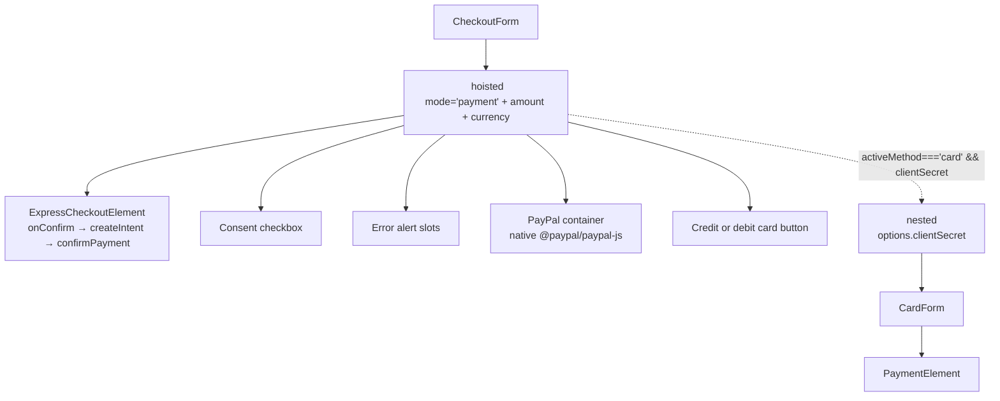

# Module 3 — Stripe Wallets via Express Checkout Element · Design Doc

**Status:** Draft · **Last updated:** 2026-04-29
**Parent PRD:** [../prd/module-3-first-payment.md](../prd/module-3-first-payment.md)
**Decision record:** [../adr/ADR-0001-stripe-wallets-via-express-checkout-element.md](../adr/ADR-0001-stripe-wallets-via-express-checkout-element.md)

## Overview

Replaces the legacy `stripe.paymentRequest()`-based Google Pay path in `typestest/` with Stripe's Express Checkout Element (ECE), exposing both Google Pay AND Apple Pay as correctly-branded buttons under a single Stripe-managed slot. Hoists a deferred-mode `<Elements>` provider at the top of `<CheckoutForm>` and slides PaymentIntent creation into ECE's `onConfirm` callback so the existing on-demand-intent property survives the migration. Closes ADR-0001 Open Questions #2 and #3, and specifies the resolution path for #1.

## Design Summary

```yaml
design_type: "refactoring"
complexity_level: "medium"
complexity_rationale:
  requirements: "Replaces a wallet path while preserving on-demand intent semantics and three-slot UI; widens method-type union; reroutes confirm flow from two-stage to one-stage."
  constraints_risks: "Stripe Elements groups are immutable post-mount; pricing must be present at CheckoutForm mount; Apple Pay live-mode requires deployment-side prerequisites; backend payment_method_type for the wallet path is unresolved (probe-then-lock)."
main_constraints:
  - "Hoisted <Elements> requires amount + currency at mount → render dependency on PricingInfo."
  - "Card path's PaymentElement requires clientSecret at provider mount time; cannot share the deferred-mode hoisted provider for that purpose."
  - "Stripe key/mode guard (assertKeyMatchesMode) is unaffected and must continue to function."
biggest_risks:
  - "Pricing regression silently disables the wallet path (R11')."
  - "Apple Pay live-mode prerequisites missed at deploy → button absent in prod despite passing test-mode acceptance."
  - "Backend rejects the chosen wallet payment_method_type → wallet path 4xx on first click."
```

## Background and Context

### Prerequisite ADRs

- [ADR-0001 Stripe Wallets via Express Checkout Element](../adr/ADR-0001-stripe-wallets-via-express-checkout-element.md) — `Accepted`. This Design Doc is the named resolution venue for that ADR's Open Questions #2 and #3 and specifies the probe procedure for #1.

No common ADRs (`ADR-COMMON-*`) exist in `docs/adr/` for logging, error handling, or contract conventions; this is the first wallet-domain Design Doc in the repo and inherits the existing module-3 patterns established by `usePaymentIntent` and `CardForm`.

### Scope

**In scope:**

- Replace `useGooglePay` with a new `useExpressCheckout` hook scoped to ECE lifecycle.
- Hoist `<Elements>` at the top of `<CheckoutForm>` in deferred-intent mode (`mode='payment'` + `amount` + `currency` from `PricingInfo`).
- Refactor `<CheckoutForm>` to mount ECE in the wallets slot and remove `useGooglePay`-specific state (`gpayClientSecretRef`, `handleGooglePayMethod`, the standalone GPay button slot).
- Widen `PaymentIntentMethodType` to include the wallet path's value (probe-locked; default candidate `'card'`).
- Widen `FunnelSession.paymentIntent.keyedBy.methodType` accordingly.
- Rewrite the wallet portion of `CheckoutForm.test.tsx`; preserve Card and PayPal coverage. Delete `useGooglePay.test.tsx` with the hook.
- Add a placeholder README under `public/.well-known/` documenting the deployment requirement for the Apple Pay association file.

**Out of scope:**

- PayPal flow (`usePayPalCheckout` + `@paypal/paypal-js`) — untouched.
- Card path business logic (`<PaymentElement>` + `stripe.confirmPayment`) — untouched. Only the **arrangement of its scoped `<Elements>` provider** changes (it nests under the hoisted one); CardForm's props, behaviour, and tests are preserved.
- Backend changes (`/payment/stripe/create-payment-intent`, `/payment/stripe/first-sale/payments/confirm`).
- Stripe key/mode handling (`stripePromise`, `assertKeyMatchesMode`) — preserved verbatim.
- Apple Pay live-mode Dashboard registration and `apple-developer-merchantid-domain-association` provisioning — deployment task; this design only adds the placeholder README.

### Applicable Standards

| Standard | Source | Type |
|---|---|---|
| Vitest + React Testing Library, co-located `*.test.tsx` next to source | `src/**/*.test.tsx` (e.g. `CheckoutForm.test.tsx`, `usePaymentIntent.test.tsx`) | implicit |
| `vi.hoisted` + `vi.mock` factory pattern for Stripe SDK + intent hooks | `src/components/checkout/CheckoutForm.test.tsx` lines 22–60 | implicit |
| Path alias `@/...` for repo-internal imports | tsconfig + existing imports across `src/` | implicit |
| Tri-state availability + idempotent dev-time invariants (`assertKeyMatchesMode`) | `src/lib/stripe.ts`, `useGooglePay.ts` | implicit |
| Doc-block comments at file head describing PRD section coverage | All `usePaymentIntent.ts`, `CardForm.tsx`, etc. | implicit |
| No backend-changing work in this slice | PRD §3, ADR-0001 Decision row "Why this" | explicit |

Implicit standards above are inferred from existing code patterns. Implementation must follow them; deviations require explicit rationale in code review.

### Existing Codebase Analysis

**Implementation files inspected (Code Inspection Evidence):**

| File | Lines | Relevance |
|---|---|---|
| `src/hooks/useGooglePay.ts` | 167 | Pattern reference + integration point being replaced |
| `src/hooks/usePaymentIntent.ts` | 453 | Integration point — `PaymentIntentMethodType`, `keyedBy.methodType`, `createIntent` signature |
| `src/components/checkout/CheckoutForm.tsx` | 388 | Main integration point — hosts hoisted `<Elements>` and removes GPay-specific wiring |
| `src/components/checkout/CardForm.tsx` | 126 | Pattern reference (PaymentElement + `confirmPayment`) — preserved unchanged |
| `src/hooks/usePayPalCheckout.ts` | n/a | Boundary marker — untouched; demonstrates non-Stripe-Elements path coexistence |
| `src/lib/stripe.ts` | 40 | Pattern reference (memoised `stripePromise`, `assertKeyMatchesMode`) — unchanged |
| `src/lib/session.ts` | 93 | Integration point — `FunnelSession.paymentIntent.keyedBy.methodType` union widens |
| `src/components/checkout/CheckoutForm.test.tsx` | n/a | Test rewrite target — wallet-path tests replaced; Card and PayPal tests preserved |
| `src/hooks/useGooglePay.test.tsx` | n/a | Deleted with the hook |
| `playwright.config.ts` | 11 | Confirms Playwright is set up via `lovable-agent-playwright-config` — but no E2E specs exist yet |
| `public/` | 4 files | No `.well-known/` directory yet; placeholder README to be added |

**Similar functionality search.** Searched `src/hooks/` for any wallet, ECE, or PaymentRequest-equivalent abstraction. Result: only `useGooglePay` exists — and it is precisely the implementation being replaced. No competing or duplicate wallet hooks. `usePayPalCheckout` is the closest sibling but is for a different rail (native PayPal SDK) and stays out of scope. **Decision: new implementation (`useExpressCheckout`) is justified** because the existing hook will be deleted.

**Reuse-vs-new for the wallet hook.** `useGooglePay` is being deleted (not extended) because its core surface — `paymentRequest`, `canMakePayment`, `paymentmethod` event, two-stage confirm — has no analogue under ECE. The replacement is a thin configuration helper around `<ExpressCheckoutElement>`; not a fork.

## Acceptance Criteria

ECE-specific ACs map directly from PRD §8 and are restated here in EARS form for traceability. Cross-cutting ACs (1–11a) and Card / PayPal ACs (12–19, 26–29) are owned by the PRD and not duplicated.

- [ ] AC-D01: When `<CheckoutForm>` mounts and `pricing` is defined, the system shall create the hoisted `<Elements>` provider with `mode='payment'`, `amount` derived from `PricingInfo`, and `currency` derived from `PricingInfo.currency_code`.
- [ ] AC-D02: When `pricing` is undefined at `<CheckoutForm>` mount, the system shall not mount `<ExpressCheckoutElement>` and shall not throw.
- [ ] AC-D03: While the hoisted Elements provider is mounted, the system shall render `<ExpressCheckoutElement>` such that ECE renders any wallet button supported by the browser/device (Google Pay on Chrome+saved card; Apple Pay on Safari with Apple Pay configured) without any application-level `canMakePayment()` call.
- [ ] AC-D04: When ECE invokes `onConfirm`, the system shall call `intent.createIntent(<wallet payment_method_type>)` exactly once before invoking `stripe.confirmPayment({ elements, clientSecret, confirmParams: { return_url }, redirect: 'if_required' })`.
- [ ] AC-D05: If `stripe.confirmPayment` returns `error`, the system shall surface `error.message` inline in CheckoutForm's per-method error slot and shall not call the backend confirm endpoint.
- [ ] AC-D06: If `stripe.confirmPayment` returns `paymentIntent.status === 'succeeded'`, the system shall call `finalizeAfterStripeSuccess(paymentIntent.id)` and navigate per `redirect_page`.
- [ ] AC-D07: When the user opens `<CheckoutForm>` while `session.paymentIntent.keyedBy.methodType === 'google_pay'` (legacy value) and clicks the ECE wallet button, the system shall treat the cached entry as a miss (because `methodType` no longer matches the new wallet value) and create a fresh PaymentIntent. No errors are raised, no duplicate cache entry persists, and the legacy entry is overwritten by the new one. (Closes ADR-0001 OQ#3.)
- [ ] AC-D08: While `activeMethod === 'card' && intent.clientSecret` is truthy, the system shall mount a separately scoped `<Elements options={{ clientSecret }}>` provider as a descendant of the hoisted deferred-mode `<Elements>` provider, wrapping `<CardForm>` only. (Closes ADR-0001 OQ#2 — see §Key Design Decisions.)
- [ ] AC-D09: When the user toggles `activeMethod` between `null` and `'card'`, the system shall not remount the hoisted `<Elements>` provider.
- [ ] AC-D10: While `consented === false` or `submitting === true`, the wallet path shall not initiate `createIntent` even if ECE's button is clicked. (Achieved via ECE configuration, not application-level `canMakePayment` — see boundary contract for ECE in §Module / hook contracts.)
- [ ] AC-D11: When the production deployment serves `/checkout` without the `apple-developer-merchantid-domain-association` file under `/.well-known/`, the system shall still render the wallet slot (Apple Pay simply does not appear) and shall not throw. The placeholder README is a documentation-only artefact and shall not impact runtime.

## Files Changed

| File Path | Change Type | Description |
|---|---|---|
| `src/hooks/useExpressCheckout.ts` | Create | ECE configuration helper. See §Module / hook contracts. |
| `src/hooks/useExpressCheckout.test.tsx` | Create | Unit tests for the hook's configuration/return shape. |
| `src/hooks/useGooglePay.ts` | Delete | Replaced by `useExpressCheckout`. |
| `src/hooks/useGooglePay.test.tsx` | Delete | Removed alongside the hook. |
| `src/hooks/usePaymentIntent.ts` | Modify | Widen `PaymentIntentMethodType` union to add the wallet `payment_method_type` value. No signature changes. |
| `src/hooks/usePaymentIntent.test.tsx` | Modify | Add a test asserting the natural-cache-miss behaviour for legacy `'google_pay'` entries. |
| `src/lib/session.ts` | Modify | Widen `FunnelSession.paymentIntent.keyedBy.methodType` to match `PaymentIntentMethodType`. |
| `src/components/checkout/CheckoutForm.tsx` | Modify | Hoist `<Elements>`; mount `<ExpressCheckoutElement>` in wallets slot; nest scoped `<Elements clientSecret>` for the card branch; remove GPay state. |
| `src/components/checkout/CheckoutForm.test.tsx` | Modify | Rewrite wallet-path tests against ECE's `onConfirm`; keep Card and PayPal coverage. |
| `public/.well-known/README.md` | Create | Documentation-only placeholder describing deployment-side provisioning of the Apple Pay association file. |

## Design

### Change Impact Map

```yaml
Change Target: CheckoutForm wallet slot (Stripe Wallets) + supporting hook
Direct Impact:
  - src/hooks/useGooglePay.ts (delete)
  - src/hooks/useGooglePay.test.tsx (delete)
  - src/hooks/useExpressCheckout.ts (create)
  - src/hooks/useExpressCheckout.test.tsx (create)
  - src/components/checkout/CheckoutForm.tsx (refactor — hoist Elements, swap wallet slot)
  - src/components/checkout/CheckoutForm.test.tsx (rewrite wallet tests)
  - src/hooks/usePaymentIntent.ts (widen union; no signature change)
  - src/lib/session.ts (widen union)
  - public/.well-known/README.md (placeholder)
Indirect Impact:
  - src/components/checkout/CardForm.tsx (no code change; now nested under hoisted <Elements>)
  - src/pages/CheckoutPage.tsx (no code change; CheckoutForm still mounted in same place)
No Ripple Effect:
  - src/hooks/usePayPalCheckout.ts (untouched)
  - src/lib/stripe.ts (untouched)
  - Backend endpoints (untouched)
  - Module 1 resume guard, Module 2 pricing hook (untouched)
  - All non-checkout pages and shared UI primitives
```

### Field Propagation Map

The `methodType` field is the only field crossing component boundaries with semantic change. PayPal does not flow through `usePaymentIntent` and is not in this map.

| Boundary | Field | Status | Rationale |
|---|---|---|---|
| ECE `onConfirm` → `useExpressCheckout` callback | (wallet identity is not exposed at create-intent time) | dropped | Stripe API: ECE does not surface chosen wallet at this seam; only inside its event payload, post-confirm. |
| `useExpressCheckout` → `usePaymentIntent.createIntent` | `methodType` | transformed | Hard-coded to the resolved wallet `payment_method_type` (probe-locked; default `'card'`). Single value covers both GPay and Apple Pay. |
| `usePaymentIntent.createIntent` → `apiPost('create-payment-intent')` body | `payment_method_type` | preserved | Sent verbatim to backend. |
| `usePaymentIntent` → `FunnelSession.paymentIntent.keyedBy.methodType` | `methodType` | preserved | Stored on cache write; compared on cache read. Legacy `'google_pay'` values are a natural miss. |

### Architecture (component tree)

The hoisted `<Elements>` provider is at the top of `<CheckoutForm>`. ECE renders inside it. The Card branch nests its own scoped `<Elements clientSecret>` under the same hoisted provider. PayPal and the consent gate sit at the same depth as ECE under the hoisted provider, but PayPal does not consume Stripe Elements at all.

```
CheckoutForm
└─ <Elements stripe={stripePromise} options={{ mode: 'payment', amount, currency, appearance, loader: 'auto' }}>   (HOISTED, deferred-intent mode)
   ├─ Consent checkbox + label
   ├─ Intent-error alert slot
   ├─ Per-method error alert slot
   ├─ <ExpressCheckoutElement onConfirm={...} options={{ buttonType, buttonTheme, buttonHeight, ... }} />          (wallets slot)
   ├─ PayPal container <div ref=…>                                                                                  (rendered by usePayPalCheckout)
   ├─ "Credit or debit card" <Button onClick={handleCardClick} />
   └─ activeMethod === 'card' && intent.clientSecret
      └─ <Elements stripe={stripePromise} options={{ clientSecret, appearance, loader: 'auto' }}>                  (NESTED scoped provider — card path only)
         └─ <CardForm clientSecret={intent.clientSecret} ... />
            └─ <PaymentElement options={{ layout: 'tabs' }} />
```



### Data Flow

```
User opens /checkout → Module 1 resume guard → session.pricingInfo refreshed
  ↓
CheckoutForm mounts (pricing present) → hoisted <Elements options={{ mode:'payment', amount, currency }}>
ECE renders supported wallet buttons immediately (deferred mode, no clientSecret yet).
  ↓
─ Wallet path: User clicks GPay/Apple Pay → ECE.onConfirm(event, helpers) →
    intent.createIntent(<wallet payment_method_type>) → POST create-payment-intent (or cache hit)
    → stripe.confirmPayment({ elements, clientSecret, confirmParams:{return_url}, redirect:'if_required' })
    → success: finalizeAfterStripeSuccess → backend confirm → navigate
    → error: inline alert; ECE shows its own button-state error
─ Card path: setActiveMethod('card') → createIntent('card') → nested <Elements options={{clientSecret}}>
    mounts → <CardForm> <PaymentElement> → Pay → stripe.confirmPayment(...) → finalize → navigate
─ PayPal path (unchanged): createIntent('paypal') → stripe.confirmPayPalPayment → redirect → return URL
    → usePaymentIntent mount recovery picks up redirect_status → finalize → navigate
```

### Key Design Decisions

**KDD-1 — Card-path `<Elements>` provider disposition: KEEP NESTED. (Closes ADR-0001 OQ#2.)**

The hoisted `<Elements>` runs in deferred mode (`mode='payment' + amount + currency`, no `clientSecret`). ECE's `onConfirm` reads from this provider and supplies `clientSecret` at `confirmPayment` time. The Card path's `<PaymentElement>` requires `clientSecret` at provider mount time — Stripe Elements groups are immutable after mount, so a `clientSecret` cannot be added to an already-mounted deferred provider. Therefore the existing scoped `<Elements options={{ clientSecret }}>` around `<CardForm>` MUST be retained. It is rendered as a descendant of the hoisted provider so CardForm stays in CheckoutForm's layout subtree.

Two-providers-coexisting (one deferred, one with `clientSecret`) is explicitly supported by Stripe (see Stripe's deferred-intent migration guide; each Elements group is an isolated context).

Alternative considered: **merge into a single provider that re-mounts when `clientSecret` becomes available.** Rejected because (a) it would cause CardForm to re-mount whenever the wallet path interacted with the hoisted provider, (b) it would lose PaymentElement state on intent-cache changes, and (c) it would force a re-mount of ECE every time the user toggled the card form open/closed — defeating the entire reason ECE was hoisted in the first place.

**KDD-2 — Cache invalidation strategy for legacy `keyedBy.methodType === 'google_pay'`: NATURAL CACHE MISS. (Closes ADR-0001 OQ#3.)**

`usePaymentIntent.isKeyedByMatch` already compares `cached.keyedBy.methodType === methodType` byte-for-byte (`usePaymentIntent.ts` lines 110–115). When the wallet path is invoked with the new `payment_method_type` value (default `'card'`), any cached entry keyed by `'google_pay'` is structurally non-matching and falls through to fresh-create. The newly-created intent overwrites the cache entry via `patchSession`. No migration code, no version bump, no manual eviction.

This is robust against concurrent same-tab refreshes: the cache write is synchronous via `patchSession`, and `sessionStorage` is per-tab.

**KDD-3 — Backend `payment_method_type` for the wallet path: LOCKED to `'card'` (fallback, backend probe inconclusive 2026-04-29).** (Closes ADR-0001 OQ#1.)

Locked value is `'card'`. Probe attempted on 2026-04-29 against the orchestrator's available backend repo (`d:/Projects/JadeApp/jadeapp-backend/`); that repo is a separate (subscription-focused) service whose only Stripe surface is `POST /api/v1/common/stripe/buySubscription` — it does not own `POST /payment/stripe/create-payment-intent`. The TestIQ backend that owns the create-intent endpoint was not accessible from the orchestrator's working tree, so per §Backend contract & probe procedure → Default / fallback, the value defaults to `'card'`. Rationale: ECE wraps card-family wallets and the backend is already known to accept `'card'` for the existing card path. ECE does not expose the chosen wallet at create-intent time (the wallet identity surfaces only inside `onConfirm`, after the intent has been requested in the same call), so even if the backend were to accept `'apple_pay'` distinctly, the frontend cannot differentiate at create-intent time without restructuring the flow to defer create-intent until post-confirm — which would invert ECE's design. If test-mode confirm fails post-implementation with `'card'`, escalate per the §Backend contract escalation rule.

**KDD-4 — `useExpressCheckout` does not own a Stripe instance.** Unlike the deleted `useGooglePay` (which subscribed to `stripePromise` directly because no `<Elements>` provider was guaranteed), the new hook is *only* consumed inside the hoisted Elements provider. Stripe is read implicitly by `<ExpressCheckoutElement>` via the React context. The hook is therefore a thin adapter: it wires `pricing` → button options + `onConfirm` glue and returns props ready to spread on `<ExpressCheckoutElement>`. No `useEffect` for SDK loading, no `available` state, no `show()` imperative handle.

**KDD-5 — `assertKeyMatchesMode` invocation is preserved unchanged.** It runs once on every CheckoutForm render when `pricing.payment_mode` is present (idempotent). Hoisting `<Elements>` does not change this.

### Module / hook contracts

#### `useExpressCheckout(options)` contract

| Field | Direction | Type | Notes |
|---|---|---|---|
| `pricing` | input | `PricingWithMode \| undefined` | Source for `amount` / `currency`; if undefined, hook returns a sentinel that suppresses ECE rendering. |
| `disabled` | input | `boolean` | True when consent is unchecked or another method is submitting. ECE's button options are configured to treat the slot as non-interactive when set. |
| `onConfirm` | input | `(event, helpers: { resolve, reject, paymentFailed, ... }) => Promise<void>` | Implementation calls `intent.createIntent(<wallet methodType>)` then `stripe.confirmPayment({...})`. The hook does not own this — the consumer (CheckoutForm) supplies it. |
| `onReady` | input (optional) | `() => void` | Forwarded to `<ExpressCheckoutElement>`'s `onReady`; consumer may use it to dismiss a placeholder. |
| `eceProps` | output | object spread onto `<ExpressCheckoutElement>` | Includes `onConfirm`, `options.buttonType`, `options.buttonTheme`, `options.buttonHeight`, `onReady`, etc. |
| `ready` | output | `boolean` | True once ECE's `onReady` has fired at least once. Consumer-visible signal for analytics; not used for gating. |

Lifecycle: pure (no side effects). Re-runs only when `pricing` scalars (`first_sale_price`, `currency_code`, `first_sale_cents_price`) change.

Error propagation: failures inside the consumer-supplied `onConfirm` MUST be surfaced via `helpers.paymentFailed()` so ECE updates its own button state, AND via `setMethodError(...)` in CheckoutForm for the inline alert. Both paths are required because ECE owns its button visual state independently of React.

#### `usePaymentIntent` changes

| Aspect | Before | After |
|---|---|---|
| `PaymentIntentMethodType` | `"card" \| "google_pay"` | `"card" \| <wallet value>` — exact wallet value is probe-locked. Default `"card"` covers both GPay and Apple Pay because ECE wraps card-family wallets and does not expose the chosen wallet at create-intent time. PayPal-via-Stripe-confirm migration is **out of scope** for this slice; `usePayPalCheckout` remains self-contained on the native `@paypal/paypal-js` path and never calls `createIntent`. |
| `createIntent` signature | `(methodType: PaymentIntentMethodType) => Promise<{ clientSecret, intentId }>` | Unchanged. |
| Cache key | `(qidRaw, prcId, mdid, methodType)` | Unchanged (same shape; widened union only). |
| Mount effect | Read-only recovery | Unchanged. |

Because `createIntent`'s signature does not change, no caller needs updating beyond the new wallet-path call site in `useExpressCheckout`/`CheckoutForm`.

#### `<CheckoutForm>` changes

Removed:
- `gpayClientSecretRef`
- `handleGooglePayMethod`
- `handleGooglePayClick`
- `useGooglePay` integration
- The standalone GPay `<Button>` element (lines 297–315 in current file)

Added:
- Hoisted `<Elements>` provider with deferred-intent options derived from `pricing`.
- `useExpressCheckout({ pricing, disabled: !consented || submitting, onConfirm })` invocation.
- `<ExpressCheckoutElement {...eceProps} />` rendered inside the hoisted provider.
- Wallet-path `onConfirm` implementation: calls `intent.createIntent(<wallet methodType>)`, then `stripe.confirmPayment({ elements, clientSecret, confirmParams: { return_url: cardReturnUrl }, redirect: 'if_required' })`, then `handleFinalize(paymentIntent.id)` on success.

Preserved (no logic change):
- Consent checkbox + gating.
- PayPal slot via `usePayPalCheckout`.
- Credit-or-debit-card branch (button, scoped `<Elements clientSecret>`, `<CardForm>`).
- `assertKeyMatchesMode` invocation.
- `handleFinalize` / `handleRetryFinalize` / auto-finalise on `recoveredSucceeded`.
- `cardReturnUrl` derivation via `withPromoParams`.

### Integration Boundary Contracts

```yaml
Boundary: CheckoutForm → usePaymentIntent (wallet path)
  Input:  methodType (the resolved wallet payment_method_type value)
  Output: Promise<{ clientSecret, intentId }> (sync from cache OR async via POST)
  On Error: throws Error with .message; CheckoutForm catches and surfaces inline.

Boundary: ECE → useExpressCheckout.onConfirm
  Input:  event payload + helpers ({ resolve, reject, paymentFailed })
  Output: void (Promise<void>); resolution is signalled via helper calls.
  On Error: must call helpers.paymentFailed() so ECE button state updates;
            must also surface via setMethodError(...) for the inline alert.

Boundary: useExpressCheckout → stripe.confirmPayment
  Input:  { elements (from Elements context), clientSecret, confirmParams: { return_url }, redirect: 'if_required' }
  Output: { paymentIntent, error } (Stripe's standard shape)
  On Error: bubble error.message to CheckoutForm; do NOT call backend confirm.

Boundary: CheckoutForm → finalizeAfterStripeSuccess
  Input:  paymentIntent.id (string)
  Output: ConfirmResponse (shape per usePaymentIntent.ts:35)
  On Error: BACKEND_CONFIRM_FAILURE_MESSAGE shown inline; Retry CTA reuses same id.
```

### Interface Change Matrix

| Existing Operation | New Operation | Conversion Required | Adapter Required | Compatibility Method |
|---|---|---|---|---|
| `useGooglePay({ pricing, onPaymentMethod })` | `useExpressCheckout({ pricing, disabled, onConfirm, onReady? })` | Yes | No (hook is replaced wholesale; not adapted) | N/A — old hook deleted |
| `gpay.show()` imperative trigger | (none — ECE owns its own click) | Yes | No | N/A |
| `gpay.available` tri-state | (none — ECE owns availability) | Yes | No | N/A |
| `useGooglePay.onPaymentMethod(event)` | `onConfirm(event, helpers)` | Yes | No | Wallet-path test rewrite drives the new contract directly. |
| `usePaymentIntent.createIntent(methodType)` | unchanged | No | No | Union widens; existing callers compile unchanged. |
| `FunnelSession.paymentIntent.keyedBy.methodType` | union widens | No (read sites use `===` only) | No | Pre-existing legacy values fail equality → natural miss (KDD-2). |

## Backend contract & probe procedure (resolution path for ADR-0001 OQ#1)

The backend endpoint contract (`POST /payment/stripe/create-payment-intent` body, response shape) is **unchanged**. Only the *value* sent for `payment_method_type` on the wallet path is open.

### Probe procedure

1. Locate the backend repository (not in the orchestrator's working tree). If the backend is opaque or inaccessible, escalate.
2. Find the request handler for `POST /payment/stripe/create-payment-intent`. Search by route string or by the response shape `{ client_secret, id }`.
3. Inspect the validator/whitelist on `payment_method_type`. Specifically look for: enum lists, allow-lists, switch/match constructs, or `Stripe::PaymentIntent.create(payment_method_types: [...])` calls.
4. Determine the set of accepted values. Common possibilities:
   - Only `'card'` and `'paypal'` are accepted → use `'card'` for the wallet path. **Locked.**
   - `'card'`, `'paypal'`, and `'apple_pay'` (or similar) are accepted → still use `'card'` because ECE cannot differentiate at create-intent time (KDD-3). The `'apple_pay'` value would only be useful if create-intent were deferred until post-confirm, which is an architectural change out of scope.
   - The field is unrestricted (free-form string passed to Stripe) → use `'card'` for compatibility with Stripe's PaymentIntent API expectations.
5. Verify in Stripe **test mode** that an intent created with the chosen value can be confirmed via ECE on Chrome (Google Pay) and Safari (Apple Pay). Confirm both surfaces succeed end-to-end.
6. If the chosen value fails (intent creation 4xxs, or `confirmPayment` rejects post-create) → **escalate**. Do not silently fall back to a different method's value.

### Default / fallback

- **Default candidate locked here: `'card'`.** Apply unless probe reveals a backend-side requirement to differentiate.
- **Fallback when probe is inconclusive:** `'card'`. This is documented so the task-executor is not blocked on backend access.
- **Escalation trigger:** test-mode intent creation or confirm fails with the chosen value, AND the backend repo is inaccessible or its validator semantics are not reproducible from the frontend's vantage point.

## Deployment prerequisites (Apple Pay live mode)

These are **not** implementation tasks; they are deployment-task work items tracked under PRD §10 O6 / O7. The Design Doc records them so they are not lost between implementation and release.

| Item | Owner | Required at | Action |
|---|---|---|---|
| Stripe Dashboard domain registration | Deployment | Before live-mode launch | Register the production domain under Stripe Dashboard → Settings → Payment Methods → Apple Pay. Out-of-band; no code change. |
| `apple-developer-merchantid-domain-association` file | Deployment | Before live-mode launch | Place the file at `public/.well-known/apple-developer-merchantid-domain-association` (no extension). Vite serves anything under `public/` as static assets at the root path. The file must be available at `https://<prod-domain>/.well-known/apple-developer-merchantid-domain-association`. |
| Verify Vite / hosting CDN does not block `.well-known/` | Deployment | Before live-mode launch | Vite serves directories under `public/` verbatim, including `.well-known/`. Verify any production CDN, reverse proxy, or path-rewrite rule does not intercept `.well-known/` paths. |
| Placeholder README | Implementation (this Design Doc) | At merge | Create `public/.well-known/README.md` documenting the deployment requirement. The actual association file is provisioned at deploy time and not committed to source control. |

The implementation slice does not run in live mode and does not require either prerequisite to land.

## Implementation Approach

**Strategy: Hybrid (vertical-slice-leaning)** — the wallet path is end-to-end vertical (hook + component + tests + UI all change in one slice), but it requires a small horizontal-slice prerequisite (the union widening in `usePaymentIntent` and `session.ts`) before the vertical slice compiles.

Phase 1–4 of the implementation-approach skill applied:

- **Phase 1 (Current state):** Wallet path is a `paymentRequest`-based two-stage flow tightly coupled to `useGooglePay`. PaymentElement card path is independent and stable. The widening of `PaymentIntentMethodType` is the smallest change but blocks everything else compiling.
- **Phase 2 (Strategy exploration):** ECE migration via the deferred-intent-mode pattern is the only forward-compatible option that closes the Apple Pay branding gap (per ADR-0001).
- **Phase 3 (Risk assessment):** Highest risk is silent regression of the pricing dependency at `<Elements>` mount. Mitigated by AC-D02 (graceful skip when pricing absent) and integration tests asserting it. Second risk is backend `payment_method_type` rejection — mitigated by the probe procedure with explicit escalation rule.
- **Phase 4 (Constraints):** Stripe Elements immutability is the binding technical constraint and is what forces the nested-card-Elements decision (KDD-1).

**Implementation order** (non-obvious sequencing only — the Work Plan owns full task breakdown):

1. Widen `PaymentIntentMethodType` and `FunnelSession` unions first — required for any other file to compile against the new method-type value.
2. Create `useExpressCheckout` and its unit tests — exercisable in isolation under a mocked `<Elements>` context.
3. Refactor `<CheckoutForm>` (hoist `<Elements>`, swap wallet slot) and rewrite `CheckoutForm.test.tsx` together — the production refactor and the test rewrite must land in the same change to avoid a broken test step.
4. Delete `useGooglePay.ts` and `useGooglePay.test.tsx` — only after all references are gone.
5. Add the placeholder README — independent; can land any time.

### Integration Point Map

| Integration Point | Existing Component | Integration Method | Impact Level |
|---|---|---|---|
| Hoisted `<Elements>` wrapping CheckoutForm body | `CheckoutForm.tsx` (currently no top-level Elements) | Provider addition | High — changes the component tree |
| ECE in wallets slot replacing `useGooglePay` button | `CheckoutForm.tsx` lines 297–315 (current GPay button block) | Replacement | High |
| Nested scoped `<Elements clientSecret>` for card path | `CheckoutForm.tsx` lines 359–382 (current card branch) | Repositioning (now nested under hoisted provider) | Medium — same provider, different ancestor |
| `PaymentIntentMethodType` consumers | `usePaymentIntent.ts`, `session.ts`, `CheckoutForm.tsx`, all test files | Union widening | Low — type-level only |
| Backend create-intent endpoint | (server) | New value flowing through existing field | Low — no contract change; field value resolution per probe |
| `usePayPalCheckout` and `assertKeyMatchesMode` | (no change) | Read-only coexistence | Low |

## Test Strategy

### Test conventions in this repo

- Co-located `*.test.tsx` next to source (`src/**/*.test.tsx`). No separate `tests/` dir.
- Vitest + React Testing Library + jsdom.
- `vi.hoisted` + `vi.mock` factories for SDK mocks; existing `CheckoutForm.test.tsx` is the canonical pattern.
- No suffix-based separation between unit and integration tests; CheckoutForm's tests today are technically integration tests (they render the component with mocked SDKs and assert end-to-end interactions). The new wallet-path tests follow the same convention.
- **Playwright is installed** (see `playwright.config.ts`) but **no E2E specs exist** in `typestest/` today. E2E for this slice is therefore handled as a manual acceptance walkthrough (PRD §11 step 9) until a Playwright suite is established.

### Unit tests

- `useExpressCheckout.test.tsx` (new):
  - When `pricing` is undefined, the hook returns props that suppress ECE rendering.
  - When `pricing` is present, returned `eceProps.options` includes the configured `buttonType` / `buttonTheme` / `buttonHeight` defaults.
  - The hook does not subscribe to `stripePromise` directly (verified by absence of any module-level mock interaction).
- `usePaymentIntent.test.tsx` (extend):
  - Cache hit: legacy `keyedBy.methodType === 'google_pay'` + new wallet `payment_method_type` call → fresh POST issued; cache overwritten.
  - No regression in card-path / paypal-path cache behaviour.

### Integration tests

- `CheckoutForm.test.tsx` (rewrite wallet portion; preserve Card and PayPal):
  - Renders the hoisted `<Elements>` (mocked) when `pricing` is provided.
  - Mounts `<ExpressCheckoutElement>` (mocked as a renderable stub exposing a test handle to drive `onConfirm`).
  - Drives the stub's `onConfirm` and asserts:
    - `intent.createIntent(<wallet methodType>)` is called exactly once with the resolved value.
    - `stripe.confirmPayment` is called with `{ elements, clientSecret, confirmParams: { return_url }, redirect: 'if_required' }`.
    - On `paymentIntent.status === 'succeeded'`, `finalizeAfterStripeSuccess` is called with the right id and `navigate(...)` fires with the resolved redirect.
    - On `error`, `setMethodError` produces an inline alert and the backend confirm endpoint is NOT called (assert via mock-not-called).
  - Asserts the consent gate: ECE's `onConfirm` is allowed to no-op when `consented === false` (or, equivalently, ECE is configured `disabled`); no `createIntent` call fires.
  - Asserts the legacy-cache-natural-miss: `session.paymentIntent.keyedBy.methodType = 'google_pay'` pre-set; first wallet click POSTs a fresh intent.
  - Card and PayPal blocks are kept verbatim (no behaviour change, tests already pass).

### Mocking strategy for `<ExpressCheckoutElement>`

Mock `@stripe/react-stripe-js` to export a stub `<ExpressCheckoutElement>` that renders `data-testid="ece-stub"` and captures the `onConfirm` prop into a hoisted `vi.fn`. Tests retrieve the captured callback via `eceOnConfirmMock.mock.calls[0][0]` and invoke it as `await capturedOnConfirm(fakeEvent, fakeHelpers)` where `fakeHelpers.{resolve,reject,paymentFailed}` are spies. This isolates tests from Stripe's internal state machine while verifying component-level wiring.

### E2E and manual acceptance

- **Automated E2E:** none added in this slice; Playwright is configured but no specs exist in `typestest/`. Establishing an E2E suite is a separate initiative.
- **Manual acceptance** (PRD §11 step 9, ECE-specific bullets):
  - Chrome with a saved Google Pay card → verify GPay button renders inside ECE; click; complete; verify navigation.
  - Safari (macOS or iOS Simulator) with Apple Pay configured → verify Apple Pay button renders; click; complete; verify navigation. **Cannot be automated in this repo today; flagged as a manual step.**
  - Firefox without a wallet → verify ECE slot renders nothing (no console errors), rest of the form is usable.
  - Legacy-cache-miss walkthrough: pre-populate `sessionStorage` with `keyedBy.methodType === 'google_pay'`, click wallet, verify a single fresh POST and successful confirm.

## Acceptance criteria → test mapping

| AC | Test |
|---|---|
| PRD §8 ACs 1–11a (cross-cutting) | Existing `CheckoutForm.test.tsx` tests (preserved) plus `usePaymentIntent.test.tsx`. |
| PRD §8 ACs 12–19 (Card method) | Existing `CardForm.test.tsx` + `CheckoutForm.test.tsx` Card block (preserved). |
| PRD §8 AC 20 (ECE under hoisted Elements) | `CheckoutForm.test.tsx` — assert hoisted `<Elements>` mock is rendered before `<ExpressCheckoutElement>` and receives `mode='payment' + amount + currency`. |
| PRD §8 AC 21 (Chrome/GPay) | Manual acceptance + integration test driving the ECE stub `onConfirm` with a `paymentMethodType: 'google_pay'`-shaped event. |
| PRD §8 AC 22 (Safari/Apple Pay) | Manual acceptance only (Safari cannot be automated in this repo). |
| PRD §8 AC 23 (unsupported browsers) | Integration test: ECE stub renders no button, form remains interactable. Plus manual Firefox check. |
| PRD §8 AC 24 (onConfirm failure path) | Integration test: drive `onConfirm` with a `confirmPayment` error; assert inline alert; assert backend confirm not called. |
| PRD §8 AC 25 (single-stage confirm) | Code review + absence of `confirmCardPayment` / `handleCardAction` calls in the wallet path; no test asserts negation directly. |
| PRD §8 AC 25a (legacy cache-key migration) | Integration test in `CheckoutForm.test.tsx` (legacy-cache-natural-miss walkthrough). |
| PRD §8 ACs 26–29 (PayPal) | Existing PayPal tests (preserved). |
| AC-D02 (graceful no-pricing path) | `useExpressCheckout.test.tsx` — when `pricing` undefined, ECE rendering is suppressed. |
| AC-D08 (nested scoped `<Elements>`) | Code review + integration test verifying CardForm renders without remounting on wallet interactions. |
| AC-D11 (no-association-file resilience) | Manual; live-mode-only. |

## Risks

| Risk | Impact | Mitigation |
|---|---|---|
| **R-D1 (PRD R11′)** Pricing regression silently disables wallet path | High | AC-D02 + integration test asserting `<ExpressCheckoutElement>` does not render when `pricing` is undefined. Module 2 tests guard pricing arrival upstream. |
| **R-D2 (PRD R13)** Apple Pay live-mode prerequisites missed at deploy | High | Placeholder README in `public/.well-known/`; deployment task explicitly tracked under PRD §10 O6 / O7; Risk acknowledged, not fixed in implementation slice. |
| **R-D3 (PRD R14)** ECE branding does not match prior custom GPay pill | Medium | `buttonType` / `buttonTheme` / `buttonHeight` exposed via `useExpressCheckout` options for marketing/design alignment; pixel-level matching not guaranteed. |
| **R-D4** Backend rejects the chosen wallet `payment_method_type` | High | Probe procedure with explicit escalation rule. Default `'card'`. Test-mode end-to-end verification before release. |
| **R-D5** Card path PaymentElement re-mounts unexpectedly because of hoisted-Elements churn | Medium | KDD-1: keep nested scoped `<Elements clientSecret>` so its lifecycle is independent of the hoisted provider. Integration test asserts no re-mount on wallet interactions. |
| **R-D6** ECE's `onConfirm` errors don't update its button visual state | Low | Boundary contract: error path MUST call `helpers.paymentFailed()`. Code review; documented in `useExpressCheckout` contract. |
| **R-D7** Apple Pay manual acceptance gap (no Safari automation) | Medium | Manual step is explicit in the work plan; release checklist must include Safari verification. |
| **R-D8** Probe yields an unexpected backend whitelist that requires per-wallet differentiation | Medium | Escalation rule fires; design intentionally leaves `'card'` as default to avoid premature lock-in. The ADR's "kill criteria" applies if backend churn is unacceptable. |

## Open questions

- **OQ#1 (ADR-0001 OQ#1) — resolved 2026-04-29.** Backend `payment_method_type` value for the wallet path: **LOCKED to `'card'`** (fallback applied; backend probe inconclusive — TestIQ backend repo not accessible from the orchestrator's working tree). See KDD-3. Escalation reserved for the case where test-mode confirm rejects `'card'` post-implementation.
- **OQ#2 (ADR-0001 OQ#2) — closed in this Design Doc.** Resolution: KEEP NESTED. (KDD-1.)
- **OQ#3 (ADR-0001 OQ#3) — closed in this Design Doc.** Resolution: NATURAL CACHE MISS. (KDD-2.)
- **DD-OQ-1 — new.** ECE button options (`buttonType`, `buttonTheme`, `buttonHeight`) — design choice deferred to marketing/design review before live launch. Implementation lands with Stripe defaults; no AC blocks on this.
- **DD-OQ-2 — new.** Whether to add an automated Playwright spec for the wallet path is out of scope here. Establishing an E2E suite is a separate initiative.

## References

- PRD: [docs/prd/module-3-first-payment.md](../prd/module-3-first-payment.md) — §4.4.2, §4.9, §6.3, §8 (ACs), §9 (risks), §10 (open items).
- ADR: [docs/adr/ADR-0001-stripe-wallets-via-express-checkout-element.md](../adr/ADR-0001-stripe-wallets-via-express-checkout-element.md) — Decision, Open Questions, Implementation Guidance.
- Stripe Express Checkout Element overview — `https://docs.stripe.com/elements/express-checkout-element` (component capabilities and wallet routing).
- Stripe Express Checkout Element migration guide — `https://docs.stripe.com/elements/express-checkout-element/migration` (deferred-intent mode contract; supported coexistence of multiple Elements groups).
- Stripe deferred-intent integration guide — `https://docs.stripe.com/payments/accept-a-payment-deferred` (`mode='payment' + amount + currency`; `confirmPayment({ elements, clientSecret, ... })` at confirm time).
- Stripe Apple Pay domain verification — `https://docs.stripe.com/apple-pay#web` (Dashboard registration and `apple-developer-merchantid-domain-association` file).
- Source files (current state): `src/hooks/useGooglePay.ts`, `src/hooks/usePaymentIntent.ts`, `src/components/checkout/CheckoutForm.tsx`, `src/components/checkout/CardForm.tsx`, `src/lib/stripe.ts`, `src/lib/session.ts`, `src/components/checkout/CheckoutForm.test.tsx`, `playwright.config.ts`.
