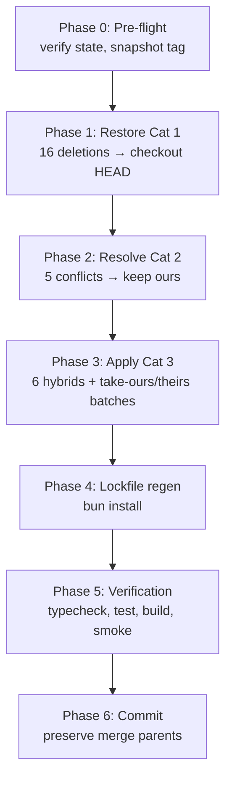
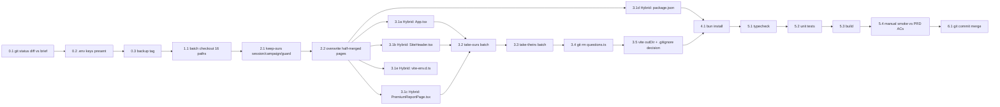

# Work Plan: Merge Remediation — Restore API Integration after `main` pull

Created Date: 2026-04-27
Type: regression-remediation (not new feature work)
Estimated Duration: 1 day (solo, executed sequentially with verification gates)
Estimated Impact: ~50 files (16 restored from HEAD, 6 hybrid edits, ~22 take-theirs/take-ours, 1 file deleted, 2 lockfiles regenerated)
Repo: `d:/Projects/TestIQ/typestest`

## Related Documents

The "design of record" being protected here is the existing PRDs and module plans. There is **no new design doc** — this work plan is a regression-remediation plan whose acceptance is "the merge commit passes Modules 1–5 ACs verbatim."

PRDs (acceptance contracts the merge must not violate):
- [`docs/prd/module-1-load-questions.md`](../prd/module-1-load-questions.md)
- [`docs/prd/module-2-pricing-display.md`](../prd/module-2-pricing-display.md)
- [`docs/prd/module-3-first-payment.md`](../prd/module-3-first-payment.md)
- [`docs/prd/module-4-cross-sell.md`](../prd/module-4-cross-sell.md)
- [`docs/prd/module-5-details-and-report.md`](../prd/module-5-details-and-report.md)
- Parent scope: [`docs/scope.md`](../scope.md)

Module plans (already-implemented behavior on `develop-frok`):
- [`docs/plans/module-1-load-questions.md`](module-1-load-questions.md)
- [`docs/plans/module-2-pricing-display.md`](module-2-pricing-display.md)
- [`docs/plans/module-3-first-payment.md`](module-3-first-payment.md)
- [`docs/plans/module-4-cross-sell.md`](module-4-cross-sell.md)

Backend contract: [`docs/Frontend API List.postman_collection.json`](../Frontend%20API%20List.postman_collection.json)

> **Important**: this plan is the executor's full instruction set. The Categories below carry the file-by-file decisions (already adjudicated during investigation) — do not re-derive them. Execute verbatim.

## Objective

Complete the in-progress merge of `main` into `develop-frok` so that:

1. The full ~25-commit API integration on `develop-frok` (`aa0a44b..14a2dac`, Modules 1–5) survives the merge intact.
2. `main`'s legitimate new features land additively: `ThemeSwitcher`, `CareerReportPage`, `FamousPeoplePage`, `ReportPdf` (PDF export), expanded scoring (`utils/scoring.ts` signed-Likert + A/T axis), and the 16 premium-type avatar updates.
3. The build compiles cleanly (`tsc --noEmit`, `bun run build`).
4. Module 1–5 unit tests pass.
5. Module 1–5 PRD acceptance criteria are reproducible against the live backend.

## Background

- User pulled `main` into `develop-frok` (HEAD: `develop-frok`, MERGE_HEAD: `0338e37`, merge-base: `b0d43113`).
- `main` was rebuilt without the API integration and added unrelated features (theme switcher, career-report page, famous-people page, PDF export, scoring tweaks, premium-type avatar updates).
- Most "deletions" auto-merged silently with **no conflict UI** because the affected files were unmodified on `develop-frok` since the merge-base — git's three-way merge took main's deletion as authoritative.
- Mid-merge: `Unmerged paths` exist, many staged deletions, two pages (`EmailCapturePage.tsx`, `CrossSellPage.tsx`) currently sit on disk as half-merged uncompilable hybrids.
- Working tree is dirty with auto-applied deletions.

User-confirmed scope: complete the merge so `main`'s legitimate features land while losing none of the API integration. Build must compile and Modules 1–5 acceptance criteria must still pass.

## Implementation Strategy

**Approach: phased sequential resolution by category, with a build-test-smoke gate after the categories that mutate the working tree most heavily.**

Phasing rationale (per `implementation-approach` skill, foundation-driven):
- The cheapest action with the highest payoff is a single batch `git checkout HEAD -- …` over Category 1 — those are pure restorations of files that are already in HEAD's object DB. We do this first.
- Category 2 conflicts are resolved next while the foundation is fresh.
- Category 3 is the only category that requires manual editing (the hybrids); it lands last so the simpler restorations are already in place to inform any ambiguity.
- Lockfile regeneration (Phase 4) only happens after `package.json` is finalized.
- Verification (Phase 5) is a single end-to-end pass tied to PRD ACs.
- Commit (Phase 6) only after every gate is green.

Verification levels used (from `implementation-approach`):
- **L3 (build)** after Phases 1, 2, 3, 4 — `bun run build` and `bunx tsc --noEmit`.
- **L2 (unit tests)** after Phase 4 — `bun run test` for restored Module 1–4 tests.
- **L1 (manual smoke against backend)** in Phase 5 — full funnel walk for each module.

Constraints (per user brief):
- Do not `--amend`. Do not `--no-verify`. Preserve both merge parents on the final commit.
- Leave both `bun.lock` and `package-lock.json` as-is unless install fails (out of scope for this remediation).

## Risk Register

### R1 — `bun install` peer-dep conflict between Stripe and React PDF
- **Risk**: `bun install` may fail if `@stripe/react-stripe-js@^6.2.0`, `@stripe/stripe-js@^9.2.0`, and `@react-pdf/renderer@^4.5.1` have an unsatisfiable peer-dep graph (often `react`/`react-dom` major).
- **Impact**: Phase 4 blocks; Phase 5 cannot run.
- **Mitigation**:
  1. Try the install verbatim first.
  2. If it fails, grep `bun.lock` on `b0d43113` (merge-base) for the resolved Stripe versions and pin to those: `git show b0d43113:typestest/bun.lock | grep -A2 '@stripe/react-stripe-js'`.
  3. If still unresolvable, downgrade `@react-pdf/renderer` to its highest version compatible with the project's `react` major (currently 18.x — confirm via `package.json` after restoration).
  4. Record the chosen pin in this plan's "Notes" section.

### R2 — `vite.config.ts` outDir change from `build/` to `dist/` may break deploy
- **Risk**: `main` switched the Vite outDir from `build` to the default `dist`. Any CI script, hosting config, or `.htaccess` referencing `build/` will break silently.
- **Impact**: Production deploy from the merged branch ships the wrong directory.
- **Mitigation**:
  1. Confirm `public/.htaccess` was already removed (it was — staged deleted).
  2. Search the repo for any `build/` references: `grep -r "build/" typestest --include="*.json" --include="*.yml" --include="*.yaml" --include="*.toml" --include=".htaccess" --include="*.config.*"`.
  3. If a deploy config references `build/`, either update it in this plan (record under Phase 3.5) or revert `vite.config.ts`'s outDir.

### R3 — `mbtiResult.ts` orphaned `persistResult`
- **Risk**: Taking theirs on `mbtiResult.ts` brings `persistResult` and `buildResult(atScore)` into the tree, but the API-shape `useQuiz` no longer calls them.
- **Impact**: Dead code; no functional impact.
- **Mitigation**: Verify no consumer remains after Phase 3. If orphaned, leave (tree-shaken in production build) or remove in a separate cleanup commit — out of scope for this remediation.

### R4 — `useRedirectGuard` calls `POST /questions/results`
- **Risk**: HEAD's `useRedirectGuard.ts` posts to `/questions/results`. `main` had no API integration so it didn't exercise this endpoint; if backend changed the contract since `b0d43113`, the resume-guard could break.
- **Impact**: Resume-guard misroutes after a refresh on `/checkout`, `/details`, or `/premium-report`.
- **Mitigation**: Cross-check `docs/Frontend API List.postman_collection.json` for the `/questions/results` route shape (request body fields, response fields). Risk is low — `main` had no API integration so no main commit could have rotated the contract.

### R5 — `PremiumReportPage.tsx` hybrid prop-shape mismatch
- **Risk**: HEAD's `<ReportContent>` was authored before main's `<ReportPdf>` existed. The PDF download path needs to feed the same data shape into `<ReportPdf>` that the on-screen render uses. Prop names may differ.
- **Impact**: Compile error or runtime crash on Premium Report page.
- **Mitigation**: When applying the hybrid in Task 3.1c, read both `<ReportContent>` (HEAD) and `<ReportPdf>` (theirs) before editing. If the prop shape differs, write a small inline adapter in `PremiumReportPage.tsx` that maps `ReportContent`'s props to `<ReportPdf>`'s expected shape. Do not change either component.

### R6 — Restored test files reference moved modules
- **Risk**: Some Category 1 restored `*.test.ts/tsx` files import siblings (e.g., `useQuiz.test.ts` imports `./useQuiz`). If anything moved, imports drift.
- **Impact**: Tests fail to load before any assertion runs.
- **Mitigation**: Run `bun run test` immediately after Phase 4. Fix import paths in the test files only — do not chase the symptom into production code.

## Phase Structure



## Task Dependency Diagram



---

## Phase 0 — Pre-flight (do not alter merge state)

**Purpose**: Confirm the working tree matches the brief, ensure `.env` is populated, and create a recovery anchor before any destructive action.

**Verification level**: L3 (read-only inspection).

**Closes**: nothing — this phase only reduces risk.

### Task 0.1 — Verify merge state

- **Purpose**: Confirm the repo is in the state described in the brief before touching anything.
- **Steps**:
  1. `cd d:/Projects/TestIQ/typestest`
  2. `git status` — confirm the message includes `You have unmerged paths` and lists `MERGE_HEAD`.
  3. `git rev-parse HEAD` — confirm it is the tip of `develop-frok`.
  4. `git rev-parse MERGE_HEAD` — must equal `0338e37` (or the prefix matches; full hash may be longer).
  5. `git merge-base HEAD MERGE_HEAD` — must equal `b0d43113…`.
  6. `git ls-files -u` — list of unmerged paths. Must include `src/lib/session.ts`, `src/hooks/useRedirectGuard.ts`, `src/hooks/useRedirectGuard.test.ts`, `src/lib/campaign.ts`, `src/lib/campaign.test.ts`, `src/pages/EmailCapturePage.tsx`, `src/pages/CrossSellPage.tsx` (these are Category 2).
  7. `git diff --name-only --diff-filter=D --cached` — list of staged deletions. Must include every Category 1 path (api.ts, apiTypes.ts, deviceInfo.ts, ip.ts, likertScale.ts, pricingConstants.ts, promoUrl.ts, redirectRouter.ts, stripe.ts, session.test.ts, useGooglePay.ts, usePaymentIntent.ts, usePricing.ts, useQuiz.test.ts, CardForm.tsx, CheckoutForm.tsx, plus their `.test.*` siblings).
- **Files touched**: none.
- **Acceptance**: Outputs match the brief. If they do not, **STOP** and reconcile with user before proceeding.
- **Verification**: visual inspection of command output.
- **Rollback**: not applicable (read-only).

### Task 0.2 — Confirm `.env` contents

- **Purpose**: The merged branch will not boot or pass smoke tests without all four env vars.
- **Steps**:
  1. `cat typestest/.env` (or open in editor).
  2. Confirm presence of all four keys with non-empty values:
     - `VITE_API_BASE_URL`
     - `VITE_API_TOKEN`
     - `VITE_X_HOST`
     - `VITE_STRIPE_PUBLISHABLE_KEY`
  3. If any key is missing, add it before continuing. The first three are PRD §4.1 of Module 1; the fourth is required by Module 3.
- **Files touched**: `typestest/.env` (already gitignored — never committed).
- **Acceptance**: All four keys present and non-empty.
- **Verification**: `grep -E '^VITE_(API_BASE_URL|API_TOKEN|X_HOST|STRIPE_PUBLISHABLE_KEY)=' typestest/.env | wc -l` returns `4`.
- **Rollback**: not applicable.

### Task 0.3 — Create backup tag pointing at HEAD

- **Purpose**: Mid-merge `git stash` is unsafe (the index has unmerged entries). A lightweight tag is the cheapest reliable rollback point.
- **Steps**:
  1. `git tag pre-remediation-backup HEAD`
  2. Verify: `git rev-parse pre-remediation-backup` matches `git rev-parse HEAD`.
- **Files touched**: none (tag is in `.git/refs/tags/`).
- **Acceptance**: Tag exists, points at the same commit as HEAD.
- **Rollback**: see "Global Rollback" below.
- **Note**: This tag references HEAD, **not** the in-progress merge state. The in-progress merge is recoverable via `git merge --abort` followed by re-running `git merge MERGE_HEAD` if needed; the tag is the absolute fallback.

### Phase 0 Completion Criteria
- [ ] `git status` confirmed mid-merge.
- [ ] All Category 1, 2 paths verified present in the unmerged/staged-deletion lists.
- [ ] `.env` has all four keys.
- [ ] `pre-remediation-backup` tag created.

### Phase 0 Operational Verification
1. `git tag --list pre-remediation-backup` returns the tag.
2. `git status` still shows `You have unmerged paths`.

---

## Phase 1 — Restore Category 1 deletions (single batch, 1 commit-equivalent)

**Purpose**: Restore the entire API foundation in a single atomic batch by checking out HEAD's blobs. Lowest risk, highest payoff phase.

**Verification level**: L3.

**Closes**: foundation for Modules 1, 2, 3, 4, 5 ACs (no AC fully verifiable yet — pages don't compile until Phase 3).

### Task 1.1 — Batch restore from HEAD

- **Purpose**: Each Category 1 path is currently `staged: deleted`. HEAD's blob is still in the object DB even though the file is missing from the working tree. A single `git checkout HEAD -- <paths>` repopulates all of them and unstages the deletions in one stroke.
- **Steps**:
  1. From `d:/Projects/TestIQ/typestest`, run **a single command** with all 16 paths plus their `.test.*` siblings (one continuous shell command — split across lines here for readability with `\` continuations):
     ```bash
     git checkout HEAD -- \
       src/lib/api.ts \
       src/lib/api.test.ts \
       src/lib/apiTypes.ts \
       src/lib/deviceInfo.ts \
       src/lib/deviceInfo.test.ts \
       src/lib/ip.ts \
       src/lib/ip.test.ts \
       src/lib/likertScale.ts \
       src/lib/pricingConstants.ts \
       src/lib/promoUrl.ts \
       src/lib/promoUrl.test.ts \
       src/lib/redirectRouter.ts \
       src/lib/redirectRouter.test.ts \
       src/lib/stripe.ts \
       src/lib/stripe.test.ts \
       src/lib/session.test.ts \
       src/hooks/useGooglePay.ts \
       src/hooks/useGooglePay.test.ts \
       src/hooks/usePaymentIntent.ts \
       src/hooks/usePaymentIntent.test.ts \
       src/hooks/usePricing.ts \
       src/hooks/usePricing.test.ts \
       src/hooks/useQuiz.test.ts \
       src/components/checkout/CardForm.tsx \
       src/components/checkout/CardForm.test.tsx \
       src/components/checkout/CheckoutForm.tsx \
       src/components/checkout/CheckoutForm.test.tsx
     ```
     `git checkout HEAD -- <path>` restores **both** the working tree file and the index entry — no separate `git add` is needed.
  2. If any path errors with `pathspec did not match any file known to git`, the path on HEAD differs from what the brief lists. Stop and re-grep HEAD for the actual location: `git ls-tree -r HEAD --name-only | grep <basename>`.
- **Files touched**: 27 files restored (16 source + their tests; the `+test` shorthand in the brief expands to 11 test files).
- **Acceptance**:
  - `git status` no longer shows any of these paths under "Changes to be committed: deleted".
  - Each file exists in the working tree (`ls src/lib/api.ts` etc.).
- **Verification**:
  - `git diff --cached --name-only --diff-filter=D | grep -E '(api|apiTypes|deviceInfo|ip|likertScale|pricingConstants|promoUrl|redirectRouter|stripe|session\.test|useGooglePay|usePaymentIntent|usePricing|useQuiz\.test|CardForm|CheckoutForm)\.(ts|tsx)$'` returns empty.
  - `bunx tsc --noEmit` will likely still fail at this point (Category 2 conflicts remain) — **do not gate on typecheck yet**; gate on it after Phase 3.
- **Rollback**: `git checkout MERGE_HEAD -- <path>` to revert any single file to main's state, or `git reset --hard pre-remediation-backup` to roll back the entire phase (this also un-aborts the merge state — see Global Rollback).

### Phase 1 Completion Criteria
- [ ] All 27 paths exist in working tree.
- [ ] None of them appear in `git status` as "deleted".
- [ ] No `pathspec` errors during the checkout.

### Phase 1 Operational Verification
1. `ls typestest/src/lib/api.ts typestest/src/hooks/useQuiz.test.ts typestest/src/components/checkout/CheckoutForm.tsx` — all three exist.
2. `git status` still shows the Category 2 paths under `Unmerged paths` (Phase 2 will handle these).

---

## Phase 2 — Resolve Category 2 conflicts

**Purpose**: Resolve the explicit unmerged paths by keeping HEAD's version (`develop-frok`'s API integration), overwriting the two half-merged page hybrids that currently sit on disk uncompilable.

**Verification level**: L3 (after the phase, `bunx tsc --noEmit` should still surface only Phase 3 issues, not Phase 2 ones).

**Closes**: foundation for Modules 1, 4, 5 ACs.

### Task 2.1 — Keep-ours for the three hook/lib unmerged paths

- **Purpose**: `session.ts`, `useRedirectGuard.ts`, and `campaign.ts` (plus their tests) were modified on `develop-frok` and deleted on `main`. Resolution is unconditionally `keep ours` — these files implement Module 1–5 foundation logic with no equivalent on `main`.
- **Steps**:
  1. Run a single batch:
     ```bash
     git checkout HEAD -- \
       src/lib/session.ts \
       src/hooks/useRedirectGuard.ts \
       src/hooks/useRedirectGuard.test.ts \
       src/lib/campaign.ts \
       src/lib/campaign.test.ts
     ```
  2. `git checkout HEAD -- <path>` already stages the resolution. Confirm with `git status` — these paths should move from `Unmerged paths` to `Changes to be committed: modified` (or vanish if HEAD's version equals the merge-base's).
- **Files touched**: 5 files.
- **Acceptance**:
  - `git ls-files -u | grep -E '(session\.ts|useRedirectGuard|campaign)'` returns empty.
- **Verification**: `git status`.
- **Rollback**: per-file `git checkout MERGE_HEAD -- <path>`.

### Task 2.2 — Overwrite half-merged pages

- **Purpose**: `EmailCapturePage.tsx` and `CrossSellPage.tsx` currently sit on disk as half-merged uncompilable hybrids (conflict markers were partially resolved by an earlier auto-merge attempt). Overwrite them wholesale with HEAD's blob.
- **Steps**:
  1. ```bash
     git checkout HEAD -- src/pages/EmailCapturePage.tsx src/pages/CrossSellPage.tsx
     ```
  2. Open both files in editor and confirm:
     - No `<<<<<<<`, `=======`, or `>>>>>>>` markers remain.
     - The contents match HEAD's last commit on `develop-frok` for these files (Module 1 EmailCapturePage uses `apiPost` to `questions/submit`; Module 4 CrossSellPage uses `apiPost` to `questions/cross-sale-confirm`).
- **Files touched**: 2 files.
- **Acceptance**:
  - `grep -nE '^(<<<<<<<|=======|>>>>>>>)' typestest/src/pages/EmailCapturePage.tsx typestest/src/pages/CrossSellPage.tsx` returns empty.
  - `git ls-files -u | grep -E '(EmailCapturePage|CrossSellPage)'` returns empty.
- **Verification**: visual check + grep for conflict markers.
- **Rollback**: per-file `git checkout MERGE_HEAD -- <path>`.

### Phase 2 Completion Criteria
- [ ] `git ls-files -u` returns empty (no remaining unmerged paths).
- [ ] No conflict markers anywhere: `grep -rnE '^(<<<<<<<|=======|>>>>>>>)' typestest/src` returns empty.

### Phase 2 Operational Verification
1. `git status` no longer reports any `Unmerged paths` section.
2. The two pages compile in isolation (`bunx tsc --noEmit` may still fail elsewhere — do not gate here).

---

## Phase 3 — Apply Category 3 hybrids and take-ours/take-theirs decisions

**Purpose**: Apply the manual hybrid edits, take the bulk decisions in two batches, delete the resurrected `questions.ts`, and finalize config.

**Verification level**: L3 at the end of the phase — `bunx tsc --noEmit` and `bun run build` must both succeed before Phase 4 begins.

**Closes**: foundation for every Module 1–5 AC. ACs become **verifiable** after Phase 5.

### Task 3.1a — Hybrid edit: `src/App.tsx`

- **Purpose**: Keep HEAD's `AppBoot` component (with `captureCampaignParams()` and `resolveIp()` boot effects) **AND** add main's lazy routes for `<FamousPeoplePage>` and `<CareerReportPage>`, **AND** apply the theme on mount via `applyTheme(getStoredThemeId())`.
- **Resolution mechanic**: this is a true 3-way merge. Use the editor.
- **Steps**:
  1. ```bash
     git show HEAD:src/App.tsx > /tmp/app.head.tsx
     git show MERGE_HEAD:src/App.tsx > /tmp/app.theirs.tsx
     ```
  2. Open `typestest/src/App.tsx`. Use HEAD's version as the base.
  3. From HEAD, **keep verbatim**:
     - The `AppBoot` component (or top-level `useEffect` calling `captureCampaignParams()` first then `resolveIp()`).
     - All existing route definitions for `/`, `/instructions`, `/quiz`, `/calculating`, `/email`, `/checkout`, `/cross-sell`, `/details`, `/results`, `/premium-report`.
     - The `<Toaster />` mount.
  4. From `MERGE_HEAD` (theirs), **add**:
     - The lazy import for `FamousPeoplePage`: `const FamousPeoplePage = lazy(() => import('@/pages/FamousPeoplePage'))`.
     - The lazy import for `CareerReportPage`: `const CareerReportPage = lazy(() => import('@/pages/CareerReportPage'))`.
     - The two new `<Route>` entries — paths from theirs (likely `/famous-people` and `/career-report` — read theirs to confirm exact paths).
     - The mount-time theme application: at the top of `AppBoot` (or inside the same boot `useEffect`), add `applyTheme(getStoredThemeId())` from `@/lib/themes`. Run it **synchronously before** `resolveIp()` so the theme is applied on first paint.
  5. Add a `<Suspense fallback={…}>` wrapper around the lazy routes if HEAD doesn't already have one — use the same fallback pattern theirs uses.
  6. Confirm imports resolve: `import { applyTheme, getStoredThemeId } from '@/lib/themes'` — `themes.ts` is Category 4 (already added by the merge).
  7. `git add src/App.tsx`.
- **Files touched**: `src/App.tsx`.
- **Acceptance**:
  - `bunx tsc --noEmit -- src/App.tsx` typechecks (in isolation, ignoring downstream errors).
  - `grep -E '(captureCampaignParams|resolveIp|FamousPeoplePage|CareerReportPage|applyTheme)' typestest/src/App.tsx | wc -l` returns at least 5.
- **Rollback**: `git checkout HEAD -- src/App.tsx` then redo from step 1.

### Task 3.1b — Hybrid edit: `src/components/SiteHeader.tsx`

- **Purpose**: Keep HEAD's `withPromoParams('/instructions')` Start-Test calls (both desktop and mobile breakpoints) **AND** add theirs' `<ThemeSwitcher>` mounts and hover style additions.
- **Steps**:
  1. ```bash
     git show HEAD:src/components/SiteHeader.tsx > /tmp/header.head.tsx
     git show MERGE_HEAD:src/components/SiteHeader.tsx > /tmp/header.theirs.tsx
     ```
  2. Use HEAD as the base.
  3. From HEAD, **keep verbatim**:
     - Both Start-Test buttons (desktop and mobile) and their `onClick` calling `navigate(withPromoParams('/instructions'))`.
     - The `import { withPromoParams } from '@/lib/promoUrl'` import.
  4. From theirs, **add**:
     - `import { ThemeSwitcher } from '@/components/ThemeSwitcher'`.
     - The `<ThemeSwitcher />` mount points — typically two (desktop nav and mobile menu). Match theirs' placement exactly.
     - Any new hover-style className additions on existing nav links — copy verbatim from theirs.
  5. `git add src/components/SiteHeader.tsx`.
- **Files touched**: `src/components/SiteHeader.tsx`.
- **Acceptance**:
  - File contains both `withPromoParams` and `<ThemeSwitcher`.
  - Start-Test buttons still navigate via `withPromoParams`.
- **Rollback**: `git checkout HEAD -- src/components/SiteHeader.tsx`.

### Task 3.1c — Hybrid edit: `src/pages/PremiumReportPage.tsx`

- **Purpose**: Keep HEAD's resume-guard dual-path entry (`<ReportGuardedPlaceholder>` + `useRedirectGuard('/results')`) **AND** import main's `pdf` from `@react-pdf/renderer`, `<ReportPdf>`, `downloadReportPdf()`, and the `Download` icon for the rendered branch only.
- **Steps**:
  1. ```bash
     git show HEAD:src/pages/PremiumReportPage.tsx > /tmp/premium.head.tsx
     git show MERGE_HEAD:src/pages/PremiumReportPage.tsx > /tmp/premium.theirs.tsx
     ```
  2. Read both files end-to-end before editing (per R5).
  3. Use HEAD as the base.
  4. From HEAD, **keep verbatim**:
     - The early-return `<ReportGuardedPlaceholder>` block and the `useRedirectGuard('/results')` call at the top of the component.
     - The on-screen `<ReportContent>` render path.
  5. From theirs, **add to the rendered branch only**:
     - `import { pdf } from '@react-pdf/renderer'`.
     - `import { ReportPdf } from '@/pdf/ReportPdf'`.
     - `import { downloadReportPdf } from '@/pdf/downloadReportPdf'` (or wherever theirs' helper lives — check theirs' import path).
     - `import { Download } from 'lucide-react'` (likely already imported; merge into the existing icon import).
     - The Download button JSX (matching theirs' placement and styling) inside the rendered branch — must not appear above the `useRedirectGuard` early-return.
     - The `onClick` handler that calls `downloadReportPdf(<ReportPdf {...props} />)` (or the equivalent from theirs).
  6. **Adapter check** (per R5): if `<ReportContent>`'s prop shape (HEAD) differs from `<ReportPdf>`'s expected props (theirs), add a small inline mapper at the top of the rendered branch:
     ```typescript
     // map ReportContent's props to ReportPdf's expected shape
     const pdfProps = { /* explicit field mapping */ };
     ```
     Do not modify `<ReportContent>` or `<ReportPdf>` themselves.
  7. `git add src/pages/PremiumReportPage.tsx`.
- **Files touched**: `src/pages/PremiumReportPage.tsx`.
- **Acceptance**:
  - File still contains `useRedirectGuard('/results')` at the top.
  - File contains `import { pdf } from '@react-pdf/renderer'` and `<ReportPdf`.
  - The Download button JSX is **inside** the rendered branch, not before the guard.
  - `bunx tsc --noEmit` (after Phase 3 completes) passes for this file.
- **Rollback**: `git checkout HEAD -- src/pages/PremiumReportPage.tsx`.

### Task 3.1d — Hybrid edit: `package.json`

- **Purpose**: Restore HEAD's Stripe SDK pins **AND** keep theirs' `@react-pdf/renderer` addition.
- **Steps**:
  1. Open `typestest/package.json`.
  2. Inspect current state — likely main's version is currently checked out (since the merge was started with main as the incoming side). Confirm whether `@stripe/react-stripe-js` and `@stripe/stripe-js` entries are present.
  3. In `dependencies`, ensure these three pins exist (add or restore as needed):
     - `"@stripe/react-stripe-js": "^6.2.0"` (from HEAD)
     - `"@stripe/stripe-js": "^9.2.0"` (from HEAD)
     - `"@react-pdf/renderer": "^4.5.1"` (from theirs)
  4. Cross-check by reading HEAD's `package.json`: `git show HEAD:package.json | grep -E '"@stripe|@react-pdf"'`. The two Stripe pins must match exactly. The `@react-pdf/renderer` pin should match `git show MERGE_HEAD:package.json | grep '@react-pdf'`.
  5. Resolve any other dependency conflicts encountered during this read by preferring HEAD's version unless theirs adds something genuinely new (e.g., `@react-pdf/renderer`, theme-related libs if any).
  6. Save and `git add package.json`.
- **Files touched**: `package.json`.
- **Acceptance**:
  - `grep -E '"@stripe/react-stripe-js": "\\^6\\.2\\.0"' typestest/package.json` matches.
  - `grep -E '"@stripe/stripe-js": "\\^9\\.2\\.0"' typestest/package.json` matches.
  - `grep -E '"@react-pdf/renderer": "\\^4\\.5\\.1"' typestest/package.json` matches.
- **Rollback**: `git checkout HEAD -- package.json`.

### Task 3.1e — Hybrid edit: `src/vite-env.d.ts`

- **Purpose**: Restore HEAD's `ImportMetaEnv` (Module 1's three keys) **AND** add `VITE_STRIPE_PUBLISHABLE_KEY: string` (Module 3).
- **Steps**:
  1. Open `typestest/src/vite-env.d.ts`.
  2. Ensure the `ImportMetaEnv` interface declares all four keys, all `string`:
     ```typescript
     interface ImportMetaEnv {
       readonly VITE_API_BASE_URL: string;
       readonly VITE_API_TOKEN: string;
       readonly VITE_X_HOST: string;
       readonly VITE_STRIPE_PUBLISHABLE_KEY: string;
     }
     ```
  3. Keep the standard `interface ImportMeta { readonly env: ImportMetaEnv }` declaration.
  4. `git add src/vite-env.d.ts`.
- **Files touched**: `src/vite-env.d.ts`.
- **Acceptance**:
  - All four `VITE_*` keys typed as `string`.
- **Rollback**: `git checkout HEAD -- src/vite-env.d.ts`.

### Task 3.2 — Take-ours batch (8 paths)

- **Purpose**: Take HEAD wholesale for the eight pages/components/hooks where there is no main-side change worth preserving. The brief adjudicates these.
- **Steps**:
  1. Single batch:
     ```bash
     git checkout HEAD -- \
       src/pages/IntroPage.tsx \
       src/pages/InstructionsPage.tsx \
       src/pages/QuizPage.tsx \
       src/pages/CalculatingPage.tsx \
       src/pages/CheckoutPage.tsx \
       src/pages/DetailsPage.tsx \
       src/pages/PricingPage.tsx \
       src/hooks/useQuiz.ts \
       src/components/ScaleSelector.tsx
     ```
- **Files touched**: 9 files.
- **Acceptance**:
  - `git status` shows these as either modified-staged or unchanged.
  - `git diff HEAD -- <path>` returns empty for each.
- **Rollback**: per-file `git checkout MERGE_HEAD -- <path>` if a take-ours decision turns out wrong.

### Task 3.3 — Take-theirs batch

- **Purpose**: Take main wholesale for the additive content from main (scoring expansion, mbtiResult variant, premium-type avatar updates, vite/vitest config, `SiteFooter.tsx`).
- **Steps**:
  1. Single batch:
     ```bash
     git checkout MERGE_HEAD -- \
       src/components/SiteFooter.tsx \
       src/utils/scoring.ts \
       src/utils/mbtiResult.ts \
       src/utils/premiumTypeData.ts \
       vite.config.ts \
       vitest.config.ts
     ```
  2. The 16 `src/utils/premiumTypes/<XXXX>.ts` files: enumerate them with `git diff --name-only HEAD MERGE_HEAD -- 'src/utils/premiumTypes/*.ts'` and pass the resulting list to `git checkout MERGE_HEAD --`. If the list is exactly the 16 four-letter MBTI files, run:
     ```bash
     git checkout MERGE_HEAD -- src/utils/premiumTypes/
     ```
  3. The Category 4 paths (`ThemeSwitcher.tsx`, `themes.ts`, `CareerReportPage.tsx`, `FamousPeoplePage.tsx`, `ReportPdf.tsx`, `careerReports.ts`, `famousAvatars.ts`, `src/assets/famous/**`, `src/assets/career-*.png`) are already added by the merge — **no action needed**. Confirm with `git status` that they appear under `Changes to be committed: new file`.
- **Files touched**: 6 + 16 = 22 files (plus any Category 4 paths that need verification, no edits).
- **Acceptance**:
  - `git status` shows all listed paths as staged.
  - `grep -nE '^(<<<<<<<|=======|>>>>>>>)' typestest/src/utils/scoring.ts typestest/src/utils/mbtiResult.ts` returns empty.
- **Rollback**: per-file `git checkout HEAD -- <path>`.

### Task 3.4 — Delete resurrected `src/utils/questions.ts`

- **Purpose**: `questions.ts` was deleted on `develop-frok` in commit `5f40945` as part of Module 1's "delete dead code" task. Main never deleted it (main had no API integration), so the merge auto-resurrected it. Remove it again.
- **Steps**:
  1. ```bash
     git rm src/utils/questions.ts
     ```
  2. Confirm no source file imports it: `grep -rE "from '@/utils/questions'|from '\\.\\./utils/questions'|from '\\./questions'" typestest/src --include="*.ts" --include="*.tsx"` should return empty.
  3. If anything imports it (e.g., a stale test file restored in Phase 1 — unlikely but possible), the typecheck in Phase 5 will catch it; revisit then.
- **Files touched**: `src/utils/questions.ts` deleted.
- **Acceptance**:
  - `ls typestest/src/utils/questions.ts` reports no such file.
  - No remaining importers.
- **Rollback**: `git checkout HEAD -- src/utils/questions.ts` (HEAD doesn't have it either, so this would actually restore from main's side via `MERGE_HEAD` — only do this if a consumer is found).

### Task 3.5 — Vite outDir + `.gitignore` decision

- **Purpose**: Final config reconciliation.
- **Steps**:
  1. `vite.config.ts` and `vitest.config.ts` are already taken from theirs in Task 3.3 (default `dist` outDir, no explicit `build/`). **Verify R2**:
     - `grep -rE 'build/' typestest --include="*.json" --include="*.yml" --include="*.yaml" --include="*.toml" --include="*.config.*" --include=".htaccess" 2>/dev/null` — confirm no deploy reference to `build/`.
     - `ls typestest/public/.htaccess 2>/dev/null` — confirm absent (it was staged-deleted earlier).
     - If any reference is found, **STOP** and either update the deploy reference to `dist/` or revert `vite.config.ts` to keep `outDir: 'build'`. Record the decision under "Notes".
  2. `.gitignore`: take ours.
     ```bash
     git checkout HEAD -- .gitignore
     ```
     Confirm it contains `build/`, `.env`, `.env.local`. The presence of `build/` is harmless even after switching outDir to `dist/` — it just covers stale local artifacts.
- **Files touched**: `.gitignore`.
- **Acceptance**:
  - `grep -E '^(build/|\\.env$|\\.env\\.local)' typestest/.gitignore` matches all three.
  - No deploy reference to `build/` remains.
- **Rollback**: `git checkout MERGE_HEAD -- .gitignore` if a deploy reference turns up.

### Phase 3 Completion Criteria
- [ ] All hybrid edits applied and staged.
- [ ] Take-ours and take-theirs batches applied.
- [ ] `src/utils/questions.ts` deleted.
- [ ] `git status` shows zero `Unmerged paths` and zero half-merged files.
- [ ] `bunx tsc --noEmit` succeeds (or only fails on issues to be addressed by lockfile install in Phase 4 — typically import errors for `@react-pdf/renderer` until install runs).
- [ ] No conflict markers anywhere: `grep -rnE '^(<<<<<<<|=======|>>>>>>>)' typestest/src` returns empty.

### Phase 3 Operational Verification
1. `git status` shows only `Changes to be committed` plus the staged merge — no `Unmerged paths`, no `Changes not staged for commit`.
2. `git diff --cached --stat` shows the expected file list (~50 files).

---

## Phase 4 — Lockfile regeneration and untracked tidy

**Purpose**: Refresh `bun.lock` after `package.json` finalized; verify no untracked tidy is needed.

**Verification level**: L3.

### Task 4.1 — Run `bun install`

- **Purpose**: Resolve and lock the dependency graph including the three pins added/restored in Task 3.1d.
- **Steps**:
  1. ```bash
     cd typestest && bun install
     ```
  2. If install succeeds: `git add bun.lock`. Skip step 3.
  3. If install fails with a peer-dep conflict (R1):
     - Read the error to identify the conflict (typically a `react`/`react-dom` major mismatch).
     - Inspect merge-base's lockfile for known-good Stripe versions: `git show b0d43113:typestest/bun.lock | grep -E '@stripe/(react-stripe-js|stripe-js)' -A2`.
     - If those versions still exist on npm, pin to them in `package.json`. Re-run `bun install`.
     - If `@react-pdf/renderer` is the cause, downgrade to its highest version compatible with the project's `react` major (read the project's `react` major from `package.json`).
     - Document the chosen pin in the "Notes" section of this plan.
     - Re-run `bun install` until green. Then `git add package.json bun.lock`.
- **Files touched**: `bun.lock` (regenerated). Possibly `package.json` if R1 forces a version pin change.
- **Acceptance**:
  - `bun install` exits 0.
  - `bun.lock` is staged.
- **Rollback**: `git checkout HEAD -- bun.lock package.json` then redo.

### Task 4.2 — `package-lock.json` decision

- **Purpose**: Out of scope for this remediation per the brief; default is leave-as-is.
- **Steps**: none. The `package-lock.json` will appear in `git status` either as modified (if main updated it) or unchanged. Stage whatever state it is in: `git add package-lock.json` if it appears as modified.
- **Files touched**: `package-lock.json` (verification only).
- **Acceptance**: `package-lock.json` is staged or unchanged — never `Unmerged`.

### Phase 4 Completion Criteria
- [ ] `bun install` succeeds.
- [ ] `bun.lock` (and `package.json` if pin adjusted) staged.
- [ ] `package-lock.json` staged or unchanged.

### Phase 4 Operational Verification
1. `bun install` exits 0.
2. `git status` shows no `Unmerged paths`, no untracked source files outside `node_modules` and `dist`.

---

## Phase 5 — Verification (typecheck, test, build, smoke)

**Purpose**: Close every quality gate before the merge commit. This is the only phase where the build/test/smoke gates fire.

**Verification levels**: L3 → L2 → L1.

**Closes**: every PRD AC for Modules 1–5 (verifies, does not implement).

### Task 5.1 — Typecheck

- **Steps**:
  1. ```bash
     cd typestest && bunx tsc --noEmit
     ```
- **Acceptance**: zero errors.
- **Rollback path**: any error here points back to a Phase 3 hybrid (most likely 3.1c `PremiumReportPage` adapter, or 3.1e `vite-env.d.ts` missing key). Fix the offending file in place — do not abort the merge. If a structural drift is found (R6), fix the import path in the offending test only.

### Task 5.2 — Unit tests

- **Steps**:
  1. ```bash
     bun run test
     ```
- **Acceptance**: all tests pass. Coverage is **not** a gate for this remediation — these are Modules 1–4 unit tests and they were green on `develop-frok` before the merge; passing them again is the regression check.
- **Specific test files expected to run** (restored in Phase 1 + 2):
  - `src/lib/api.test.ts`
  - `src/lib/session.test.ts`
  - `src/lib/deviceInfo.test.ts`
  - `src/lib/ip.test.ts`
  - `src/lib/promoUrl.test.ts`
  - `src/lib/redirectRouter.test.ts`
  - `src/lib/stripe.test.ts`
  - `src/lib/campaign.test.ts`
  - `src/hooks/useGooglePay.test.ts`
  - `src/hooks/usePaymentIntent.test.ts`
  - `src/hooks/usePricing.test.ts`
  - `src/hooks/useQuiz.test.ts`
  - `src/hooks/useRedirectGuard.test.ts` (or `.tsx`)
  - `src/components/checkout/CardForm.test.tsx`
  - `src/components/checkout/CheckoutForm.test.tsx`
- **Rollback path**: see R6.

### Task 5.3 — Build

- **Steps**:
  1. ```bash
     bun run build
     ```
- **Acceptance**:
  - Exits 0.
  - `dist/` directory exists and contains `index.html` plus hashed asset bundles.
  - If `vite.config.ts` was reverted to `outDir: 'build'` per R2, then `build/` instead.
- **Rollback path**: typically a missing import or a runtime-only error caught by the bundler. Fix in place.

### Task 5.4 — Manual smoke test against backend

**Goal**: Walk every Module 1–5 PRD AC against the live backend in a single fresh-incognito session.

- **Pre-conditions**:
  1. `bun run dev` is running.
  2. DevTools open with Network tab and the Console.
  3. Fresh incognito window (no `sessionStorage` / `localStorage` from previous runs).

**Module 1 — Load Questions** (PRD `module-1-load-questions.md` §8)

- **AC 1 (Happy path)**: Visit `/?prc_id=ABC&mdid=50`. Walk Intro → Instructions → Quiz → Email. Confirm:
  - Intro and Instructions render.
  - QuizPage shows 60 questions sourced from `GET /questions` (Network tab — request URL contains `/questions`, response status 200).
  - Submit on Email page POSTs to `/questions/submit` and lands on a server-driven route (`/checkout?qid=…` for `INITIAL_PAYMENT_PAGE`).
- **AC 2**: Take the test a second time → question order differs.
- **AC 3 / 4 / 5**: URL params captured to session and stripped from address bar. With both `prc_id` and `mdid` present, only `mdid` is kept and a `console.warn` fires.
- **AC 6**: Submit body contains plausible `start_time` and `end_time` (DevTools → Network → Payload).
- **AC 7**: Block `/questions` in DevTools → error card with retry.
- **AC 8**: Block `/questions/submit` → toast, email retained.
- **AC 9**: Empty email → browser blocks submit.
- **AC 10**: `INITIAL_PAYMENT_PAGE` → `/checkout`.
- **AC 11**: Unknown `redirect_page` → falls through to `/checkout` with console.warn.
- **AC 12**: Every backend request includes `Authorization: Bearer …`, `x-host`, `ip_address` headers.
- **AC 13**: Refresh on `/email` post-submit → `sessionStorage['testiq.session']` retains `qidRaw`, `qidEncrypted`, `email`, `pricingInfo`.
- **AC 14**: DevTools device-mode swap to iPhone → submit body shows `user_device: 'Mobile'`, `user_os: 'iOS'`.

**Module 2 — Pricing Display** (PRD `module-2-pricing-display.md`)

- PricingPage shows the API-driven price (from `pricing_info` in session) with strikethrough on the original and a savings indicator. Confirm the displayed numbers match the values in `sessionStorage['testiq.session'].pricingInfo`.

**Module 3 — First Payment** (PRD `module-3-first-payment.md`)

- Land on `/checkout?qid=…`. Confirm:
  - Stripe Payment Element mounts (Stripe iframe visible) using a `clientSecret` fetched from `/payment_intents/create` (or whichever endpoint per the Postman collection).
  - GPay button conditional on browser support — visible on supported browsers, hidden otherwise.
  - Submit → `POST /payment_intents/confirm` then `POST /payments/confirm` (both visible in Network tab).
  - On success → server-driven redirect.

**Module 4 — Cross-sell** (PRD `module-4-cross-sell.md`)

- With `show_cross_sale_page: true` on the previous response, land on `/cross-sell`. Confirm:
  - Confirm button → `POST /questions/cross-sale-confirm` (or per Postman) and routes onward.
  - Skip button → same endpoint with skip semantics, routes onward.
- With `show_cross_sale_page: false`, the user should be redirected through to the next page automatically (no `/cross-sell` shown).

**Module 5 — Details and Report** (PRD `module-5-details-and-report.md`)

- DetailsPage submit → `PUT /customer/update`. Server's `redirect_page` respected.
- PremiumReportPage:
  - Direct refresh on `/premium-report` → resume guard fires `POST /questions/results`, routes per response.
  - On the rendered branch, the Download button generates and downloads a PDF (open the file — confirm it is non-empty and visually matches `<ReportContent>`).

**Cross-cutting (main's additions)**

- ThemeSwitcher: cycle through themes; the page restyles immediately and the chosen theme persists across reload (via `getStoredThemeId()` on boot).
- `/famous-people` route loads `<FamousPeoplePage>`, avatars render.
- `/career-report` route loads `<CareerReportPage>`.

- **Acceptance**: every bullet above ticks. Failures are recorded inline in this plan's "Phase 5 Notes" subsection and addressed before Phase 6.
- **Rollback path** for individual smoke failures: locate the offending hybrid (typically Task 3.1a, 3.1c) and re-edit. Re-run the affected test. **Do not** roll back the entire phase unless multiple modules fail — in that case use Global Rollback.

### Phase 5 Completion Criteria
- [ ] `bunx tsc --noEmit` clean.
- [ ] `bun run test` all green.
- [ ] `bun run build` succeeds, `dist/` populated.
- [ ] Module 1 ACs 1–14 verified.
- [ ] Module 2 ACs verified.
- [ ] Module 3 ACs verified (Payment Element mounts, both POSTs fire, redirect respected).
- [ ] Module 4 ACs verified (both branches: `show_cross_sale_page` true and false).
- [ ] Module 5 ACs verified (Details PUT, Premium Report guard + PDF download).
- [ ] ThemeSwitcher, Career Report, Famous People routes loaded successfully.

---

## Phase 6 — Commit

**Purpose**: Land the merge commit with both parents preserved.

### Task 6.1 — Create the merge commit

- **Steps**:
  1. Verify final state: `git status` shows only `All conflicts fixed but you are still merging.` and a populated `Changes to be committed`.
  2. ```bash
     git commit
     ```
     Use the editor to write the commit message. Suggested body:
     ```
     Merge main into develop-frok preserving API integration

     Restores the full Modules 1–5 API integration that was silently
     deleted by the auto-merge (foundation hooks, lib utilities, Stripe
     SDK, checkout components, page rewrites). Integrates main's
     additive features: ThemeSwitcher, CareerReportPage, FamousPeoplePage,
     ReportPdf (PDF export), expanded scoring (signed-Likert + A/T axis),
     and 16 premium-type avatar updates.

     Hybrid edits applied to: App.tsx, SiteHeader.tsx, PremiumReportPage.tsx,
     package.json, vite-env.d.ts.

     Removed: src/utils/questions.ts (resurrected by auto-merge; was
     deleted on develop-frok in 5f40945 as part of Module 1).

     All Modules 1–5 PRD acceptance criteria reverified post-merge.
     ```
  3. **Do not** use `--amend`. **Do not** use `--no-verify`. Both merge parents (`HEAD` and `MERGE_HEAD`) must remain in the resulting commit's parent list.
  4. Confirm with `git log -1 --pretty=full` — the commit must show two parents.
- **Files touched**: none (commit only).
- **Acceptance**:
  - `git log -1 --format='%P' | wc -w` returns `2`.
  - `git status` reports `nothing to commit, working tree clean`.
- **Rollback**: `git reset --hard pre-remediation-backup` undoes the commit and restores the pre-merge state. The merge can be retried.

### Phase 6 Completion Criteria
- [ ] Merge commit landed.
- [ ] Two parents on the commit.
- [ ] Working tree clean.
- [ ] `pre-remediation-backup` tag still in place (do not delete until next pull).

---

## Global Rollback

If at any point the plan needs to be aborted:

1. **Soft rollback (preferred during Phases 1–5)**:
   ```bash
   git merge --abort
   ```
   This restores the pre-merge HEAD state. Untracked files added by the merge (e.g., `src/assets/famous/**`) remain on disk — clean with `git clean -fd src/assets/famous src/assets` if needed.

2. **Hard rollback (if `--abort` fails or after a bad partial commit)**:
   ```bash
   git reset --hard pre-remediation-backup
   ```
   Then `git clean -fd` to remove any stray untracked files.

3. **After rollback**: `git status` should report `On branch develop-frok` with a clean working tree. The merge can be re-attempted with `git merge 0338e37`.

## Files Touched Summary

| Category | Action | Count |
|---|---|---|
| Cat 1 — restored from HEAD | `git checkout HEAD -- …` | 27 (16 listed + 11 test siblings) |
| Cat 2 — keep ours / overwrite | `git checkout HEAD -- …` | 7 (5 hooks/libs + 2 pages) |
| Cat 3 hybrid — manual edit | editor | 5 (App, SiteHeader, PremiumReport, package.json, vite-env.d.ts) |
| Cat 3 take-ours batch | `git checkout HEAD -- …` | 9 (7 pages + useQuiz + ScaleSelector) |
| Cat 3 take-theirs batch | `git checkout MERGE_HEAD -- …` | 22 (6 explicit + 16 premiumTypes/) |
| Cat 3 deletion | `git rm` | 1 (`questions.ts`) |
| Cat 3 config | manual + checkout | 2 (`vite-env.d.ts` already counted; `.gitignore`) |
| Cat 4 — added by merge, no action | (verified only) | 8+ source files + ~150 PNG assets |
| Lockfiles | `bun install` | 1 (`bun.lock`) |
| **Total directly touched** | | **~74 files** (includes ~150 Cat 4 assets that simply pass through) |

## AC-to-Phase Traceability

- Module 1 ACs 1–14 → verified in Phase 5 Task 5.4 (each AC bullet listed). Implementation lives in Cat 1 + Cat 2 restorations and the `App.tsx` + `EmailCapturePage.tsx` resolutions.
- Module 2 ACs → verified in Phase 5 Task 5.4 (PricingPage section). Implementation lives in `usePricing.ts`, `pricingConstants.ts`, `PricingPage.tsx`.
- Module 3 ACs → verified in Phase 5 Task 5.4 (CheckoutPage section). Implementation lives in `usePaymentIntent.ts`, `useGooglePay.ts`, `CardForm.tsx`, `CheckoutForm.tsx`, `stripe.ts`, `CheckoutPage.tsx`, `package.json` Stripe pins, `vite-env.d.ts` Stripe key.
- Module 4 ACs → verified in Phase 5 Task 5.4 (CrossSell section). Implementation lives in `CrossSellPage.tsx` (Cat 2 overwrite).
- Module 5 ACs → verified in Phase 5 Task 5.4 (Details + Premium Report sections). Implementation lives in `DetailsPage.tsx` (take-ours), `PremiumReportPage.tsx` (hybrid 3.1c), `useRedirectGuard.ts` (Cat 2 keep-ours), `ReportPdf.tsx` (Cat 4 take-theirs).

## Open Items

These are flagged for visibility, not blockers. Resolve as encountered.

1. **R1 fallback pin (if `bun install` fails)**: record the actual chosen Stripe / React-PDF version pins here once Phase 4 settles.
2. **R2 deploy reference**: if any CI/hosting config references `build/`, document the resolution (update reference vs revert outDir) here.
3. **R3 `mbtiResult.ts` orphans**: confirm whether `persistResult`/`buildResult(atScore)` have any consumer post-Phase 3. If not, leave (tree-shaken) or remove in a follow-up commit — out of scope here.
4. **R4 `/questions/results` contract**: cross-check `useRedirectGuard.ts`'s POST body against the Postman collection. Risk is low; document if any drift found.
5. **R5 `PremiumReportPage` adapter**: if a prop-shape adapter was added in Task 3.1c, note its mapping here so Module 5 follow-ups know about it.
6. **R6 test import drift**: if any restored `.test.*` file needed an import-path fix, list it here.

## Notes

- This plan is regression-remediation, not new feature work. No ADR needed; no Design Doc needed. The "design" is the existing PRDs and Module plans — they remain authoritative.
- `.gitignore` excludes `docs/plans/*.md` per the documentation-criteria skill, so this file lives untracked locally. That is intentional — the plan is a working artifact, not a deliverable.
- The Category 4 paths (ThemeSwitcher, themes, CareerReportPage, FamousPeoplePage, ReportPdf, careerReports, famousAvatars, asset PNGs) are added by the merge automatically. No action is needed beyond verifying they appear in `git status` as new files staged.
- Once this merge lands and the next pull is verified clean, `git tag -d pre-remediation-backup` can remove the backup tag.

## Progress Tracking

### Phase 0 — Pre-flight
- Start: _TBD_
- Complete: _TBD_
- Notes:

### Phase 1 — Restore Cat 1
- Start: _TBD_
- Complete: _TBD_
- Notes:

### Phase 2 — Resolve Cat 2
- Start: _TBD_
- Complete: _TBD_
- Notes:

### Phase 3 — Cat 3 hybrids and batches
- Start: _TBD_
- Complete: _TBD_
- Notes:

### Phase 4 — Lockfile regen
- Start: _TBD_
- Complete: _TBD_
- Notes:

### Phase 5 — Verification
- Start: _TBD_
- Complete: _TBD_
- Notes:

### Phase 6 — Commit
- Start: _TBD_
- Complete: _TBD_
- Notes:
