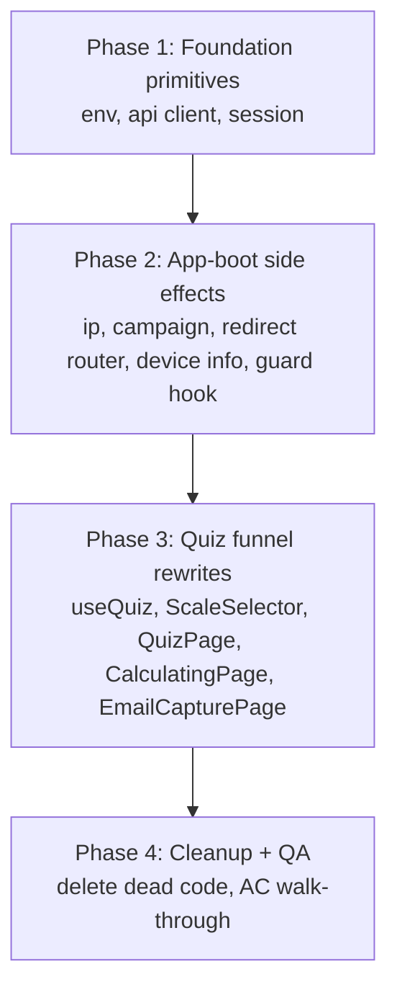
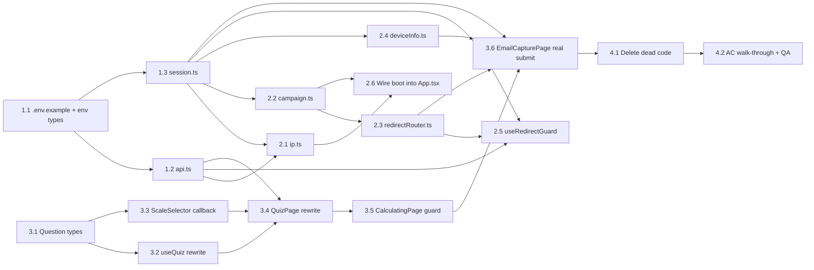

# Work Plan: Module 1 — Load Questions

Created Date: 2026-04-22
Type: feature
Estimated Duration: 3–4 days (solo)
Estimated Impact: ~17 files (8 new, 9 modified, 2 deleted)
Module: 1 of 5 (first-half funnel + cross-cutting foundation)

## Related Documents
- PRD (design of record): [`docs/prd/module-1-load-questions.md`](../prd/module-1-load-questions.md)
- Parent scope: [`docs/scope.md`](../scope.md)
- Backend contract: [`docs/Frontend API List.postman_collection.json`](../Frontend%20API%20List.postman_collection.json)
- Codebase conventions: [`typestest/CLAUDE.md`](../../typestest/CLAUDE.md)

> There is no separate Design Doc for Module 1. The PRD's §4 (foundation architecture), §5 (data flow), §6 (per-page specs), §7 (code changes table), and §8 (acceptance criteria) serve as the technical spec. Any ambiguity discovered during implementation is logged under "Open items" below rather than resolved by guessing.

## Objective

Wire the first half of the funnel (Intro → Instructions → Quiz → Calculating → Email) to the live backend, and deliver the cross-cutting foundation (HTTP client, session, env, IP, campaign params, redirect router, resume-guard skeleton, device info) that every subsequent module depends on. At the end of this module, a fresh user can complete the pre-payment funnel and land on `/checkout?qid=…` with a server-issued session.

## Background

- Funnel today is fully stubbed: `setTimeout + navigate`, local questions, client-side MBTI scoring.
- Backend is already in production; the frontend adapts to it with no backend changes.
- React Query, React Router, shadcn/ui, Vitest, Playwright are already installed — **Module 1 adds no new dependencies.**
- `localStorage['user_gender']` on InstructionsPage is retained (PRD §6.2).

## Implementation Strategy

**Approach: Foundation-first, then vertical slice through the pre-payment funnel.**

Rationale:
- The funnel pages cannot be wired until the HTTP client, session, and redirect router exist.
- Each foundation piece is independently unit-testable and leaves the tree building on its own commit.
- Page rewrites are ordered by route progression so each page can be smoke-tested against the real backend as soon as its upstream dependencies land.

Verification levels used (from `implementation-approach` skill):
- **L3 (build)** on every commit: `npm run build` + `npm run lint` + `npx tsc --noEmit`.
- **L2 (unit tests)** for pure utilities and the resume guard hook.
- **L1 (manual smoke)** at the end of Phase 3 and Phase 4 (real backend traffic via DevTools Network).

## Risks and Countermeasures

### Technical Risks

- **Risk**: `answer` field shape (PRD Assumption A1). PRD says option `id`; if backend wants position, submit will 4xx.
  - **Impact**: Submit fails for every user.
  - **Countermeasure**: Isolate the mapping in `useQuiz` (single line). Verify with one real submit before declaring Phase 3 done. Flip mapping in one file if wrong.
- **Risk**: `ipify.org` blocked on corporate networks (A2).
  - **Impact**: Blocking error toast on app boot; user cannot proceed.
  - **Countermeasure**: PRD §10 explicitly accepts blocking behavior for v1. Deferred — revisit if it causes pain.
- **Risk**: Backend returns non-Likert items (A3).
  - **Impact**: Filter drops them; may end up with fewer than 60 items.
  - **Countermeasure**: `console.warn` on drop; quiz still proceeds with whatever passes filter. No code fallback.
- **Risk**: Unknown `redirect_page` enum values (A4).
  - **Impact**: User routed to `/checkout` instead of the intended destination.
  - **Countermeasure**: `resolveRedirect` logs a warn + safe default. One-file fix when real values are observed.
- **Risk**: `useRedirectGuard` built without a consumer in Module 1 — regressions invisible until Module 2.
  - **Impact**: Hook could ship broken.
  - **Countermeasure**: Unit tests cover all four branches (no qid, success, mismatched `redirect_page`, API failure). No production code path exercises it yet — that is intentional per PRD §4.7.

### Schedule Risks

- **Risk**: Real backend not reachable during dev (CORS, bearer token drift, `x-host` mismatch).
  - **Impact**: Cannot finish Phase 3 smoke test.
  - **Countermeasure**: Confirm credentials and network reachability during Phase 1 Task 1.1 (before writing anything else).

## Phase Structure

## Task Dependency Diagram

Each task leaves the tree building. Foundation (Phase 1) commits first, side effects (Phase 2) before they're consumed, then pages in funnel order (Phase 3), then deletions (Phase 4 — safe only once nothing imports the dead modules).

---

## Phase 1: Foundation primitives (3 commits)

**Purpose**: Ship the bottom of the dependency stack — env vars, HTTP client, session accessor. Nothing in the app consumes these yet, so each commit is isolated.

**Closes ACs**: foundation for 1, 3, 4, 5, 10, 11, 12, 13, 14. No AC fully verifiable in this phase.

### Task 1.1 — `.env.example` + env var typing

- **Purpose**: Declare the env contract the rest of the module depends on.
- **Files touched**:
  - `typestest/.env.example` (new) — commit with placeholder values from PRD §4.1.
  - `typestest/src/vite-env.d.ts` (modify) — add `VITE_API_BASE_URL`, `VITE_API_TOKEN`, `VITE_X_HOST` to `ImportMetaEnv`.
  - `typestest/.gitignore` (verify) — confirm `.env` (without `.example`) is ignored.
- **Acceptance**:
  - `.env.example` exists at repo level expected by Vite, contains the three keys from PRD §4.1 verbatim.
  - `import.meta.env.VITE_API_BASE_URL` etc. typecheck as `string` without `as` casts.
  - Real `.env` created locally (not committed) with actual token — dev server boots without import errors.
- **Verification**: `npx tsc --noEmit`; `npm run build` succeeds; `npm run dev` starts.
- **Dependency**: Confirm reachable bearer token and `x-host` value with user before committing.

### Task 1.2 — HTTP client `src/lib/api.ts`

- **Purpose**: Thin fetch wrapper per PRD §4.2.
- **Files touched**:
  - `typestest/src/lib/api.ts` (new)
  - `typestest/src/lib/api.test.ts` (new) — unit tests with `vi.fn()` stub of `fetch`.
- **Behavior requirements** (PRD §4.2):
  - Base URL prefix; injects `Authorization: Bearer …`, `x-host`, `ip_address` (read from session), `Content-Type: application/json`.
  - Unwraps `{ meta, data }` → returns `data`.
  - On `meta.success === false`, throws `ApiError(meta.message, meta.status)`.
  - On network failure, throws `NetworkError`.
  - Exports `apiGet<T>`, `apiPost<T>`, `apiPut<T>`.
  - No retries.
- **Acceptance**:
  - Unit tests cover: header injection, envelope unwrap, `meta.success=false` → `ApiError`, network failure → `NetworkError`, empty `ip_address` still sends the header.
  - No import of session into `api.ts` creates a cycle (session imports are one-way).
- **Verification**: `npx vitest run src/lib/api.test.ts`; `npm run lint`.

### Task 1.3 — Session accessor `src/lib/session.ts`

- **Purpose**: Typed accessor over `sessionStorage` key `testiq.session` per PRD §4.3.
- **Files touched**:
  - `typestest/src/lib/session.ts` (new)
  - `typestest/src/lib/session.test.ts` (new)
- **Shape** (PRD §4.3): `qidRaw`, `qidEncrypted`, `email`, `gender`, `ipAddress`, `pricingInfo`, `prcId`, `mdid`, `landingUrl`, `landingTime`. All optional.
- **API**: `getSession()`, `patchSession(partial)`, `clearSession()`.
- **Acceptance**:
  - `patchSession` merges shallowly; does not clobber unspecified fields.
  - `getSession` returns `{}` when key absent; never throws.
  - Invalid JSON in storage → returns `{}` (do not throw; do not silently overwrite — log warn and return empty).
  - `localStorage['user_gender']` is NOT touched by this module (PRD §4.3 explicitly preserves it).
- **Verification**: unit tests; `npx tsc --noEmit`.

### Phase 1 Completion Criteria
- [ ] `.env.example` committed; real `.env` present locally and ignored.
- [ ] `api.ts` + tests green; `session.ts` + tests green.
- [ ] `npm run build` succeeds; `npm run lint` clean.
- [ ] No other source file imports these modules yet (isolation check: `grep -r "lib/api" src` returns only the new files).

### Phase 1 Operational Verification
1. `npm run dev` starts without env errors.
2. Open a scratch component (or the Vitest runner) and call `apiGet('questions?variant_type=&tag=')`. DevTools Network shows the request with all three custom headers. Do not commit this scratch code.

---

## Phase 2: App-boot side effects + hook skeletons (6 commits)

**Purpose**: Deliver every side-effectful foundation piece that runs before any page needs it, and the resume-guard hook (unmounted but unit-tested).

**Closes ACs**: sets up 3, 4, 5, 10, 11, 12, 13, 14. AC 3/4/5/12 become verifiable once App.tsx is wired (Task 2.6).

### Task 2.1 — IP resolution `src/lib/ip.ts`

- **Purpose**: One-shot ipify fetch per PRD §4.4.
- **Files touched**:
  - `typestest/src/lib/ip.ts` (new)
  - `typestest/src/lib/ip.test.ts` (new)
- **Behavior**:
  - `resolveIp()`: if `getSession().ipAddress` set, no-op.
  - Otherwise `fetch('https://api.ipify.org?format=json')` → `{ ip }` → `patchSession({ ipAddress: ip })`.
  - On failure: leave session empty, return a typed result indicating failure so the caller (App.tsx) can decide to toast. **Do not swallow the error silently** (fail-fast per `ai-development-guide`).
- **Acceptance**: tests cover cached path, success path, failure path.
- **Verification**: `npx vitest run src/lib/ip.test.ts`.

### Task 2.2 — Campaign param capture `src/lib/campaign.ts`

- **Purpose**: Capture `prc_id` / `mdid` on first paint per PRD §4.5.
- **Files touched**:
  - `typestest/src/lib/campaign.ts` (new)
  - `typestest/src/lib/campaign.test.ts` (new)
- **Behavior** (PRD §4.5):
  - Read `prc_id` and `mdid` from `window.location.search`.
  - If both present: keep `mdid`, drop `prc_id`, `console.warn`.
  - If either present and session empty for that field: write to session.
  - Also captures `landingUrl = window.location.href` and `landingTime = Date.now()` if not already set (PRD §6.1).
  - `window.history.replaceState({}, '', window.location.pathname)` to strip query.
- **Acceptance**: tests cover all four combinations (none / prc_id only / mdid only / both), verify history.replaceState called, verify landing captured only once.
- **Verification**: unit tests.
- **Closes**: AC 3 (prc_id), AC 4 (mdid), AC 5 (both present → warn).

### Task 2.3 — Redirect router `src/lib/redirectRouter.ts`

- **Purpose**: Enum → route map per PRD §4.6.
- **Files touched**:
  - `typestest/src/lib/redirectRouter.ts` (new)
  - `typestest/src/lib/redirectRouter.test.ts` (new)
- **Behavior**: `REDIRECT_TO_ROUTE` record (PRD §4.6); `resolveRedirect(page?)` returns mapped route or `/checkout` default with `console.warn` on unknown.
- **Acceptance**: tests cover every mapped enum, `undefined`, `''`, and an unknown string (verifies warn called).
- **Verification**: unit tests.
- **Closes**: AC 10 (INITIAL_PAYMENT_PAGE → /checkout), AC 11 (unknown → /checkout with warn).

### Task 2.4 — Device info `src/lib/deviceInfo.ts`

- **Purpose**: UA heuristic per PRD §4.8.
- **Files touched**:
  - `typestest/src/lib/deviceInfo.ts` (new)
  - `typestest/src/lib/deviceInfo.test.ts` (new)
- **Behavior**: Returns `{ user_device, user_os, user_browser }` via the exact regex rules in PRD §4.8. No new dependency (no `ua-parser-js`).
- **Acceptance**: tests cover at minimum one mobile/desktop pair, Windows/Mac/iOS samples, Edge/Chrome/Firefox/Safari UAs.
- **Verification**: unit tests.
- **Closes**: AC 14 (user_device_info reflects browser).

### Task 2.5 — Resume guard `src/hooks/useRedirectGuard.ts`

- **Purpose**: Build and unit-test the hook; **do not mount it anywhere** (PRD §4.7 explicit).
- **Files touched**:
  - `typestest/src/hooks/useRedirectGuard.ts` (new)
  - `typestest/src/hooks/useRedirectGuard.test.tsx` (new) — `@testing-library/react` with `MemoryRouter`.
- **Behavior**: Verbatim from PRD §4.7. Uses `apiPost` and `getSession`/`patchSession`.
- **Request body assumption (A5)**: Use `getSession().qidRaw ?? encryptedQid` — matches PRD code block.
- **Acceptance**: tests cover four branches — no qid in URL or session, success with matching route, success with mismatched route (navigates), api failure (navigates to `/`).
- **Verification**: `npx vitest run src/hooks/useRedirectGuard.test.tsx`.
- **Note**: No consumer exists in Module 1. This is the hook's only gate until CheckoutPage in Module 2.

### Task 2.6 — Wire boot side effects into `App.tsx`

- **Purpose**: Run `resolveIp()` + `captureCampaignParams()` on app boot per PRD §5.
- **Files touched**:
  - `typestest/src/App.tsx` (modify)
- **Behavior**:
  - Add a top-level `useEffect` (or a dedicated `<AppBoot />` component mounted inside `BrowserRouter`) that calls `captureCampaignParams()` synchronously first, then awaits `resolveIp()`.
  - Campaign capture must run before the user can click "Start Test" — synchronous is fine.
  - On ipify failure, surface a blocking toast per PRD §4.4: `"Could not start the test. Please refresh."` using the existing `sonner` toaster.
- **Acceptance**:
  - Loading a URL with `?prc_id=ABC` writes `prcId: "ABC"` to session and the URL is clean in the address bar immediately.
  - Loading a URL with both params writes only `mdid`, emits console.warn.
  - DevTools Network shows an ipify request on first load; on a refresh, ipify is skipped (cached in session).
  - If ipify is blocked (simulate via DevTools network-throttling offline on the first request), a toast appears.
- **Verification**:
  - `npm run build` succeeds; `npm run lint` clean; `npm run dev` boots.
  - Manual smoke: load `/?prc_id=foo`, check sessionStorage, check address bar, check Network tab.
- **Closes**: AC 3, AC 4, AC 5 (end-to-end capture path verifiable).

### Phase 2 Completion Criteria
- [ ] All five lib modules committed with passing unit tests.
- [ ] `useRedirectGuard` committed with passing unit tests, zero consumers in source.
- [ ] App.tsx wires boot side effects and toasts on ipify failure.
- [ ] AC 3/4/5 manually verified via DevTools.
- [ ] `npm run lint` and `npx tsc --noEmit` clean.

### Phase 2 Operational Verification
1. `npm run dev`. Visit `/?prc_id=ABC`. Session has `prcId: "ABC"`, URL is `/`.
2. Open a new tab, visit `/?mdid=50&prc_id=XYZ`. Session has `mdid: "50"`, no `prcId`. Console shows warn.
3. Visit `/` with DevTools Network blocking `api.ipify.org`. Toast appears.
4. Reload. No second ipify request (session cached).

---

## Phase 3: Quiz funnel rewrites (6 commits)

**Purpose**: Replace stubs with real API calls. Each page commit lands after its predecessors' contracts are stable.

**Closes ACs**: 1, 2, 6, 7, 8, 9, 10, 12, 13, 14.

### Task 3.1 — Question & submit types `src/lib/types.ts` (or inline in `api` callers)

- **Purpose**: Define the response shapes for `GET /questions` and `POST /questions/submit` in one place, so `useQuiz` and `EmailCapturePage` share them.
- **Files touched**:
  - `typestest/src/lib/apiTypes.ts` (new) — keep narrow; only Module 1 shapes.
- **Shape** (from PRD §6.3 and §6.5, plus Postman collection):
  - `ApiQuestion { id: string; question_type_id: number; text: string; options: Array<{ id: string; text: string; weight: number }>; ... }` — keep extra fields as `unknown` / index signature so we don't over-constrain.
  - `QuizSubmitResponse { quiz_result_id: number; encrypted_quiz_result_id: string; email?: string; pricing_info?: PricingInfo; redirect_page?: string; ... }`.
  - `PricingInfo` — minimal shape needed by Module 1 (just enough to store). Revisit in Module 2.
- **Acceptance**: types compile; no `any` leaks out.
- **Verification**: `npx tsc --noEmit`.

### Task 3.2 — Rewrite `src/hooks/useQuiz.ts`

- **Purpose**: Strip scoring, hold raw answers + timing per PRD §6.3 and §7.
- **Files touched**:
  - `typestest/src/hooks/useQuiz.ts` (rewrite)
  - `typestest/src/hooks/useQuiz.test.ts` (new — the hook doesn't have tests today; this is in scope because the PRD §7 labels it "rewritten").
- **New behavior**:
  - Accepts the filtered, shuffled, sliced question list as a parameter (no more importing `questions.ts`).
  - Exposes `currentQuestion`, `questionIndex`, `totalQuestions`, `answers` (array of `{ id, answer }`), `isComplete`, `startTime`, `endTime`, `answer(positionIndex: number)`, `reset()`.
  - `answer(positionIndex)` maps `position → options[positionIndex].id` and pushes to `answers`. If this is the first answer, stamps `startTime = Date.now()`. If it is the last, stamps `endTime = Date.now()` and sets `isComplete = true`.
  - No scoring, no `Scores`, no `applyAnswer`.
- **Acceptance**:
  - Unit tests cover: initial state, answer advancement, final-answer completion, startTime stamped on first answer (not on mount — PRD §6.3 says "first question paint", but practical stamp point is first-answer-click since mount time is before any interaction; flag in Open items).
  - **Open item flagged**: PRD §6.3 says "On first question paint, record `startTime = Date.now()`". First-paint vs. first-answer differ by seconds-to-minutes. Pick one and document in the task.
- **Verification**: unit tests; `npx tsc --noEmit`.

### Task 3.3 — `ScaleSelector` callback signature

- **Purpose**: Change `onSelect` from `(weight: number)` to `(positionIndex: number)` per PRD §6.3 and §7.
- **Files touched**:
  - `typestest/src/components/ScaleSelector.tsx` (modify)
- **Behavior**:
  - Options array keeps its labels and colors (visual identical).
  - Internal `weight` field removed or renamed; `onSelect` called with `0..4` corresponding to Strongly Agree → Strongly Disagree (same vertical order as today).
  - The position-index meaning (0 = first option rendered) must match what `useQuiz` expects from `options[positionIndex].id`. Backend question options are assumed to arrive in the same vertical order the UI renders them — **flag in Open items** and verify with one real request before Phase 3 closes.
- **Acceptance**: typecheck; visual regression check (UI unchanged). No unit test required if the component has none today and the change is purely a callback type swap.
- **Verification**: `npx tsc --noEmit`; manual smoke on `/quiz`.

### Task 3.4 — Rewrite `src/pages/QuizPage.tsx`

- **Purpose**: Fetch questions from `GET /questions`, filter, shuffle, take 60, drive the new `useQuiz`, navigate to `/calculating` with the answers state per PRD §6.3.
- **Files touched**:
  - `typestest/src/pages/QuizPage.tsx` (rewrite the data-loading parts; keep the existing visual layout)
- **Behavior**:
  - `useQuery({ queryKey: ['questions'], queryFn: () => apiGet<ApiQuestion[]>('questions?variant_type=&tag=') })`.
  - On success: filter to `question_type_id === 6 && options.length === 5 && options.every(o => typeof o.text === 'string' && typeof o.weight === 'number')`. Drop invalid with `console.warn`. Fisher–Yates shuffle. Slice to 60 (or fewer with `console.warn` if pool smaller).
  - Memoize the filtered list so it's stable across re-renders (avoid reshuffling every render).
  - Pass the list into `useQuiz`.
  - Loading state: full-screen spinner with "Loading your questions…" copy (PRD §6.3).
  - Error state: full-page error card with Retry button (calls `refetch`). No fallback to local questions.
  - Empty state: "This test isn't available right now" + Try Again button.
  - On `isComplete`: `navigate('/calculating', { state: { answers, startTime, endTime } })`. Remove the `persistResult(scores)` call (scoring is dead).
- **Acceptance**:
  - Manual: loading state visible during fetch; killing network shows error card; retry works.
  - Manual: two consecutive runs present questions in different orders (AC 2).
  - Console warns about dropped items if the backend returns any.
  - No import of `@/utils/questions` or `@/utils/scoring` remains.
- **Verification**: `npm run build`; manual smoke against live backend.
- **Closes**: AC 2, AC 7.

### Task 3.5 — `CalculatingPage` state guard

- **Purpose**: Swap the `scores`-based guard to `answers`-based per PRD §6.4 and §7.
- **Files touched**:
  - `typestest/src/pages/CalculatingPage.tsx` (modify)
- **Behavior**:
  - Route state typed as `{ answers: Array<{id, answer}>; startTime: number; endTime: number }`.
  - If `answers` missing → `navigate('/', { replace: true })`.
  - Pass the full state object through to `/email` on timeout.
  - Remove the `Scores` import and the `allLetters` MBTI simulation only if it's purely cosmetic (it currently drives the animated letter display). **Decision**: retain the `allLetters` cycling animation for visuals — it doesn't depend on real scoring, it just flickers letters. Only the guard and state-passthrough change.
- **Acceptance**:
  - Direct navigation to `/calculating` (no state) bounces to `/`.
  - End-to-end: quiz → calculating (8s) → email — the state object reaches EmailCapturePage with `answers`, `startTime`, `endTime`.
- **Verification**: manual smoke.

### Task 3.6 — `EmailCapturePage` real submit

- **Purpose**: Replace the `setTimeout` stub with `POST /questions/submit` + session write + server-driven redirect per PRD §6.5.
- **Files touched**:
  - `typestest/src/pages/EmailCapturePage.tsx` (modify)
- **Behavior** (PRD §6.5 request body):
  - Entry guard: missing `answers` → `navigate('/')`.
  - On submit: build body exactly as PRD §6.5 specifies (`email`, `variant_type: ''`, `quiz_data: answers`, `start_time`, `end_time`, `prc_id` from session, `pricing_discount: session.mdid ? { mdid } : { mdid: '' }`, `user_device_info: getDeviceInfo()`, `landing_url_detail: { landing_url: session.landingUrl ?? window.location.origin + '/', landing_time: session.landingTime ?? null }`, `geo_data: { city: '', region: '' }`).
  - `await apiPost<QuizSubmitResponse>('questions/submit', body)`.
  - On success: `patchSession({ qidRaw: res.quiz_result_id, qidEncrypted: res.encrypted_quiz_result_id, email, pricingInfo: res.pricing_info })` and `navigate(\`${resolveRedirect(res.redirect_page)}?qid=${res.encrypted_quiz_result_id}\`, { replace: true })`.
  - On `ApiError`: toast `meta.message`, keep user on page, restore button from loading.
  - On `NetworkError` / 5xx: toast `"Something went wrong. Please try again."`, keep email populated.
  - HTML5 `required` + `type="email"` already present — trust client-side validation (AC 9).
- **Acceptance**:
  - Happy path: real submit returns and user lands on `/checkout?qid=<encrypted>`. Session populated (AC 1, AC 10).
  - Network failure: toast shown, email still in input (AC 8).
  - Empty email: form doesn't submit (AC 9).
  - Network tab shows `Authorization`, `x-host`, `ip_address` headers on the submit request (AC 12).
  - Refresh on `/email` after a successful submit: PRD §8 AC 13 says session survives refresh but Module 1 does not yet route based on it — manually check sessionStorage contents after refresh.
  - `user_device_info` in the request body matches current browser when UA is swapped in DevTools (AC 14).
- **Verification**: `npm run build`; full funnel smoke with real backend; DevTools Network inspection.
- **Closes**: AC 1, AC 6 (timing values visible in request body), AC 8, AC 9, AC 10, AC 12, AC 13, AC 14.

### Phase 3 Completion Criteria
- [ ] All six tasks committed, each leaving the tree building.
- [ ] `npm run dev` — full funnel walks from `/` to `/checkout?qid=…` against the real backend at least once.
- [ ] Manual AC walk-through for 1, 2, 6, 7, 8, 9, 10, 12, 13, 14 passes.
- [ ] `npm run lint` clean; `npx tsc --noEmit` clean.

### Phase 3 Operational Verification
1. Fresh incognito, visit `/`. Click Start. Pick gender. Answer 60 questions. Enter email. Land on `/checkout?qid=<encrypted>` (AC 1).
2. Take the test a second time in the same session → ordering differs (AC 2).
3. DevTools Network: submit request body contains plausible `start_time`/`end_time` (AC 6), `prc_id`/`pricing_discount` correctly populated from campaign params (AC 3/4), headers present (AC 12).
4. Block `/questions` → error card, retry button works, no local questions shown (AC 7).
5. Block `/questions/submit` → toast, email retained (AC 8).
6. Empty email → browser blocks submit (AC 9).
7. Refresh `/email` after submit → `sessionStorage['testiq.session']` still has `qidRaw`, `qidEncrypted`, `email`, `pricingInfo` (AC 13).
8. Swap UA in DevTools device mode to an iPhone, take the test, check submit body shows `user_device: 'Mobile'`, `user_os: 'iOS'` (AC 14).

---

## Phase 4: Cleanup + Quality Assurance (2 commits)

**Purpose**: Delete the dead scoring/questions code and complete the AC sweep. This phase is intentionally last — deletions must follow all consumer rewrites per `ai-development-guide` impact-analysis rules.

### Task 4.1 — Delete dead code

- **Purpose**: PRD §7 mandates deletion of the local questions module and the unused scoring helpers.
- **Files touched**:
  - `typestest/src/utils/questions.ts` — **delete the file**.
  - `typestest/src/utils/scoring.ts` — delete `applyAnswer`, `calculateType`, `calculatePercentages`, `opposites`, `Scores`, `initialScores`. **Keep** `TraitPercentage` type if any file still imports it (revisit in Module 5 per PRD §7).
  - `typestest/src/utils/mbtiResult.ts` — audit: `persistResult(scores)` was called from QuizPage. After Phase 3, nothing imports it. Delete the function (or the whole file if nothing else is in it). Flag in Open items if it's non-trivial.
  - `typestest/src/hooks/useResults.ts` — **do not touch** (PRD §7 explicitly leaves it for Module 5).
- **Pre-delete impact analysis** (required by `ai-development-guide`):
  1. `grep -r "from '@/utils/questions'" typestest/src` → expected zero hits.
  2. `grep -r "from '@/utils/scoring'" typestest/src` → expect only `TraitPercentage` imports (if any) and the `useResults.ts` file which we're leaving alone. If `useResults` still imports `Scores`/`calculateType`, the deletion will break the build — reconcile before committing by either (a) leaving those symbols in place for Module 5 or (b) stubbing them. PRD §7 explicitly leaves `useResults` untouched, so option (a) — keep only what `useResults` needs, delete the rest.
- **Acceptance**:
  - `npm run build` succeeds.
  - `npm run lint` clean.
  - `grep -r "applyAnswer\|calculateType\|calculatePercentages\|initialScores" typestest/src` returns zero hits.
  - `typestest/src/utils/questions.ts` no longer exists.
- **Verification**: build + lint + typecheck.

### Task 4.2 — AC walk-through + final QA sweep

- **Purpose**: Close the Module 1 acceptance contract (PRD §8).
- **Files touched**: none (verification-only).
- **Checklist** (one row per PRD §8 AC):

  | AC | How verified | Closed by |
  |---|---|---|
  | 1 Happy path → `/checkout?qid=…` | Manual funnel run | Task 3.6 |
  | 2 Different order on second run | Manual | Task 3.4 |
  | 3 `prc_id` in URL → body | DevTools Network | Tasks 2.2 + 3.6 |
  | 4 `mdid` in URL → body | DevTools Network | Tasks 2.2 + 3.6 |
  | 5 Both → `mdid` wins + warn | Manual + console | Task 2.2 |
  | 6 `start_time`/`end_time` bracket the quiz | DevTools Network | Task 3.2 |
  | 7 `/questions` failure → retry card | Block in DevTools | Task 3.4 |
  | 8 `/questions/submit` failure → toast, email retained | Block in DevTools | Task 3.6 |
  | 9 Empty email blocked | Manual | Task 3.6 |
  | 10 `INITIAL_PAYMENT_PAGE` → `/checkout` | Manual | Tasks 2.3 + 3.6 |
  | 11 Unknown `redirect_page` → `/checkout` + warn | Unit test + manual if observable | Task 2.3 |
  | 12 `Authorization`, `x-host`, `ip_address` headers on every request | DevTools Network | Task 1.2 |
  | 13 Session survives refresh on `/email` | sessionStorage inspection after refresh | Task 1.3 + 3.6 |
  | 14 `user_device_info` reflects current browser | DevTools device-mode swap | Tasks 2.4 + 3.6 |

- **Quality gate**:
  - `npm run lint` → zero errors.
  - `npx tsc --noEmit` → zero errors.
  - `npm run test` → all tests pass.
  - `npm run build` → succeeds.
- **Acceptance**: All 14 ACs visibly checked; all four quality gates green.

### Phase 4 Completion Criteria
- [x] Dead code deleted; build green.
- [ ] All 14 PRD §8 ACs manually verified.
- [ ] Open items list (below) refreshed with anything found during QA.
- [ ] User review approval obtained.

---

## Dependencies Summary

**No new dependencies are added in Module 1.** Every library needed (React Query, React Router, Sonner, Vitest, React Testing Library) is already in `typestest/package.json`. If any task appears to require a new package, stop and reconsider — the PRD explicitly calls for no new deps.

## AC-to-Task Traceability

- AC 1 → Tasks 3.2, 3.4, 3.5, 3.6
- AC 2 → Task 3.4 (shuffle)
- AC 3 → Tasks 2.2, 3.6
- AC 4 → Tasks 2.2, 3.6
- AC 5 → Task 2.2
- AC 6 → Task 3.2
- AC 7 → Task 3.4
- AC 8 → Task 3.6
- AC 9 → Task 3.6 (existing HTML5 validation)
- AC 10 → Tasks 2.3, 3.6
- AC 11 → Task 2.3
- AC 12 → Task 1.2 (headers), verified in 3.6
- AC 13 → Tasks 1.3, 3.6
- AC 14 → Tasks 2.4, 3.6

## Open Items (flagged, not decided)

These are points where the PRD is ambiguous, silent, or marked "open" and the plan deliberately does not guess. Resolve with the user as they come up; don't let them block phase progression.

1. **`startTime` stamping point (PRD §6.3).** PRD says "On first question paint" but practically Phase 3 stamps it on first answer click. Decide: first-paint (more accurate to PRD wording) vs. first-click (simpler). Default to first-paint to match PRD, but flag if timing values look off in AC 6 verification.
2. **ScaleSelector position ordering (PRD §6.3).** PRD maps position 0..4 to the option at that index in the backend's `options` array. The UI currently renders options in a fixed Strongly-Agree-first vertical order. Assumption: the backend returns options in the same order the UI wants to display them. Verify with one real `/questions` response during Phase 3 Task 3.4.
3. **`mbtiResult.ts` cleanup.** Not listed in PRD §7's deletion table. Currently only referenced from `QuizPage.persistResult(scores)` which Task 3.4 removes. Audit during Task 4.1; keep or delete based on remaining references.
4. **`useResults` / `scoring.ts` co-dependency.** PRD §7 says to keep `TraitPercentage` "if still consumed by PremiumReportPage" and leaves `useResults.ts` alone. If `useResults` imports `Scores` or `calculateType`, the deletion list in Task 4.1 must be trimmed. Exact list finalized during impact analysis in Task 4.1.
5. **ipify blocking behavior (PRD §10).** Module 1 picks blocking; revisit if QA finds it too aggressive on real networks.
6. **`redirect_page` enum values beyond `INITIAL_PAYMENT_PAGE` (PRD §10).** Backfill the map in Module 2 when real responses arrive for cross-sell / details / results flows. No action in Module 1.
7. **`/questions/results` body shape — encrypted vs. raw id (PRD §10 / A5).** `useRedirectGuard` uses `getSession().qidRaw ?? encryptedQid`. No consumer in Module 1 so not verifiable here. Watch in Module 2.
8. **Error toast copy (PRD §10).** Using placeholder strings ("Something went wrong. Please try again.") per PRD. Final copy revisited later.

## Notes

- The PRD's §9 section is labeled "Risks & assumptions" and §8 contains the 14-item acceptance criteria. The user's brief says "§9 acceptance criteria are 14 items" — the AC numbers in this plan reference §8, which is the actual location; the count (14) matches.
- This plan is task-decomposer friendly: each task is a single-commit unit with explicit files, acceptance, and verification. Phases exist to group verification gates; the decomposer can flatten phases into a linear task list if preferred.
- No backend changes in this module (scope §1).
- `.gitignore` already excludes work plans per the documentation-criteria skill — this file may live untracked in `docs/plans/` locally.

## Progress Tracking

### Phase 1
- Start: _TBD_
- Complete: _TBD_
- Notes:
  - 2026-04-22: Task 1.2 complete — `src/lib/api.ts` + `src/lib/api.test.ts` landed; 7/7 tests green; `npx tsc --noEmit` clean; no new lint errors on touched files. Added minimal `src/lib/session.ts` stub (interface + `getSession` returning `{}`) to unblock the `./session` import; Task 1.3 will replace the stub wholesale with the real sessionStorage-backed accessor.
  - 2026-04-22: Task 1.3 complete — `src/lib/session.ts` stub replaced with full `FunnelSession` typed accessor (`getSession`/`patchSession`/`clearSession`) over `sessionStorage` key `testiq.session`. `src/lib/session.test.ts` added; 6/6 tests green. `api.test.ts` still 7/7 (it mocks `./session`, contract unchanged). `npx tsc --noEmit` clean. `localStorage` not read or written. `pricingInfo` left as `unknown` per PRD — Module 2 will narrow.

### Phase 2
- Start: _TBD_
- Complete: _TBD_
- Notes:

### Phase 3
- Start: _TBD_
- Complete: _TBD_
- Notes:

### Phase 4
- Start: _TBD_
- Complete: _TBD_
- Notes:
