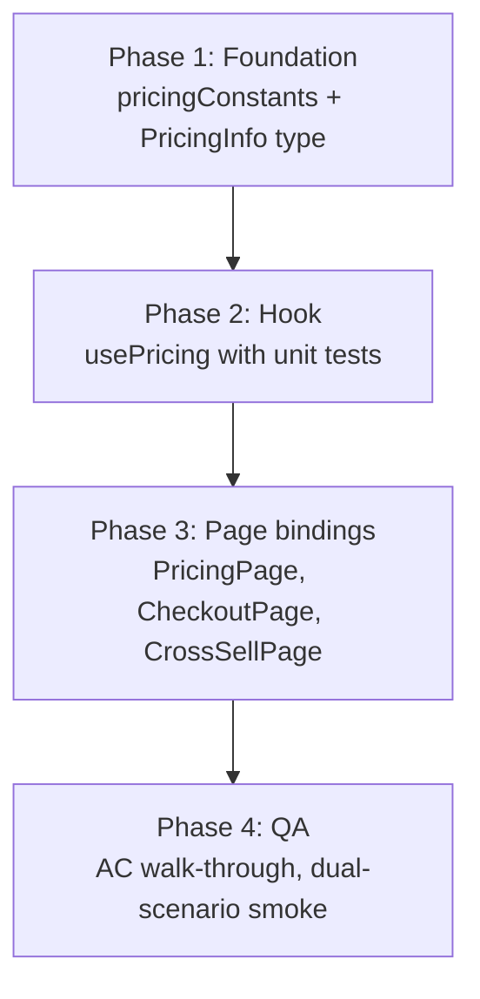
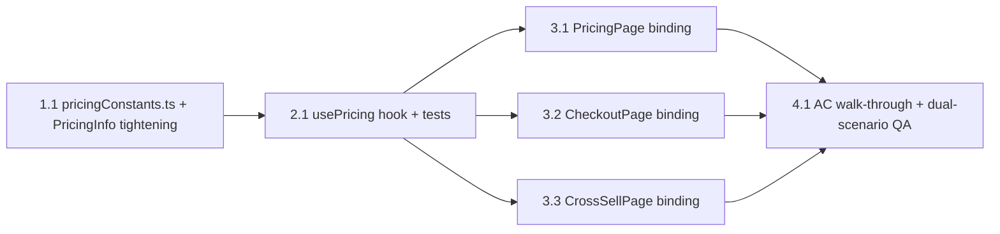

# Work Plan: Module 2 — Pricing Display

Created Date: 2026-04-22
Type: feature
Estimated Duration: 1–2 days (solo)
Estimated Impact: ~6 files (2 new, 4 modified)
Module: 2 of 5 (pricing display across PricingPage, CheckoutPage, CrossSellPage)

## Related Documents
- PRD (design of record): [`docs/prd/module-2-pricing-display.md`](../prd/module-2-pricing-display.md)
- Module 1 PRD (foundation already shipped): [`docs/prd/module-1-load-questions.md`](../prd/module-1-load-questions.md)
- Parent scope: [`docs/scope.md`](../scope.md)
- Backend contract: [`docs/Frontend API List.postman_collection.json`](../Frontend%20API%20List.postman_collection.json) — `POST /price`
- Codebase conventions: [`typestest/CLAUDE.md`](../../typestest/CLAUDE.md)

> There is no separate Design Doc for Module 2. The PRD's §4 (architecture), §5 (data flow), §6 (per-page specs), §7 (code-changes table), §8 (12 acceptance criteria), and §11 (high-level work plan) serve as the technical spec. Any ambiguity discovered during implementation is logged under "Open items" below rather than resolved by guessing.

## Objective

Replace every hardcoded price string on PricingPage, CheckoutPage, and CrossSellPage with dynamic values sourced from a single `usePricing()` hook. Pricing must remain stable for the entire session, respect `prc_id` / `mdid` campaign params captured in Module 1, and render a real strikethrough + savings badge on CheckoutPage only when a promo is actually discounted against base list price.

## Background

- Module 1 shipped the cross-cutting foundation: `apiPost`, `FunnelSession` (with `pricingInfo: unknown` placeholder), `captureCampaignParams`, `useRedirectGuard` (mounted on Checkout / CrossSell / Details / Results — the guard already refreshes `session.pricingInfo` from `POST /questions/results` on every post-submit page mount).
- `@tanstack/react-query` is already installed and a `QueryClientProvider` is mounted at `src/App.tsx`.
- **No new npm dependency** is added in Module 2. No backend changes.
- PRD §4.3 explicitly skips `POST /price/after/submit` — the `session.pricingInfo` refreshed by the Module 1 resume guard is sufficient post-submit.
- `src/utils/scoring.ts` remains untouched (prior decision, unchanged for Module 2).

## Implementation Strategy

**Approach: Foundation constants + typed contract first, then the single hook, then pages in dependency order (Pricing → Checkout → CrossSell).**

Rationale:
- The hook cannot be written until `PricingInfo` is a real type (today it's `unknown`). Tightening `apiTypes.PricingInfo` is a one-commit prerequisite.
- `pricingConstants.ts` is a trivial leaf module with no imports; committing it alongside the type tightening keeps the foundation phase to one commit.
- `usePricing()` is the single consumer abstraction every page will pull from — land it with unit tests before any page refactor so each page commit reduces to a bind-and-render diff.
- Page order (Pricing → Checkout → CrossSell) matches the funnel, but the three pages do not depend on each other at compile time. They could ship in any order once the hook lands; the plan lists them funnel-forward for reviewer clarity.

Verification levels used (from `implementation-approach` skill):
- **L3 (build)** on every commit: `npm run build` + `npm run lint` + `npx tsc --noEmit`.
- **L2 (unit tests)** for `usePricing()` — covers post-submit branch, pre-submit base-only branch, pre-submit base+promo with and without a real discount, and the `mdid`-wins-over-`prcId` defensive path. No unit tests required for the page bindings (visual/manual).
- **L1 (manual smoke)** at the end of Phase 3 against the real backend, in both organic (no promo) and campaign (`?mdid=50`) scenarios.

## Risks and Countermeasures

### Technical Risks

- **Risk**: `POST /price` response shape beyond the `{ meta, data }` envelope. PRD §4.2 defines the `PricingShape` fields but the Postman collection doesn't document whether `data` **is** the pricing object or wraps it further (e.g. `{ pricing_info: {...} }`, mirroring how `GET /questions` wrapped `{ questions: [...] }`).
  - **Impact**: Hook reads the wrong property, every price renders as `undefined`.
  - **Countermeasure**: Task 2.1 (the hook task) starts with a one-shot real `POST /price` call via the existing `apiPost` helper; inspect the unwrapped return in DevTools and lock the shape before writing the hook's resolution logic. Document the observed shape in the task notes. If it needs a second unwrap, add it and move on — do not guess.
- **Risk**: Backend returns identical `first_sale_price` for base and promo calls when the promo is not actually a discount (e.g. an invalid `prc_id` silently ignored, or a `mdid` that yields zero percent off).
  - **Impact**: A strikethrough line with identical numbers on both sides and a "saving 0%" badge — misleading UX.
  - **Countermeasure**: PRD §4.2 step 4 mandates `strikethrough` is set only when `basePrice.first_sale_price !== promoPrice.first_sale_price`. The savings badge render is gated on `strikethrough` being defined. Covered by a dedicated unit test case.
- **Risk**: The two pre-submit queries (base and promo) race; if the promo query errors, the hook must still surface an error rather than silently falling back to base pricing.
  - **Impact**: User sees list price instead of the advertised discount — silently misleading.
  - **Countermeasure**: PRD §4.2 step 6 — `isError` is true when **any enabled query** has errored and has no cached data. Unit test covers `promo query failed, base query succeeded → isError: true`. No silent fallback (fail-fast per `ai-development-guide`).
- **Risk**: `staleTime: Infinity` combined with navigation back to `/pricing` from `/instructions` could re-render without hitting the network (AC 3). That's the intended behavior but easy to misconfigure.
  - **Impact**: Either a second `POST /price` (breaks AC 3) or a stale error state persisting after a retry (breaks AC 8).
  - **Countermeasure**: Use React Query's built-in `staleTime: Infinity` + `gcTime: 1_000 * 60 * 60` per PRD §4.2. Test the navigate-away/navigate-back path manually during Phase 3 smoke.

### Schedule Risks

- **Risk**: PRD §10 Open items O1/O2 (backend pricing variance and invalid-promo error shape) are unresolved. If the backend silently ignores a bad `prc_id` and returns base pricing for the promo call, the hook will render no strikethrough — which is correct UX but worth confirming before QA.
  - **Impact**: Could trigger a late spec change.
  - **Countermeasure**: Flag in Open items; verify during Phase 3 manual smoke with a real invalid campaign param. Resolution does not block Module 2 delivery.

## Phase Structure



## Task Dependency Diagram



Each task leaves the tree building. Phase 3's three page tasks have no compile-time dependencies on each other and could be parallelized by a second developer, but the linear order below keeps reviewer context tight.

---

## Phase 1: Foundation (1 commit)

**Purpose**: Land the trivial constants module and tighten `PricingInfo` from `unknown` to a concrete type. Nothing else in the app changes.

**Closes ACs**: foundation for all 12 ACs. No AC fully verifiable in this phase.

### Task 1.1 — `pricingConstants.ts` + `PricingInfo` type tightening

- **Purpose**: Deliver `DEFAULT_SUBSCRIPTION_DAYS` and `TRIAL_DAYS` constants (PRD §4.5, §4.6) and replace the `PricingInfo` placeholder (currently `{ [k: string]: unknown }` in `src/lib/apiTypes.ts`) with the concrete shape from PRD §4.2. Narrow `FunnelSession.pricingInfo` from `unknown` to `PricingInfo | undefined` by extension.
- **Files touched**:
  - `typestest/src/lib/pricingConstants.ts` (**new**) — exports `DEFAULT_SUBSCRIPTION_DAYS = '28'` (string, matches backend's `subscription_day_label` type per PRD §4.5) and `TRIAL_DAYS = 7` (number).
  - `typestest/src/lib/apiTypes.ts` (**modify**) — replace the placeholder `PricingInfo` interface with the full shape from PRD §4.2: `currency_code: string`, `first_sale_price: string`, `first_sale_price_label: string`, `cross_sale_price: string`, `cross_sale_price_label: string`, `subscription_price: string`, `subscription_price_label: string`, optional `subscription_day_label?: string`, optional `first_and_cross_sale_price_label?: string`, optional `show_cross_sale_page?: boolean`, optional `cross_sale_compulsory?: boolean`, `payment_gateways: Array<{ id: string; name: string }>`, and a trailing `[k: string]: unknown` index signature so backend additions don't break typecheck.
  - `typestest/src/lib/session.ts` (**modify**) — change `pricingInfo?: unknown` to `pricingInfo?: PricingInfo` and add an `import type { PricingInfo } from './apiTypes'`.
- **PRD anchors**: §4.2 (`PricingShape`), §4.5 (`DEFAULT_SUBSCRIPTION_DAYS`), §4.6 (`TRIAL_DAYS`), §7 ("Files added").
- **AC coverage**: Foundation for AC 1, 4, 5, 7, 11, 12. No AC closed by this task in isolation.
- **Acceptance**:
  - `pricingConstants.ts` compiles; `DEFAULT_SUBSCRIPTION_DAYS` is typed `'28'` (const-asserted string) so downstream template literals don't widen. `TRIAL_DAYS` is typed `7` (const-asserted number).
  - `PricingInfo` is a real interface; `session.pricingInfo` is typed `PricingInfo | undefined`.
  - `useRedirectGuard.ts` (Module 1, already writes `pricingInfo: data.pricing_info` into session) still typechecks — the response type it uses (`QuizResultResponse.pricing_info`) is either already compatible or narrows cleanly. If it doesn't, cast at the guard's boundary with a short comment; do not widen `PricingInfo` to accommodate.
  - No other file in `src/` needs editing in this task — the tightening is transparent because today everything reading `session.pricingInfo` either doesn't exist yet (Module 2) or casts on read.
- **Verification**:
  - `npx tsc --noEmit` clean (this is the real gate — if any existing caller was relying on `pricingInfo: unknown`, it surfaces here).
  - `npm run lint` clean.
  - `npm run build` succeeds.
  - `npm run test` — existing tests still pass (session.test.ts, api.test.ts, useRedirectGuard.test.tsx).
- **Note**: PRD §4.2 types `first_sale_price` as a `string` (numeric string like `"4.99"`). The savings-math in §4.4 calls `parseFloat(...)` on these strings — preserve the string type, do not normalize to `number` in the interface.

### Phase 1 Completion Criteria
- [x] `pricingConstants.ts` committed with `DEFAULT_SUBSCRIPTION_DAYS` and `TRIAL_DAYS`.
- [x] `apiTypes.ts` `PricingInfo` is concrete; `session.ts` types `pricingInfo` against it.
- [x] `npx tsc --noEmit` + `npm run lint` + `npm run build` + `npm run test` all green.
- [x] No page code changes in this commit (isolation check: `git diff --stat` lists only the three foundation files).

### Phase 1 Operational Verification
1. `npm run dev` starts without type or build errors.
2. In a scratch console, import and log `DEFAULT_SUBSCRIPTION_DAYS` + `TRIAL_DAYS` to confirm values.

---

## Phase 2: The hook (1 commit)

**Purpose**: Deliver the single `usePricing()` abstraction every price-rendering component will consume.

**Closes ACs**: foundation for AC 1, 2, 3, 4, 5, 6, 7, 8, 9, 10, 11. Fully verifiable only once page tasks land in Phase 3, but unit tests cover every resolution branch independently.

### Task 2.1 — `usePricing()` hook + unit tests

- **Purpose**: Implement the resolution logic in PRD §4.2. Hide the dual-source (post-submit session vs. pre-submit React Query) logic from consumers.
- **Files touched**:
  - `typestest/src/hooks/usePricing.ts` (**new**).
  - `typestest/src/hooks/usePricing.test.tsx` (**new**) — uses `@testing-library/react`, wraps the hook in a `QueryClientProvider` with a fresh `QueryClient` per test to isolate cache state.
- **PRD anchors**: §4.2 (hook contract + resolution logic), §4.3 (no `/price/after/submit`), §4.4 (savings math consumers — the math lives in CheckoutPage, not in the hook), §4.5 (`subscription_day_label` post-submit only — the hook just surfaces the field; constant fallback is applied at the page).
- **Contract** (PRD §4.2 verbatim):
  ```ts
  type UsePricingResult = {
    current: PricingInfo | undefined;
    strikethrough: PricingInfo | undefined;
    hasPromo: boolean;
    isLoading: boolean;
    isError: boolean;
    refetch: () => void;
  };
  ```
- **Resolution logic** (PRD §4.2 steps 1–6):
  1. Read `session.pricingInfo`, `session.prcId`, `session.mdid`, `session.qidRaw` via `getSession()`.
  2. **Post-submit branch**: if `session.qidRaw && session.pricingInfo` → `{ current: session.pricingInfo, strikethrough: undefined, hasPromo: !!(prcId || mdid), isLoading: false, isError: false, refetch: noop }`. Do not fire any React Query calls.
  3. **Pre-submit branch** (either `qidRaw` or `pricingInfo` missing): run two `useQuery` calls:
     - `queryKey: ['price', 'base']`, `queryFn: () => apiPost<PricingInfo>('price', {})`, `enabled: true`.
     - `queryKey: ['price', 'promo', prcId || mdid]`, `queryFn: () => apiPost<PricingInfo>('price', { prc_id: prcId ?? '', pricing_discount: mdid ? { mdid } : '' })`, `enabled: !!(prcId || mdid)`.
  4. If `hasPromo && promoQuery.data`: `current = promoQuery.data`; `strikethrough = baseQuery.data` **only if** `baseQuery.data && baseQuery.data.first_sale_price !== promoQuery.data.first_sale_price`. Otherwise `strikethrough = undefined`.
  5. If `!hasPromo`: `current = baseQuery.data`, `strikethrough = undefined`.
  6. `isLoading` is true while `current` is undefined and any enabled query is still fetching. `isError` is true when any enabled query has errored and has no cached `data`. `refetch` calls `.refetch()` on every enabled query.
- **Defensive paths**:
  - PRD §8 AC 11: if both `prcId` and `mdid` are set in session (Module 1 guarantees they're mutually exclusive, but defense-in-depth), `mdid` wins for the promo query cache key, and `console.warn('[usePricing] both prcId and mdid set; preferring mdid')` is emitted once per hook instance.
  - PRD §9 R6: if `session.pricingInfo` is set but `session.qidRaw` is absent (data integrity bug), treat as pre-submit and refetch. The branch condition in step 2 already handles this because both must be truthy.
- **React Query config** (PRD §4.2): `staleTime: Infinity`, `gcTime: 1_000 * 60 * 60` (1 hour), `refetchOnWindowFocus: false`, `retry: false` (fail fast so error UX is immediate).
- **Backend envelope confirmation (PRD §4.3 ambiguity, surfaced in user brief)**:
  - Before writing the hook's `queryFn`, run **one** real `POST /price` call from a scratch file (e.g. a temporary `vitest` assertion or a browser console call to `apiPost('price', {})`). `apiPost` already unwraps one `{ meta, data }` layer.
  - Inspect whether `data` **is** the pricing object (direct fields: `currency_code`, `first_sale_price`, …) or wraps further (e.g. `{ pricing_info: {...} }` analogous to how `GET /questions` wrapped `{ questions: [...] }`).
  - **If direct**: `apiPost<PricingInfo>('price', body)` — done.
  - **If wrapped one more layer**: `apiPost<{ pricing_info: PricingInfo }>('price', body).then(r => r.pricing_info)` — document the discovered shape in a code comment referencing PRD §4.3.
  - Delete the scratch call; do not commit it.
- **Unit test cases** (minimum set; add more if branches surface):
  1. Post-submit branch: session has both `qidRaw` and `pricingInfo` → returns `pricingInfo` as `current`, `strikethrough: undefined`, `isLoading: false`, no network call fires. Assert via a `fetch` spy that nothing is requested.
  2. Pre-submit, no promo: session has neither `prcId` nor `mdid` → base query runs; promo query is disabled. `current` resolves to base response; `strikethrough: undefined`; `hasPromo: false`.
  3. Pre-submit, promo with real discount: session has `mdid: "50"`; base returns `first_sale_price: "6.99"`, promo returns `first_sale_price: "4.99"`. `current = promo`, `strikethrough = base`, `hasPromo: true`.
  4. Pre-submit, promo with identical price (bad discount): base and promo both return `first_sale_price: "6.99"`. `current = promo`, `strikethrough: undefined` (no strikethrough rendered), `hasPromo: true`.
  5. Pre-submit, promo query errors, base succeeds: `isError: true` (fail fast; no silent fallback to base — PRD §9 R2).
  6. Pre-submit, base query errors: `isError: true` regardless of promo.
  7. AC 11 defensive: session has both `prcId` and `mdid` → warning logged once, `mdid` used in cache key and request body.
  8. `staleTime: Infinity` effect: mount the hook, resolve base; unmount; remount within the same QueryClient — no second network call.
- **Acceptance**:
  - Eight test cases green; every branch in §4.2 resolution logic has at least one test.
  - No `any` leaks out of the hook's public API.
  - Hook does not import any page code (one-way dependency).
  - `apiPost` is the only network primitive used — no direct `fetch` calls.
- **Verification**: `npx vitest run src/hooks/usePricing.test.tsx`; `npx tsc --noEmit`; `npm run lint`; `npm run build`.

### Phase 2 Completion Criteria
- [x] `usePricing.ts` + `usePricing.test.tsx` committed; 8/8 tests green.
- [x] Observed real `POST /price` envelope shape documented in a code comment.
- [x] `npx tsc --noEmit` + `npm run lint` + `npm run build` + `npm run test` all green.
- [x] No page file imports the hook yet (isolation check).

### Phase 2 Operational Verification
1. `npx vitest run src/hooks/usePricing.test.tsx` → 8 passing.
2. In DevTools (scratch console call): `apiPost('price', {})` against the real backend returns an object whose keys match `PricingInfo`. If not, the shape adaptation from Task 2.1's scratch step should already be in the hook.

---

## Phase 3: Page bindings (3 commits)

**Purpose**: Replace every hardcoded price string on the three price-bearing pages with `usePricing()` output + the two constants. No business logic changes beyond what PRD §6 spells out.

**Closes ACs**: 1, 2, 3, 4, 5, 6, 7, 8, 9, 10, 12. AC 11 is closed by the hook's unit test (Phase 2) and exercised indirectly here.

### Task 3.1 — `PricingPage.tsx` bindings + loading/error states

- **Purpose**: Make `/pricing` render dynamic prices per PRD §6.1.
- **Files touched**:
  - `typestest/src/pages/PricingPage.tsx` (**modify**).
- **PRD anchors**: §6.1 (rendering map, loading state, error state), §4.5 (pre-submit uses `DEFAULT_SUBSCRIPTION_DAYS` constant because backend doesn't ship `subscription_day_label` in `POST /price`), §4.6 (trial static).
- **AC coverage**: AC 1 (base `/price` call + labels), AC 2 (promo call with `?prc_id` / `?mdid` → discounted value rendered as primary), AC 3 (cache stable across navigation — verified by React Query config from Phase 2), AC 8 (retryable error card), AC 12 (only `DEFAULT_SUBSCRIPTION_DAYS` + `TRIAL_DAYS` remain as hardcoded duration values on this page).
- **Rendering map** (PRD §6.1):
  | Current (line) | Replace with |
  |---|---|
  | `$6.99 today` (line 44 blurb) | `${current.first_sale_price_label} today` |
  | `$29.99 billed every 28 days` (line 44 blurb) | `${current.subscription_price_label} billed every ${DEFAULT_SUBSCRIPTION_DAYS} days` |
  | `renews automatically at $29.99 every 28 days` (line 71 footer disclaimer) | `renews automatically at ${current.subscription_price_label} every ${DEFAULT_SUBSCRIPTION_DAYS} days` |
  | `$9.99` (line 84 add-on card) | `${current.cross_sale_price_label}` |
  | `7‑Day Trial` (line 36 heading) | `${TRIAL_DAYS}‑Day Trial` (static constant) |
- **Loading state**: While `isLoading`, render each price token as a pulsing placeholder `<span className="inline-block h-5 w-16 bg-muted rounded animate-pulse" />` — do not block the rest of the page. PRD §6.1 verbatim.
- **Error state**: When `isError`, render a full-page error card with a Retry button that calls the hook's `refetch`. Copy: `"Couldn't load pricing. Please try again."` PRD §6.1 verbatim. Pattern mirrors Module 1's QuizPage error card.
- **Navigation**: Unchanged — "Start your journey" still calls `navigate('/instructions')`. Out of Module 2 scope.
- **Acceptance**:
  - Five price strings bound to hook output or constants; **no hardcoded `$6.99`, `$29.99`, `$9.99`, `28`, `7-day`, `7‑Day` remain** in the file (grep check).
  - Loading placeholders visible during `/price` fetch on a slow network.
  - Error card visible when `/price` is blocked; Retry fires a new fetch.
  - With `?prc_id=ABC` in the URL, DevTools Network shows exactly two `POST /price` calls (base + promo) and the discounted number is the one rendered.
  - Navigating `/pricing` → `/` → `/pricing` within the same tab fires no additional `POST /price` calls (AC 3).
- **Verification**:
  - `npx tsc --noEmit` + `npm run lint` + `npm run build`.
  - Manual: load `/pricing` with and without `?prc_id` / `?mdid`; block `/price` in DevTools; retry.
  - `grep -nE '(\$[0-9]+\.[0-9]+|28 days|7.day)' typestest/src/pages/PricingPage.tsx` → only `${DEFAULT_SUBSCRIPTION_DAYS}` / `${TRIAL_DAYS}` template literal occurrences (i.e. no raw dollar amounts, no raw "28 days", no raw "7-day").

### Task 3.2 — `CheckoutPage.tsx` bindings + conditional strikethrough + savings badge

- **Purpose**: Make `/checkout` render dynamic prices and conditionally render the strikethrough anchor and savings badge per PRD §6.2 and §4.4.
- **Files touched**:
  - `typestest/src/pages/CheckoutPage.tsx` (**modify**).
- **PRD anchors**: §6.2 (rendering map), §4.4 (savings math), §4.5 (post-submit uses `current.subscription_day_label ?? DEFAULT_SUBSCRIPTION_DAYS`), §4.6 (trial static). The resume guard (Module 1) already runs on this page and populates `session.pricingInfo`; `usePricing()` will hit the post-submit branch.
- **AC coverage**: AC 4 (post-submit renders from session without a new `/price` call), AC 5 (promo → strikethrough + savings percent rendered), AC 6 (no promo → no strikethrough, no savings card), AC 9 (pricing API failure post-submit surfaces via the guard; the page's hook branch reads from session, so the guard's own error handling owns this — no additional UI work needed here beyond the loading/error placeholders for the price numbers), AC 12 (constants are the only hardcoded durations).
- **Rendering map** (PRD §6.2, referencing the concrete line numbers observed in the current file):
  | Element (line) | Current | Replace with |
  |---|---|---|
  | Strikethrough anchor (line 333) | `($38.38)` | `(${strikethrough.first_sale_price_label})` inside an `{strikethrough && <span …>(…)</span>}` guard — render nothing when `strikethrough` is undefined |
  | Total today (line 334) | `$4.99` | `${current.first_sale_price_label}` |
  | "Discount Applied!" card (lines 320–328) | `You're saving 87%` | Entire `<div className="bg-primary/10 …">` block wrapped in `{hasPromo && strikethrough && (…)}` guard; body text: `You're saving ${savings}%` where `savings = Math.round((1 - parseFloat(current.first_sale_price) / parseFloat(strikethrough.first_sale_price)) * 100)` per PRD §4.4 |
  | Disclaimer pay amount (line 357) | `$4.99 for your results` | `${current.first_sale_price_label} for your results` |
  | Disclaimer subscription amount (line 361) | `$29.99 every 4 weeks` | `${current.subscription_price_label} every ${current.subscription_day_label ?? DEFAULT_SUBSCRIPTION_DAYS} days` — **note**: PRD §6.2 explicitly replaces "4 weeks" with "N days", not "N weeks". |
- **Computed value**: `savings` is a local `useMemo`'d `number` computed only when `hasPromo && strikethrough && current`; otherwise `null`. Hide the badge when null.
- **Unchanged in Module 2** (explicit non-goals):
  - Payment buttons (lines 340–348) still call `navigate(next)`. Module 3 replaces these with Stripe Payment Element.
  - Both "Skip and see basic results" links (lines ~365 and ~480) stay as-is. Module 3 removes them.
  - The `useRedirectGuard('/checkout')` mount from Module 1 stays untouched.
- **Loading state**: Show pulsing placeholders for the four price numbers in the payment card while `isLoading`. Leave the rest of the page visible (PRD §6.2).
- **Error state**: Full-page error card (PRD §6.2 — "pricing failure means we can't process checkout safely, so treat it as blocking"). Use the same pattern as PricingPage's error card for consistency. Retry button calls `refetch`.
- **Acceptance**:
  - Four price strings bound to hook output; strikethrough and savings card are conditional on `strikethrough` being defined.
  - No hardcoded `$4.99`, `$38.38`, `87%`, `$29.99`, `4 weeks` remain in the file.
  - With no promo (fresh funnel, no campaign params): DevTools shows no additional `POST /price` call (post-submit branch hits session), no strikethrough, no "Discount Applied!" card visible.
  - With `?mdid=50` carried through from `/`: strikethrough visible, savings badge shows an integer percent matching `Math.round((1 - 4.99/6.99) * 100) = 29` (actual numbers depend on backend).
  - Disclaimer shows `… every 28 days …` when backend's `subscription_day_label` is `"28"` and falls back to `DEFAULT_SUBSCRIPTION_DAYS` if the field is absent.
- **Verification**:
  - `npx tsc --noEmit` + `npm run lint` + `npm run build`.
  - Manual: full funnel with and without `?mdid=50`; inspect DevTools Network for exactly zero `/price` calls after `/email` submits (post-submit branch).
  - `grep -nE '(\$[0-9]+\.[0-9]+|87%|4 weeks)' typestest/src/pages/CheckoutPage.tsx` → zero hits.

### Task 3.3 — `CrossSellPage.tsx` add-on price binding

- **Purpose**: Replace the `$9.99` in the description paragraph with `cross_sale_price_label` per PRD §6.3.
- **Files touched**:
  - `typestest/src/pages/CrossSellPage.tsx` (**modify**).
- **PRD anchors**: §6.3 (rendering map, loading/error states).
- **AC coverage**: AC 7 (cross-sell renders `cross_sale_price_label` inside the IQ Pro description).
- **Rendering map** (PRD §6.3):
  | Element (line) | Current | Replace with |
  |---|---|---|
  | Price in description (line 39) | `just $9.99` | `just ${current.cross_sale_price_label}` |
- **Unchanged in Module 2** (explicit non-goals):
  - "30 questions" and "IQ Test" in the same paragraph are product-description copy, not pricing — stay as-is. PRD §6.3 verbatim.
  - Accept/skip buttons still both call `navigate(next)`. Module 4 wires accept/skip.
  - Visibility logic (`show_cross_sale_page`, `cross_sale_compulsory`) is Module 4 scope — not implemented here even though the fields are now in the `PricingInfo` type.
  - The `useRedirectGuard('/cross-sell')` mount from Module 1 stays untouched.
- **Loading state**: Pulsing placeholder for the price string. Leave the rest of the page visible (PRD §6.3).
- **Error state**: Full-page error card matching the CheckoutPage pattern (PRD §6.3 — "full-page error fallback on hard failure"). Retry button calls `refetch`.
- **Acceptance**:
  - `$9.99` no longer appears in the file.
  - With no promo: page renders `cross_sale_price_label` from `session.pricingInfo`. DevTools shows no extra `/price` call.
  - With promo: same binding (cross-sale price is a separate field; the strikethrough logic only applies to `first_sale_price`).
- **Verification**:
  - `npx tsc --noEmit` + `npm run lint` + `npm run build`.
  - Manual: complete funnel → `/cross-sell` → verify the paragraph text.
  - `grep -n '\$9\.99' typestest/src/pages/CrossSellPage.tsx` → zero hits.

### Phase 3 Completion Criteria
- [x] All three pages bind via `usePricing()` + constants; no hardcoded prices or durations remain on price-bearing pages (AC 12).
- [x] Loading placeholders visible during `/price` fetches on PricingPage; error cards retryable on all three pages.
- [ ] Full funnel walks cleanly in both organic (no promo) and campaign (`?mdid=50` or `?prc_id=ABC`) scenarios.
- [x] `npm run lint` + `npx tsc --noEmit` + `npm run build` + `npm run test` all green.

### Phase 3 Operational Verification
1. Fresh incognito, visit `/pricing`. Confirm DevTools Network shows one `POST /price` (base only), and the three price strings render from the response.
2. `/pricing?prc_id=ABC` → two `POST /price` calls, the discounted number is the one visible.
3. Navigate `/pricing` → `/` → `/pricing`. No new `/price` call (AC 3).
4. Block `/price` in DevTools → error card with working retry (AC 8).
5. Complete the full funnel to `/checkout?qid=…`. Confirm zero `/price` calls fired after `/email` submitted (post-submit branch reads from session). Confirm total, disclaimer, and subscription line all reflect backend values.
6. Repeat step 5 with `?mdid=50` on the initial landing → strikethrough + savings badge visible; savings percent matches `Math.round((1 - currentFirstSalePrice / strikethroughFirstSalePrice) * 100)` computed by hand.
7. On `/cross-sell`, verify the description paragraph shows `just ${cross_sale_price_label}`.

---

## Phase 4: Quality Assurance (1 verification task, no commits)

**Purpose**: Close the Module 2 acceptance contract (PRD §8, 12 ACs) and document findings against Open items.

### Task 4.1 — AC walk-through + dual-scenario QA sweep

- **Purpose**: Manually verify every PRD §8 acceptance criterion in both organic and campaign scenarios per PRD §11 step 6.
- **Files touched**: none (verification-only).
- **Scenarios** (PRD §11 step 6):
  - **Organic**: Fresh incognito tab, no campaign params, full funnel from `/` through `/cross-sell`.
  - **Campaign**: Fresh incognito tab with `?mdid=50` on the initial landing URL, full funnel from `/` through `/cross-sell`.
- **AC-to-evidence matrix**:

  | AC | Scenario | How verified | Closed by |
  |---|---|---|---|
  | 1 `/pricing` fires `POST /price`, labels match response | Organic | DevTools Network + visual | Task 3.1 |
  | 2 `?prc_id=ABC` or `?mdid=50` triggers two `POST /price` calls, discounted value is primary | Campaign | DevTools Network + visual | Task 3.1 |
  | 3 Price is cached: `/pricing` → `/` → `/pricing` no re-trigger | Both | DevTools Network on second `/pricing` visit | Task 2.1 (React Query config) + Task 3.1 |
  | 4 `/checkout` renders `first_sale_price_label` from session with no extra `POST /price` | Both | DevTools Network after `/email` submits | Tasks 2.1 + 3.2 |
  | 5 `/checkout` with promo: strikethrough + integer savings% rendered | Campaign | Visual + manual math | Task 3.2 |
  | 6 `/checkout` without promo: no strikethrough, no savings card | Organic | Visual | Task 3.2 |
  | 7 `/cross-sell` renders `cross_sale_price_label` inside the IQ Pro paragraph | Both | Visual | Task 3.3 |
  | 8 Pre-submit `/price` failure → retryable error card, no stale/fallback prices | Organic | Block `/price` in DevTools on `/pricing` | Task 3.1 |
  | 9 Post-submit pricing failure surfaces via guard retry, no stale prices | Organic | Block `/questions/results` in DevTools on `/checkout` refresh | Tasks 3.2 + 3.3 (relies on Module 1 guard; Module 2 just does not present stale data) |
  | 10 Refreshing any price-bearing page preserves displayed prices | Both | Refresh on `/pricing`, `/checkout`, `/cross-sell` | Task 2.1 cache + Module 1 guard |
  | 11 If both `prcId` and `mdid` set, prefer `mdid` and warn | Defensive | Unit test (Module 1 guarantees mutual exclusion in practice) | Task 2.1 unit test |
  | 12 `DEFAULT_SUBSCRIPTION_DAYS` + `TRIAL_DAYS` are the only hardcoded durations | Both | `grep -rnE '(28 days\|7.day\|\$[0-9]+\.[0-9]+)' typestest/src/pages/` — expect only template-literal references to the two constants | Tasks 3.1, 3.2, 3.3 |

- **Quality gate**:
  - `npm run lint` → zero errors.
  - `npx tsc --noEmit` → zero errors.
  - `npm run test` → all tests pass (new usePricing tests + existing Module 1 tests unchanged).
  - `npm run build` → succeeds.
- **Acceptance**: All 12 ACs visibly checked; all four quality gates green; dual-scenario smoke complete.

### Phase 4 Completion Criteria
- [ ] All 12 PRD §8 ACs manually verified in both organic and campaign scenarios.
- [ ] Open items list (below) refreshed with anything discovered during QA (especially backend response shape confirmations for O1/O2).
- [ ] User review approval obtained.

---

## Dependencies Summary

**No new dependencies are added in Module 2.** `@tanstack/react-query` is already installed and wired at `src/App.tsx`. If any task appears to require a new package, stop and reconsider — the PRD and the user brief both explicitly call for no new deps.

## AC-to-Task Traceability

- AC 1 → Task 3.1 (+ Task 2.1 for the network call)
- AC 2 → Task 3.1 (+ Task 2.1 for the two-query machinery)
- AC 3 → Task 2.1 (React Query `staleTime: Infinity` + `gcTime: 1h`)
- AC 4 → Tasks 2.1 (post-submit branch) + 3.2
- AC 5 → Tasks 2.1 (strikethrough resolution) + 3.2 (badge rendering + savings math)
- AC 6 → Task 3.2 (conditional rendering)
- AC 7 → Task 3.3
- AC 8 → Tasks 2.1 (isError) + 3.1 (error card + retry)
- AC 9 → Task 3.2 error state (loads from session, which is refreshed by the Module 1 guard; blocking UX when session refresh fails is inherited from the guard) + Task 3.3 error state
- AC 10 → Task 2.1 (cache stability) + Module 1 guard behavior (unchanged in Module 2)
- AC 11 → Task 2.1 unit test (defensive branch)
- AC 12 → Tasks 3.1, 3.2, 3.3 (replacement completeness verified by grep in each task's Verification step)

## Open Items (flagged, not decided)

These mirror the PRD's §10 Open items plus anything surfaced during implementation. Resolve with the user as they come up; don't let them block phase progression.

1. **O1 — Backend variance within a session** (PRD §10 O1). `staleTime: Infinity` assumes `POST /price` never varies for the same tenant+promo combo within one session. If backend confirms it can vary, drop to ~10 minutes. No action in Module 2 unless backend team pushes back.
2. **O2 — Invalid `prc_id` / `mdid` error shape** (PRD §10 O2). If backend silently ignores a bad promo code and returns base pricing for the promo call, `strikethrough` will be undefined (PRD §4.2 step 4) and no discount UI renders — which is correct UX. Confirm the specific HTTP behavior (4xx vs. silent fall-through) during Phase 3 manual smoke with an intentionally bad `?prc_id=DEFINITELY_NOT_VALID` and document.
3. **O3 — Marketing/legal sign-off on option 3 strikethrough behavior** (PRD §10 O3). Confirmed in earlier discussion; noted for the record. No action.
4. **Envelope shape for `POST /price`** (user brief + PRD §4.3 ambiguity). Task 2.1 resolves this empirically with one real call before writing the `queryFn`. Document the observed shape in a code comment in `usePricing.ts` referencing PRD §4.3.
5. **`iq_booster_validity` / dynamic trial length** (PRD §4.6, R4). Backend currently returns `null`. Trial stays at static `TRIAL_DAYS = 7`. Revisit only when the backend begins populating the field meaningfully.
6. **R3 — Savings rounding** (PRD §9 R3). Using `Math.round`; a 12.5% discount displays as "13%". Flag for legal if they prefer `Math.floor`. Not changing today.
7. **Cross-sell visibility fields** (`show_cross_sale_page`, `cross_sale_compulsory`). Now typed on `PricingInfo` but unused in Module 2 — Module 4 wires the visibility logic.

## Notes

- PRD §8 contains the 12 acceptance criteria; §11 is the high-level work plan. The plan above expands §11's six bullets into four phases / five tasks with explicit completion criteria, file touch-lists, and verification procedures.
- Each task is a single-commit unit with explicit files, acceptance, and verification — the decomposer can flatten phases into a linear task list if preferred.
- The Module 1 `useRedirectGuard` is **not modified** by Module 2 — it already writes `pricing_info` into `session.pricingInfo` on every post-submit page mount, which is exactly what the hook's post-submit branch reads.
- `src/utils/scoring.ts` remains untouched (prior decision, reaffirmed in user brief).
- This plan file lives in `docs/plans/` which is gitignored — safe to keep untracked locally.

## Progress Tracking

### Phase 1
- Start: _TBD_
- Complete: _TBD_
- Notes:

### Phase 2
- Start: _TBD_
- Complete: _TBD_
- Notes:

### Phase 3
- Start: _TBD_
- Complete: _TBD_
- Notes:

### Phase 4
- Start: _TBD_
- Complete: _TBD_
- Notes:
