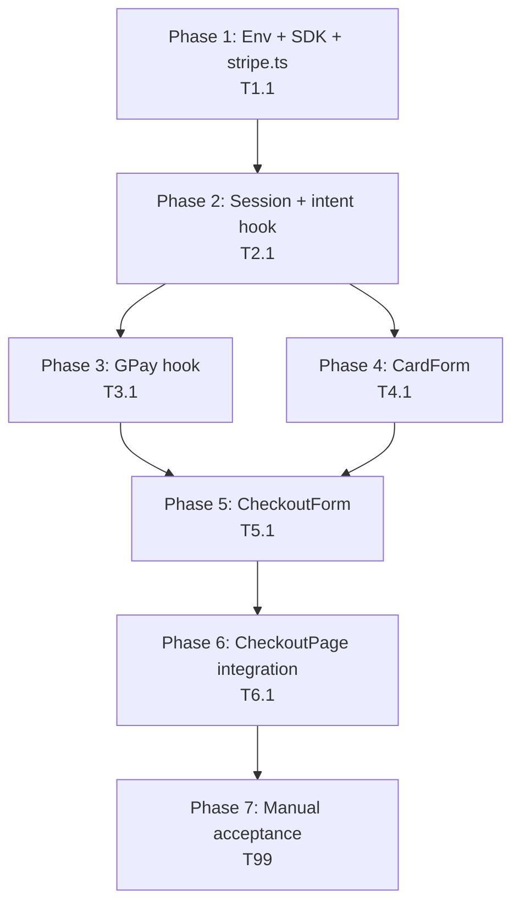
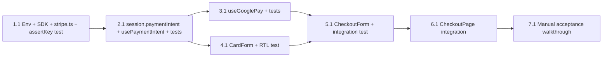

# Work Plan: Module 3 — First Payment (Stripe)

Created Date: 2026-04-22
Type: feature
Estimated Duration: 3–4 days (solo)
Estimated Impact: ~8 files (5 new, 3 modified) + `package.json` / `.env.example`
Module: 3 of 5 (Stripe-wired checkout with three-button visual preserved)

## Related Documents

- PRD (design of record): [`docs/prd/module-3-first-payment.md`](../prd/module-3-first-payment.md) — **Last updated 2026-04-22**, describes the three-button + inline CardElement pattern verbatim. Every task below cites a PRD anchor.
- Module 1 PRD (foundation shipped): [`docs/prd/module-1-load-questions.md`](../prd/module-1-load-questions.md) — `apiPost`, `FunnelSession`, `useRedirectGuard`.
- Module 2 PRD (pricing hook shipped): [`docs/prd/module-2-pricing-display.md`](../prd/module-2-pricing-display.md) — `usePricing()` already powers CheckoutPage price labels.
- Parent scope: [`docs/scope.md`](../scope.md) — Stripe in-scope; PayPal-via-Stripe preferred.
- Backend contract: [`docs/Frontend API List.postman_collection.json`](../Frontend%20API%20List.postman_collection.json) — `POST /payment/stripe/create-payment-intent` returns `client_secret`; `POST /payment/stripe/first-sale/payments/confirm` returns `cross_sale`, `redirect_page`, `first_sale_usd_price`.
- Codebase conventions: [`typestest/CLAUDE.md`](../../typestest/CLAUDE.md).

> There is no separate Design Doc for Module 3. The PRD's §4 (architecture), §5 (data flow), §6 (per-page UX), §7 (code-changes table), §8 (26 acceptance criteria in 4 groups), §9 (risks), and §11 (high-level work plan) are the technical spec. Anything unclear during implementation goes to **Open items** below, not a guess.

## Objective

Turn the three visually-preserved payment buttons on CheckoutPage (Google Pay pill, PayPal blue, green "Credit or debit card") into three live Stripe flows that share a single `PaymentIntent`, plus add a required subscription-consent checkbox and an inline `<CardElement>` form that appears beneath the buttons when the card button is clicked. PayPal uses Stripe's `confirmPayment` with `payment_method_data.type = 'paypal'` (full-page redirect). Google Pay uses Stripe's `paymentRequest` API. Card uses `confirmCardPayment` against `<CardElement>`. All success paths funnel through the backend's existing `POST /payment/stripe/first-sale/payments/confirm` endpoint and navigate per its `redirect_page`.

## Background

- Modules 1 and 2 shipped on `typestest` branch `develop`. `CheckoutPage.tsx` already runs the resume guard on mount, consumes `usePricing()` for all price strings, and renders the three buttons as `navigate(next)`-on-click placeholders — the payment layer is the only thing missing.
- Current `FunnelSession` has `qidRaw`, `qidEncrypted`, `email`, `prcId`, `mdid`, `pricingInfo`. No payment fields yet.
- **The only new npm dependencies in any module of this project** are `@stripe/stripe-js` and `@stripe/react-stripe-js` — added here. No backend changes anywhere in Module 3.
- **Single new env var**: `VITE_STRIPE_PUBLISHABLE_KEY` (the user will supply the actual key separately; `.env.example` only gets the blank line). Unit tests mock Stripe entirely; the real key is required only for Phase 5 manual smoke.
- `CheckoutPage.tsx` currently renders the three buttons with specific class strings + a `gpayIcon` import — those must be preserved verbatim when the buttons move into `CheckoutForm`.

## Implementation Strategy

**Approach: Foundation → hooks → leaf components → wrapper → page integration → manual smoke.** Each phase is independently committable and leaves the tree green. This is a horizontal slice per layer because the three payment methods share infrastructure (intent lifecycle, consent, Elements provider) and landing the infra before the buttons avoids re-writing the hooks once the UI exists.

Rationale:

- `src/lib/stripe.ts` and the env/dependency setup have zero runtime consumers at first — they're pure prerequisites. They land in Phase 1 with a trivial unit test on `assertKeyMatchesMode`.
- `FunnelSession.paymentIntent` is a type-level change that must precede the hook (the hook reads/writes it). Kept in the same commit as the hook to avoid a type-only commit that adds no behaviour.
- `usePaymentIntent` (Phase 2) is the most complex artifact in the module — it owns the whole lifecycle (create, cache, reuse-guard via `retrievePaymentIntent`, URL-return handling, backend confirm) and must land with thorough unit tests before any UI consumes it.
- `useGooglePay` (Phase 3) is isolated because GPay has a distinct SDK surface (`paymentRequest` + `paymentmethod` event) that benefits from its own hook and its own mocked-SDK test file.
- `CardForm` (Phase 4) is a leaf component — pure UI over `useStripe` + `useElements`. Testable with `@testing-library/react` against a mocked Elements provider.
- `CheckoutForm` (Phase 5) is the integration layer that composes the two hooks, the three onClick handlers, `<Elements>`, `<CardForm>`, and the consent gate. Lands with an RTL integration test.
- `CheckoutPage` refactor (Phase 6) is intentionally small — drop the three raw `<Button>`s and both skip links, mount `<CheckoutForm />` in their place. Visuals preserved by passing the existing class strings and `gpayIcon` import through to `CheckoutForm`.
- Manual acceptance walkthrough (Phase 7) runs against the real backend with a real `pk_test_` key; it covers the scenarios the automated suite cannot (GPay sheet in Chrome, PayPal redirect round-trip, 3DS challenge, tab-close-then-reopen).

Verification levels used (from `implementation-approach` skill):

- **L3 (build)** on every commit: `npx tsc --noEmit` + `npm run lint` + `npm run build`.
- **L2 (unit tests)** for `assertKeyMatchesMode`, `usePaymentIntent`, `useGooglePay`, `CardForm`, and a `CheckoutForm` integration test. All Stripe SDK surfaces are mocked.
- **L1 (manual smoke)** in Phase 7 against the real backend with the real Stripe test key.

## Risks and Countermeasures

### Technical Risks

- **R1 — Dev/live key mismatch (PRD §9 R1).** A `pk_live_` in a sandbox build (or vice versa) silently routes through the wrong Stripe account.
  - **Impact**: Real charges against a test card, or test charges that the backend sandbox can't see.
  - **Countermeasure**: Task 1.1 implements `assertKeyMatchesMode(mode)` that throws in dev when the key prefix disagrees with the backend's `payment_mode` from the pricing response. Wired at CheckoutForm mount in Phase 5 (Task 5.1). Covered by a unit test in Task 1.1.

- **R2 — Intent reuse races and TTL (PRD §9 R2, R3).** Stripe intents live 24 h; we cap at 23 h. Two tabs on the same `/checkout?qid=…` could each post to `create-payment-intent` because sessionStorage is per-tab.
  - **Impact**: Duplicate intent objects (not duplicate charges — Stripe gates that at confirmation), but messy.
  - **Countermeasure**: Task 2.2's hook gates re-creation on `keyedBy` tuple match + `createdAt < 23h` + `retrievePaymentIntent` status check. Two-tab is accepted for v1 (PRD §9 R3) and flagged in Open items; no code action.

- **R3 — Recovered-succeeded intent (PRD §8 AC 8, §4.4.4 step 2).** User closes tab after Stripe success but before the backend confirm call returns. On next mount, we must call backend confirm with the cached intent id instead of starting over.
  - **Impact**: Without this branch, the user is double-charged on retry or never gets their order finalised.
  - **Countermeasure**: Task 2.2's hook calls `stripe.retrievePaymentIntent(clientSecret)` at the start of every mount against a cached intent; if `status === 'succeeded'` it runs backend confirm immediately and navigates. Covered by a dedicated unit test.

- **R4 — Backend confirm idempotency (PRD §9 R4, O1).** If network retries `POST /payment/stripe/first-sale/payments/confirm` for the same `payment_intent_id`, the backend may 409.
  - **Impact**: Retry UX breaks; the user sees an error after a successful charge.
  - **Countermeasure**: Retry UX assumes idempotency per PRD §4.10; if Phase 7 manual smoke reveals a 409 on duplicate, we add a "payment already confirmed" branch that treats 409 as success and navigates. Flagged in Open items O1.

- **R5 — Stripe-side PayPal not enabled (PRD §9 R5, O2).** `stripe.confirmPayment(..., { payment_method_data: { type: 'paypal' } })` errors if the Stripe account doesn't have PayPal enabled.
  - **Impact**: PayPal button always fails in production.
  - **Countermeasure**: Backend team confirmation needed before Phase 7. Phase 7's manual smoke is the catch-all; if PayPal errors at runtime, the UX falls through to the "Stripe confirmation error" inline alert (PRD §4.10) — acceptable fail-fast.

- **R6 — GPay availability signal (PRD §9 R9).** `canMakePayment()` returns null for Chrome without a configured wallet and most non-Chromium browsers.
  - **Impact**: GPay button visible but disabled — correct per PRD §6.3, but worth surfacing clearly.
  - **Countermeasure**: Task 3.1 surfaces `available: boolean` from `useGooglePay`; Task 5.1 renders the button disabled with a tooltip when `!available`. Hiding instead of disabling is flagged in Open items for future marketing input.

- **R7 — PaymentRequest 3DS auto-handling.** GPay method passes `handleActions: false` to `confirmCardPayment`; if the card backing the GPay wallet requires 3DS, Stripe calls `handleCardAction` under the hood but only because we wrote it that way.
  - **Impact**: If we mis-wire the second-call pattern, 3DS-required GPay cards silently fail.
  - **Countermeasure**: Task 3.1's hook exposes the `paymentmethod` event to the component, which implements the two-stage `confirmCardPayment → handleCardAction` flow from PRD §4.4.2 verbatim. Unit test covers both `requires_action` and direct-success branches.

- **R8 — URL-param leak window (PRD §9 R8).** Stripe return params sit in `window.location.search` for ~50ms before we `replaceState`.
  - **Impact**: If the user shares the tab URL in that window, intent id leaks.
  - **Countermeasure**: Task 2.2's hook performs `history.replaceState` as its first effect on mount when return params are detected — before any async work. Acceptable v1 per PRD §9 R8.

- **R9 — Strict mode double-mount creates duplicate intents.** React 18 `StrictMode` mounts effects twice in dev; naive `useEffect` that posts to `create-payment-intent` on mount would fire twice.
  - **Impact**: Duplicate intents in dev; not a production issue but a noisy dev signal.
  - **Countermeasure**: Task 2.2's hook gates creation on `session.paymentIntent` already existing (read from sessionStorage), and uses a ref to prevent parallel in-flight creation within the same mount cycle. Unit test exercises the second-render path.

- **R10 — Preserving existing button visuals literally.** The three `<Button>` elements in CheckoutPage use specific Tailwind class strings + inline style props + the `gpayIcon` import. Any drift when moving them into `CheckoutForm` breaks AC 3.
  - **Impact**: Design regression; reviewer flags visual diff.
  - **Countermeasure**: Task 5.1 copies the exact class strings and style objects from current `CheckoutPage.tsx:384–392` into `CheckoutForm`. Task 6.1 verifies byte-for-byte preservation of the three `<Button>` elements' visual attributes via diff review.

### Schedule Risks

- **Open items O1, O2** from PRD §10 (backend confirm idempotency + Stripe-side PayPal enablement). Not blockers for automated phases; can surface late in Phase 7 manual smoke and require a small follow-up. Flagged, not schedule-blocking.
- **Real Stripe test key availability.** Phase 7 needs a `pk_test_` that's paired with the backend's sandbox Stripe account. If the user hasn't provided it when Phases 1–6 finish, Phase 7 pauses; automated work is unaffected.

## Phase Structure



## Task Dependency Diagram



Each task leaves the tree building. T3.1 (GPay hook) and T4.1 (CardForm) have no compile-time dependency on each other — they can be swapped in order or parallelised by a second developer.

---

## Phase 1: Env + SDK + stripe.ts (1 commit)

**Purpose**: Install the only two new npm deps of the project, add the one new env var, and ship the `src/lib/stripe.ts` module that memoises `loadStripe` and implements the key-mode assertion. No runtime consumers yet.

**Closes ACs**: foundation for AC 10. No AC fully verifiable in this phase.

### Task 1.1 — `@stripe/stripe-js` + `@stripe/react-stripe-js` install, `.env.example` entry, `src/lib/stripe.ts` + unit test

- **Purpose**: Prerequisite for every subsequent task. Deliver the SDK promise and the dev-mode key-prefix assertion.
- **Files touched**:
  - `typestest/package.json` (**modify**) — add `@stripe/stripe-js` and `@stripe/react-stripe-js` to `dependencies`. Use the versions that ship as the latest stable at implementation time; pin to exact (no `^`) unless existing deps use carets, in which case match repo convention.
  - `typestest/package-lock.json` and/or `typestest/bun.lockb` (**modify**) — lockfile update from `npm install`.
  - `typestest/.env.example` (**modify**) — append `VITE_STRIPE_PUBLISHABLE_KEY=` (blank value).
  - `typestest/src/lib/stripe.ts` (**new**) — exports `stripePromise` (memoised `loadStripe(import.meta.env.VITE_STRIPE_PUBLISHABLE_KEY)`) and `assertKeyMatchesMode(mode: 'sandbox' | 'live'): void`.
  - `typestest/src/lib/stripe.test.ts` (**new**) — Vitest unit test covering `assertKeyMatchesMode`. Uses `vi.stubEnv` / `vi.stubGlobal` where needed to set `import.meta.env.DEV` and the key value per-test.
- **PRD anchors**: §4.1 (env + `assertKeyMatchesMode`), §4.2 (SDK loading / memoisation), §7 ("Dependencies added" + "Env" + `src/lib/stripe.ts`).
- **AC coverage**: Foundation for AC 10 (dev-build throws a clear setup error on key/mode mismatch). AC 10 is fully closed once T5.1 wires the call site — verified end-to-end in Phase 7.
- **`src/lib/stripe.ts` contract** (PRD §4.1 verbatim):
  ```ts
  import { loadStripe, type Stripe } from '@stripe/stripe-js';
  const pk = import.meta.env.VITE_STRIPE_PUBLISHABLE_KEY;
  export const stripePromise: Promise<Stripe | null> = loadStripe(pk);
  export function assertKeyMatchesMode(mode: 'sandbox' | 'live'): void {
    const isTest = pk.startsWith('pk_test_');
    const expectedTest = mode === 'sandbox';
    if (isTest !== expectedTest) {
      console.error(`[stripe] key mode mismatch: key is ${isTest ? 'test' : 'live'}, backend is ${mode}`);
      if (import.meta.env.DEV) throw new Error('Stripe key / backend payment_mode mismatch');
    }
  }
  ```
- **Unit test cases** (minimum set):
  1. `pk_test_xxx` key + `mode: 'sandbox'` → does not throw, does not log.
  2. `pk_live_xxx` key + `mode: 'live'` → does not throw.
  3. `pk_live_xxx` key + `mode: 'sandbox'` + DEV=true → throws `'Stripe key / backend payment_mode mismatch'`.
  4. `pk_test_xxx` key + `mode: 'live'` + DEV=true → throws.
  5. Mismatched prefix + DEV=false → does not throw, but `console.error` is called.
  6. Undefined / empty key + any mode → treated as non-test (`.startsWith` returns false), triggers mismatch for `sandbox` mode.
- **Acceptance**:
  - `stripe.ts` compiles; `stripePromise` is typed `Promise<Stripe | null>`.
  - `assertKeyMatchesMode` is typed `(mode: 'sandbox' | 'live') => void`.
  - Six unit test cases green.
  - `.env.example` has the new line; no other env vars touched.
  - `package.json` lists the two new deps and nothing else changed. `npm install` re-runs cleanly.
  - No file elsewhere in `src/` imports `stripe.ts` yet (isolation check).
- **Verification**:
  - `cd typestest && npm install` (updates the lockfile).
  - `npx vitest run src/lib/stripe.test.ts` → 6 passing.
  - `npx tsc --noEmit` clean.
  - `npm run lint` clean.
  - `npm run build` succeeds.
  - `npm run test` — full suite still green.
- **Note**: The real publishable key is supplied by the user out-of-band and placed in each developer's local `.env` (untracked). `.env.example` carries only the key name, per repo convention. Phase 7 manual smoke is the first place a real key is required.

### Phase 1 Completion Criteria
- [x] `@stripe/stripe-js` + `@stripe/react-stripe-js` present in `package.json` dependencies; lockfile refreshed.
- [x] `.env.example` has `VITE_STRIPE_PUBLISHABLE_KEY=` appended.
- [x] `src/lib/stripe.ts` + `stripe.test.ts` committed; 6/6 unit tests green.
- [x] `npx tsc --noEmit` + `npm run lint` + `npm run build` + `npm run test` all green.
- [x] No other file imports `stripe.ts` yet (isolation check: `grep -r "from.*lib/stripe" typestest/src` returns only `stripe.test.ts`).

### Phase 1 Operational Verification
1. `cd typestest && npm install` completes without peer-dep warnings beyond what Modules 1 and 2 already produce.
2. `npm run dev` starts without errors when `VITE_STRIPE_PUBLISHABLE_KEY` is unset — because no consumer has mounted yet, the bad key surfaces only when something imports `stripePromise`.
3. Scratch console import of `assertKeyMatchesMode` with a mismatched pair throws as expected in dev.

---

## Phase 2: Session extension + payment-intent hook (1 commit)

**Purpose**: Extend `FunnelSession` with the `paymentIntent` cache shape and ship the `usePaymentIntent` hook that owns the full lifecycle from PRD §4.3 and the §4.4.4 return-from-redirect state machine — plus the backend confirm call (`finalizeAfterStripeSuccess`). All SDK surfaces are mocked in the unit tests.

**Closes ACs**: foundation for AC 1, 5, 6, 7, 8, 9, 25, 26. Fully verifiable only once UI consumes the hook (Phases 5–7).

### Task 2.1 — `FunnelSession.paymentIntent` + `src/hooks/usePaymentIntent.ts` + unit tests

- **Purpose**: Deliver the stateful core of Module 3: intent creation, reuse gates, return-URL handling, and backend confirm — exposed as a single hook with a small state machine.
- **Files touched**:
  - `typestest/src/lib/session.ts` (**modify**) — add the `paymentIntent` optional field to `FunnelSession`:
    ```ts
    paymentIntent?: {
      id: string;
      clientSecret: string;
      keyedBy: { qidRaw: number; prcId: string; mdid: string };
      createdAt: number;
    };
    ```
    Keep the rest of `FunnelSession` untouched. Update any type guards or zod-style parsers that enumerate known fields (inspect the file — Module 1 uses a plain TS interface, no runtime schema, so only the interface changes).
  - `typestest/src/hooks/usePaymentIntent.ts` (**new**).
  - `typestest/src/hooks/usePaymentIntent.test.tsx` (**new**) — Vitest + `@testing-library/react`. Mocks `@stripe/stripe-js` (`loadStripe`) and uses a manually-constructed fake `Stripe` object passed through the mock (`stripe.retrievePaymentIntent`, `stripe.confirmCardPayment`, `stripe.confirmPayment`). Also mocks `apiPost` from `src/lib/api.ts` per Module 1's conventions.
- **PRD anchors**: §4.3 (intent lifecycle + reuse rules), §4.4.4 (return-from-redirect), §4.5 (backend confirm body + response merge), §4.6 (return URL shape), §7 ("Files added" — `usePaymentIntent.ts` + session extension).
- **AC coverage**:
  - AC 1 — intent is created exactly once on fresh session (`session.paymentIntent === undefined` branch).
  - AC 5 — never creates an intent when `session.pricingInfo` is missing (hook guards on `pricingInfo` presence before firing create).
  - AC 6 — promo code (`prc_id` / `mdid`) is passed into both create and confirm bodies.
  - AC 7 — refresh mid-payment reuses the cached intent (no second POST to `create-payment-intent`).
  - AC 8 — recovered-succeeded intent: `retrievePaymentIntent` returns `succeeded` on mount → hook calls backend confirm and returns the response for navigation.
  - AC 9 — `finalizeAfterStripeSuccess` merges `response.cross_sale` into `session.pricingInfo.transactions.cross_sale`, sets `cross_sale_compulsory` from the response, and clears `session.paymentIntent`.
  - AC 25 — on PayPal return with `redirect_status=succeeded`, the hook strips Stripe params via `history.replaceState` then calls backend confirm.
  - AC 26 — on PayPal return without `redirect_status=succeeded` (cancellation), the hook surfaces an error state and does not call backend confirm.
- **Hook contract** (PRD §4.3 + §4.4.4):
  ```ts
  type PaymentIntentState =
    | 'idle'           // nothing happening; waiting for session readiness
    | 'creating'       // POST /payment/stripe/create-payment-intent in flight
    | 'recovering'     // return-URL or cache-succeeded flow: confirm in flight
    | 'confirming'     // finalizeAfterStripeSuccess call in flight
    | 'ready'          // clientSecret available, usable by Stripe confirm calls
    | 'error';         // see `error` for message
  type UsePaymentIntentResult = {
    state: PaymentIntentState;
    clientSecret: string | undefined;
    intentId: string | undefined;
    error: string | undefined;
    retry: () => void;
    finalizeAfterStripeSuccess: (intentId: string) => Promise<ConfirmResponse>;
  };
  type ConfirmResponse = {
    cross_sale: { is_compulsory: boolean; /* rest of the shape per Postman */ [k: string]: unknown };
    redirect_page: string;
    first_sale_usd_price: string;
  };
  ```
- **Lifecycle (PRD §4.3, §4.4.4)**:
  1. **Mount step A — URL-return detection**: read `window.location.search`. If it has `payment_intent`, `payment_intent_client_secret`, and `redirect_status`:
     - Immediately `history.replaceState({}, '', stripped_url)` to remove the Stripe params (PRD §9 R8).
     - Call `stripe.retrievePaymentIntent(clientSecret)`.
     - If `redirect_status === 'succeeded'` and intent status is `succeeded`: move to `recovering` state, call `finalizeAfterStripeSuccess(intent.id)` internally so the component's `useEffect` observer can navigate on completion. Actually: per PRD the caller wires navigation after `finalizeAfterStripeSuccess` resolves, so the hook should expose the recovered intent and let the caller trigger finalize — see design decision below.
     - **Design decision**: on return-URL success, the hook **does not auto-call** `finalizeAfterStripeSuccess`. Instead it transitions to `state: 'ready'` with the recovered intent loaded and exposes a `recoveredSucceeded: true` flag, leaving the navigation-side decision to the component. Rationale: keeps the hook's API symmetric across all three methods — the component always calls `finalizeAfterStripeSuccess(intentId)` on success. **Reconsider**: if this complicates the caller, swap to auto-finalise-on-return. Flagged in Open items.
     - If `redirect_status === 'processing'`: move to `recovering` state, poll `retrievePaymentIntent` every 2 s up to 30 s (PRD §4.4.4.1.c). On transition to `succeeded`, behave as above. On timeout, expose `state: 'ready'` with a `processingTimedOut: true` flag and an error message for the caller to render a "continue anyway" CTA.
     - If `redirect_status === 'failed'` or status is `requires_payment_method`: drop the cached intent (clear `session.paymentIntent`), move to `state: 'error'` with the Stripe `last_payment_error.message`.
  2. **Mount step B — cached-succeeded detection** (PRD §4.4.4 step 2): if no return params but `session.paymentIntent` is cached, `retrievePaymentIntent(cachedSecret)`. If status is `succeeded`, same path as step A success (expose to caller, don't auto-finalise). If `canceled`, drop cache and fall through to creation. Otherwise reuse.
  3. **Mount step C — reuse validation**: if `session.paymentIntent` is cached, check `keyedBy` tuple against the current `(qidRaw, prcId, mdid)` and `createdAt < 23h`. On match, move to `state: 'ready'` with the cached `clientSecret`. On mismatch or expiry, clear and fall through to creation.
  4. **Mount step D — creation**: if `session.pricingInfo` is missing, stay in `state: 'idle'` (AC 5). Otherwise POST `/payment/stripe/create-payment-intent` with body per PRD §4.8 (`payment_method_type: ''`) plus `prc_id` and `pricing_discount: mdid ? { mdid } : ''`. On success, write `{ id, clientSecret, keyedBy, createdAt: Date.now() }` into `session.paymentIntent` and move to `ready`. On error, `state: 'error'`, message from `ApiError`.
  5. **`finalizeAfterStripeSuccess(intentId)`** (PRD §4.5):
     - POST `/payment/stripe/first-sale/payments/confirm` with `{ payment_intent_id: intentId, quiz_result_id: session.qidRaw, user_on_iqbooster: '', prc_id: session.prcId ?? '', pricing_discount: session.mdid ? { mdid: session.mdid } : '' }`.
     - On success: merge `response.cross_sale` into `session.pricingInfo.transactions.cross_sale` (create the path if missing) and set `session.pricingInfo.cross_sale_compulsory ??= response.cross_sale.is_compulsory`. Clear `session.paymentIntent`. Return the response.
     - On error: move to `state: 'error'`, propagate the error via `throw` so the caller can render "payment succeeded but we couldn't finalise" with a retry that re-calls `finalizeAfterStripeSuccess(intentId)` (PRD §4.10 backend-confirm-failure branch).
  6. **`retry()`**: clears the current error, re-enters the lifecycle at the appropriate step (creation if no cache, otherwise reuse validation).
- **Re-entrancy / StrictMode guard** (R9): wrap the creation POST in a ref-guarded single-flight so two renders inside the same mount cycle don't both fire. Pattern:
  ```ts
  const inFlightRef = useRef<Promise<void> | null>(null);
  if (!inFlightRef.current) inFlightRef.current = createIntent().finally(() => { inFlightRef.current = null; });
  ```
- **Unit test cases** (minimum set, all with `loadStripe` + `apiPost` mocked):
  1. **Fresh mount, session has pricingInfo, no cache** → `state` transitions `idle → creating → ready`, `clientSecret` resolves, one `apiPost('payment/stripe/create-payment-intent', …)` call, `session.paymentIntent` populated with correct `keyedBy`.
  2. **Fresh mount, session missing `pricingInfo`** → stays in `state: 'idle'`, zero API calls (AC 5).
  3. **Cached intent, keyedBy matches, < 23h** → `retrievePaymentIntent` returns `requires_payment_method`, hook reuses → `state: 'ready'` with cached `clientSecret`, zero `create-payment-intent` calls (AC 7).
  4. **Cached intent, keyedBy mismatch (prcId changed)** → cache dropped, fresh POST, new intent stored.
  5. **Cached intent, createdAt > 23h** → cache dropped, fresh POST.
  6. **Cached intent, `retrievePaymentIntent` returns `succeeded`** → hook transitions to `ready` with `recoveredSucceeded: true`; does not auto-call confirm; caller can then call `finalizeAfterStripeSuccess` (AC 8).
  7. **Cached intent, `retrievePaymentIntent` returns `canceled`** → cache dropped, fresh POST.
  8. **URL has `?payment_intent=…&payment_intent_client_secret=…&redirect_status=succeeded`** → `history.replaceState` called first, then `retrievePaymentIntent`, then `state: 'ready'` with `recoveredSucceeded: true` (AC 25).
  9. **URL has `redirect_status=failed`** → cache cleared, `state: 'error'` with `last_payment_error.message`, zero confirm call (AC 26).
  10. **URL has `redirect_status=processing`** → hook polls every 2s; test using fake timers; on 3rd poll Stripe returns `succeeded` → hook transitions to `ready` with `recoveredSucceeded: true`.
  11. **`finalizeAfterStripeSuccess` success path** → POSTs confirm body with correct fields (AC 6 — `prc_id` + `pricing_discount.mdid` propagated), merges `cross_sale` into `session.pricingInfo.transactions.cross_sale`, clears `session.paymentIntent`, returns response (AC 9).
  12. **`finalizeAfterStripeSuccess` error path** → `state: 'error'`, `session.paymentIntent` is NOT cleared (user can retry), throws the error so caller sees it.
  13. **`retry()` after create-intent failure** → re-fires the POST, transitions through `creating → ready`.
  14. **StrictMode double-mount guard** → render the hook, let the effect run twice (simulate Strict), assert only one `create-payment-intent` call fired (R9).
  15. **PRC + MDID both empty** → create body sends `prc_id: ''` and `pricing_discount: ''` (AC 6 empty-string branch per PRD §4.5 body shape).
- **Acceptance**:
  - `FunnelSession.paymentIntent` interface compiles; all Module 1/2 consumers still typecheck (`useRedirectGuard`, `usePricing`, existing session getters/setters).
  - `usePaymentIntent.ts` contract matches above.
  - 15 unit test cases green.
  - Hook does not import any component or page code (one-way dependency).
  - Hook's only SDK touchpoint is `stripe.retrievePaymentIntent` (and internal typing). It does NOT call `confirmCardPayment` / `confirmPayment` / `paymentRequest` — those live in the component and GPay hook respectively.
- **Verification**:
  - `npx vitest run src/hooks/usePaymentIntent.test.tsx` → 15 passing.
  - `npx tsc --noEmit` + `npm run lint` + `npm run build` + `npm run test` all green.
  - No file under `src/components/` or `src/pages/` imports the hook yet (isolation check).

### Phase 2 Completion Criteria
- [x] `FunnelSession.paymentIntent` field present in `src/lib/session.ts`; all existing consumers typecheck without casts.
- [x] `usePaymentIntent.ts` + test file committed; 15/15 unit tests green.
- [x] `npx tsc --noEmit` + `npm run lint` + `npm run build` + `npm run test` all green.
- [x] Open items updated with the auto-finalise-on-return design decision (step A in lifecycle) so reviewers can flag if they disagree.

### Phase 2 Operational Verification
1. `npx vitest run src/hooks/usePaymentIntent.test.tsx` → 15 passing.
2. Lifecycle state machine is a pure function of `(session, URL params, Stripe responses, timeouts)` — no UI coupling. Verifiable by the tests above without any browser.

---

## Phase 3: Google Pay hook (1 commit)

**Purpose**: Isolate the `stripe.paymentRequest` API surface into its own hook so CheckoutForm's onClick wiring stays readable.

**Closes ACs**: foundation for AC 18, 19, 20, 21, 22. Fully verifiable in Phase 7.

### Task 3.1 — `src/hooks/useGooglePay.ts` + unit tests

- **Purpose**: Wrap `stripe.paymentRequest` construction, `canMakePayment()` polling, and `paymentmethod` event subscription into a small hook with a clean imperative handle.
- **Files touched**:
  - `typestest/src/hooks/useGooglePay.ts` (**new**).
  - `typestest/src/hooks/useGooglePay.test.tsx` (**new**) — Vitest. Mocks `useStripe` from `@stripe/react-stripe-js` to return a fake `stripe` whose `paymentRequest` method returns a controllable fake PaymentRequest object.
- **PRD anchors**: §4.4.2 (GPay method flow), §4.9 (`paymentRequest` lives in CheckoutForm / ref-stable), §7 ("Files added" — `useGooglePay.ts`).
- **AC coverage**:
  - AC 18 — `canMakePayment()` is called on mount; result gates the button.
  - AC 19 — `show()` opens the native sheet (exposed as imperative handle).
  - AC 20 — on `paymentmethod` event, caller receives `event.paymentMethod.id` + `event.complete` for its own `confirmCardPayment` call (hook doesn't call Stripe confirm itself — the component does).
  - AC 21, 22 — `event.complete('success' | 'fail')` wiring — hook passes `event.complete` through to the caller's handler.
- **Hook contract**:
  ```ts
  type UseGooglePayOptions = {
    clientSecret: string | undefined;
    pricing: { currency_code: string; first_sale_cents_price?: string; first_sale_price: string } | undefined;
    country?: string; // default 'US'
    onPaymentMethod: (event: PaymentRequestPaymentMethodEvent) => Promise<void>;
    // The component implements confirmCardPayment + backend confirm + event.complete inside this callback.
  };
  type UseGooglePayResult = {
    available: boolean | null;           // null = still checking; false = not available; true = available
    show: () => void;                    // imperative; no-op when not available
    paymentRequest: PaymentRequest | undefined;
  };
  ```
- **Lifecycle** (PRD §4.4.2):
  1. On mount, if `stripe` (from `useStripe()`) is loaded, `clientSecret` is defined, and `pricing` has a numeric amount, construct the PaymentRequest:
     ```ts
     const pr = stripe.paymentRequest({
       country,
       currency: pricing.currency_code,
       total: {
         label: 'Total',
         amount: parseInt(pricing.first_sale_cents_price || String(Math.round(Number(pricing.first_sale_price) * 100))),
       },
       requestPayerEmail: false,
       requestPayerName: false,
     });
     ```
  2. Call `pr.canMakePayment()`. On resolution: `available = !!result?.googlePay || !!result?.applePay` (PRD §3 notes Apple Pay is surfaced automatically; we treat either as "GPay button usable").
     - Per PRD §6.3 the button label is "Google Pay" and the icon is `gpayIcon` — we do not switch to an Apple-Pay visual. Apple Pay's availability is treated as a bonus surface on the same button. This is documented in the hook's JSDoc.
  3. Subscribe to `pr.on('paymentmethod', onPaymentMethod)`. Clean up on unmount.
  4. Store `pr` in a ref so re-renders don't reconstruct it. Recompute only when `clientSecret` or `pricing.first_sale_price` changes.
  5. Expose `show()` which calls `pr.show()` if `available === true`, else no-op.
- **Error surface**: The hook doesn't own error UI — the component renders errors from the onPaymentMethod callback. If `paymentRequest` construction throws (rare — bad currency), `available = false` and a `console.error` is emitted.
- **Unit test cases** (minimum set):
  1. Stripe not yet loaded → `available: null`, `paymentRequest: undefined`, `show()` is a no-op.
  2. Mount with valid inputs → `stripe.paymentRequest` called once with computed `amount = 499` for `first_sale_price: '4.99'` (no `first_sale_cents_price`).
  3. `canMakePayment()` resolves `{ googlePay: true }` → `available: true`.
  4. `canMakePayment()` resolves `null` → `available: false`.
  5. `canMakePayment()` resolves `{ applePay: true }` → `available: true` (documented expansion).
  6. `paymentmethod` event fires → the injected `onPaymentMethod` callback is invoked with the event object.
  7. `show()` called while `available: true` → underlying `pr.show()` invoked.
  8. `show()` called while `available: false` → `pr.show()` not called.
  9. `clientSecret` changes to a new value → a new `PaymentRequest` is constructed (old one's listener is removed).
  10. Unmount → `pr.off('paymentmethod', …)` called (leak check).
  11. `first_sale_cents_price: '499'` explicit → `amount: 499` without recomputing from dollars.
- **Acceptance**:
  - Hook contract matches above; `available` is a tri-state.
  - 11 unit test cases green.
  - Hook does not depend on `usePaymentIntent` or any component.
  - No direct import of `@stripe/stripe-js` — the `Stripe` object comes exclusively via `useStripe()` from `@stripe/react-stripe-js`.
- **Verification**:
  - `npx vitest run src/hooks/useGooglePay.test.tsx` → 11 passing.
  - `npx tsc --noEmit` + `npm run lint` + `npm run build` + `npm run test` all green.
  - No file under `src/components/` or `src/pages/` imports the hook yet.

### Phase 3 Completion Criteria
- [x] `useGooglePay.ts` + test file committed; 11/11 unit tests green.
- [x] `npx tsc --noEmit` + `npm run lint` + `npm run build` + `npm run test` all green.
- [x] Apple-Pay fallback behaviour on the GPay button is documented in the hook's JSDoc (so reviewers see it without digging).

### Phase 3 Operational Verification
1. `npx vitest run src/hooks/useGooglePay.test.tsx` → 11 passing.
2. Running dev mode on Chrome (without a wallet set up) would report `available: false` — manually verified in Phase 7, not this phase.

---

## Phase 4: CardForm leaf component (1 commit)

**Purpose**: Isolate the inline `<CardElement>` form so CheckoutForm stays focused on the three buttons and the orchestration.

**Closes ACs**: foundation for AC 11, 12, 13, 14, 15, 16, 17. Fully verifiable in Phase 7 (plus RTL unit test here).

### Task 4.1 — `src/components/checkout/CardForm.tsx` + RTL test

- **Purpose**: Render a single combined `<CardElement>`, a Pay button labelled with the dynamic first-sale price, and inline error surface. Gate the Pay button on `CardElement.onChange` reporting `complete`. On submit, call `stripe.confirmCardPayment(clientSecret, { payment_method: { card, billing_details: { email } } })`. On success call `onSuccess(intentId)`; on Stripe error render the message inline and re-enable.
- **Files touched**:
  - `typestest/src/components/checkout/CardForm.tsx` (**new**). Directory `src/components/checkout/` is new — create the folder.
  - `typestest/src/components/checkout/CardForm.test.tsx` (**new**) — RTL + Vitest. Mocks `useStripe`, `useElements`, and `CardElement` (a stub that exposes an `onChange` prop the test can fire).
- **PRD anchors**: §4.4.1 (card method flow), §4.9 (`<CardElement>` inside `<Elements>` provider, `onChange` gates Pay button), §6.3 (gating table — Pay is enabled when `consented && intentReady && cardElement.complete && !submitting`), §7 ("Files added" — `CardForm.tsx`).
- **AC coverage**:
  - AC 11 — clicking the card button reveals this form with `<CardElement>` + Pay button. (Rendering wiring verified here; button-click → reveal wiring is Task 5.1.)
  - AC 12 — Pay button disabled until `CardElement.onChange` reports `complete: true`.
  - AC 13 — Pay label is `Pay {current.first_sale_price_label}`.
  - AC 14 — on non-3DS success, `onSuccess(paymentIntent.id)` fires.
  - AC 15 — on 3DS success, same `onSuccess(paymentIntent.id)` fires (Stripe handles the challenge inside `confirmCardPayment`).
  - AC 16 — on `error`, Stripe's `error.message` is rendered; Pay re-enables.
- **Component contract**:
  ```tsx
  type CardFormProps = {
    clientSecret: string;
    email: string | undefined;
    priceLabel: string;          // e.g. "$4.99"
    submitting: boolean;         // parent-controlled; reflects the inflight confirm + backend confirm
    consented: boolean;          // disables Pay if false (belt + suspenders; parent also won't show form)
    onSuccess: (intentId: string) => void;
    onError: (message: string) => void;  // for the parent to hoist into its error slot if it wants; also shown inline here
  };
  ```
  The component renders:
  ```tsx
  <form onSubmit={handleSubmit} className="space-y-3">
    <div className="border border-border rounded-md p-3 bg-card">
      <CardElement options={cardElementOptions} onChange={onChange} />
    </div>
    {inlineError && <div role="alert" className="text-sm text-destructive">{inlineError}</div>}
    <Button
      type="submit"
      disabled={!complete || !consented || submitting}
      className="w-full py-6 text-lg font-semibold"
      size="lg"
    >
      {submitting ? 'Processing…' : `Pay ${priceLabel}`}
    </Button>
  </form>
  ```
  `cardElementOptions` uses a minimal style block that inherits the app's text colour via CSS vars — PRD §4.9 mentions `appearance` on `<Elements>`, so no per-element theming is required beyond font-family/font-size matching Tailwind's `font-sans`.
- **Submit handler** (PRD §4.4.1):
  ```ts
  const { error, paymentIntent } = await stripe.confirmCardPayment(clientSecret, {
    payment_method: {
      card: elements.getElement(CardElement)!,
      billing_details: { email },
    },
  });
  if (error) { setInlineError(error.message ?? 'Payment failed'); onError(error.message ?? 'Payment failed'); return; }
  if (paymentIntent?.status === 'succeeded') { onSuccess(paymentIntent.id); return; }
  if (paymentIntent?.status === 'requires_action') {
    // Stripe handled the 3DS challenge in-flight; if we reach here with requires_action,
    // it means the redirect-based authenticator was used (rare) — the component resolves
    // on return via usePaymentIntent's URL-return branch (Task 2.1 step A).
    // No action needed; the component unmounts on redirect.
  }
  ```
- **Consent gate**: If `!consented`, the form should not be rendered at all by the parent, but defence-in-depth the Pay button is disabled. Visible-but-disabled is acceptable here.
- **RTL unit test cases** (minimum set, Stripe SDK fully mocked):
  1. Initial render → Pay button disabled, no inline error, label reads `Pay $4.99`.
  2. `CardElement.onChange` fired with `{ complete: true }` → Pay button enabled.
  3. `CardElement.onChange` fired with `{ complete: false, error: { message: 'Invalid card number' } }` → Pay disabled, inline error visible.
  4. Click Pay with `complete: true` → `stripe.confirmCardPayment` called with `{ payment_method: { card: <element>, billing_details: { email: 'x@y' } } }`.
  5. `confirmCardPayment` resolves `{ paymentIntent: { id: 'pi_123', status: 'succeeded' } }` → `onSuccess('pi_123')` called; `onError` not called.
  6. `confirmCardPayment` resolves `{ error: { message: 'Your card was declined.' } }` → inline error shows the message; `onError` called; `onSuccess` not called; Pay re-enables.
  7. `submitting: true` prop → Pay button shows "Processing…" and is disabled regardless of `complete`.
  8. `consented: false` prop → Pay disabled even when `complete: true`.
  9. `email: undefined` → `billing_details.email` sent as `undefined` (Stripe accepts it; we don't fabricate a fake).
- **Acceptance**:
  - 9 RTL tests green.
  - Component imports `useStripe`, `useElements`, `CardElement` from `@stripe/react-stripe-js` and nothing else Stripe-related.
  - Component does NOT call the backend confirm — that's the parent's responsibility via `onSuccess`.
  - Button visual matches the rest of the CheckoutPage buttons (py-6, text-lg, font-semibold, w-full).
- **Verification**:
  - `npx vitest run src/components/checkout/CardForm.test.tsx` → 9 passing.
  - `npx tsc --noEmit` + `npm run lint` + `npm run build` + `npm run test` all green.

### Phase 4 Completion Criteria
- [x] `CardForm.tsx` + test file committed; 9/9 RTL tests green.
- [x] `npx tsc --noEmit` + `npm run lint` + `npm run build` + `npm run test` all green.
- [x] No file elsewhere imports `CardForm` yet (consumed in Task 5.1).

### Phase 4 Operational Verification
1. `npx vitest run src/components/checkout/CardForm.test.tsx` → 9 passing.
2. Visual inspection of the form is deferred to Phase 7 (needs real Stripe iframe).

---

## Phase 5: CheckoutForm wrapper (1 commit)

**Purpose**: Compose Phases 1–4 into the single React surface that replaces the button trio on CheckoutPage. Owns `<Elements>`, consent, `activeMethod`, error slot, and the three onClick handlers.

**Closes ACs**: 2, 3 (partial — form owns the buttons' visuals), 4 (via removal in Task 6.1), 10 (wires `assertKeyMatchesMode`), 17, 18, 19, 20, 21, 22, 23, 24, 25, 26.

### Task 5.1 — `src/components/checkout/CheckoutForm.tsx` + integration test

- **Purpose**: The composition layer. Renders the consent checkbox, the three existing-visual buttons, the error alert slot, and `<CardForm />` when `activeMethod === 'card'`. Provides the three onClick handlers and the onPaymentMethod callback used by `useGooglePay`. Wraps everything in `<Elements stripe={stripePromise} options={{ clientSecret }}>`.
- **Files touched**:
  - `typestest/src/components/checkout/CheckoutForm.tsx` (**new**).
  - `typestest/src/components/checkout/CheckoutForm.test.tsx` (**new**) — RTL + Vitest. Mocks `loadStripe`, `Elements` (pass-through), `useStripe`, `useElements`, `usePaymentIntent`, `useGooglePay`, and `apiPost`.
- **PRD anchors**: §4.1 (assert key/mode at mount), §4.4.1 / §4.4.2 / §4.4.3 (per-method handlers), §4.7 (consent gating), §4.9 (Elements options), §4.10 (error surfaces), §6.1 / §6.3 (existing visuals preserved, three-button layout, gating table), §7 ("Files added" — `CheckoutForm.tsx`).
- **AC coverage**:
  - AC 2 — consent checkbox required before any button is enabled.
  - AC 3 — three buttons keep existing visuals (class strings + icon copied from current CheckoutPage).
  - AC 10 — `assertKeyMatchesMode(session.pricingInfo.payment_mode)` called at mount (dev-only throw).
  - AC 17 — second click on the card button collapses the inline form.
  - AC 18 — GPay button disabled with tooltip when `useGooglePay.available !== true`.
  - AC 19 — clicking enabled GPay button calls `useGooglePay.show()`.
  - AC 20, 21, 22 — onPaymentMethod callback drives `confirmCardPayment(..., { handleActions: false })`, calls `event.complete`, then finalises on success.
  - AC 23, 24, 25, 26 — PayPal button calls `stripe.confirmPayment({ confirmParams: { return_url, payment_method_data: { type: 'paypal' } } })`; on return, `usePaymentIntent` has already detected the URL params and exposed the recovered intent — CheckoutForm observes `recoveredSucceeded` and calls `finalizeAfterStripeSuccess`.
  - Error surfaces per PRD §4.10: intent-creation failure (retry button), Stripe confirmation error (inline), backend-confirm failure after Stripe success (inline + retry).
- **Component contract**:
  ```tsx
  type CheckoutFormProps = {
    priceLabel: string;                  // from usePricing().current.first_sale_price_label
    pricing: PricingInfo | undefined;    // from usePricing().current — passed through to useGooglePay
    email: string | undefined;           // from session
    gpayIcon: string;                    // image URL — imported by CheckoutPage, passed down
  };
  ```
  CheckoutPage passes these in; CheckoutForm is the self-contained payment UI.
- **Internal state**:
  - `consented: boolean` — controlled by the top checkbox.
  - `activeMethod: 'card' | null` — toggled by the card button. PayPal and GPay don't set this (PayPal redirects away; GPay uses a sheet).
  - `submitting: boolean` — true during any Stripe confirm or backend confirm in flight.
  - `methodError: string | null` — inline error for Stripe/backend-confirm failures.
- **Structure** (PRD §6.3 verbatim):
  ```tsx
  const intent = usePaymentIntent();
  useEffect(() => {
    if (pricing?.payment_mode) assertKeyMatchesMode(pricing.payment_mode);
  }, [pricing?.payment_mode]);

  // Auto-finalise when usePaymentIntent reports a recovered-succeeded intent
  useEffect(() => {
    if (intent.recoveredSucceeded && intent.intentId && !submitting) {
      void handleFinalize(intent.intentId);
    }
  }, [intent.recoveredSucceeded, intent.intentId]);

  const gpay = useGooglePay({
    clientSecret: intent.clientSecret,
    pricing,
    onPaymentMethod: async (event) => { … see below … },
  });

  return (
    <Elements stripe={stripePromise} options={{ clientSecret: intent.clientSecret, appearance: { theme: 'stripe' }, loader: 'auto' }}>
      <div className="space-y-3">
        <label className="flex items-start gap-2 text-xs">
          <Checkbox id="subscription-consent" checked={consented} onCheckedChange={setConsented} />
          <span>I understand that after the {TRIAL_DAYS}-day trial my subscription will begin automatically at {pricing.subscription_price_label} every {pricing.subscription_day_label ?? DEFAULT_SUBSCRIPTION_DAYS} days until I cancel. I agree to the <a …>Subscription Policy</a>, <a …>Terms of Use</a>, and <a …>Privacy Policy</a>.</span>
        </label>

        {intent.state === 'error' && (
          <div role="alert" className="bg-destructive/10 text-destructive rounded-md p-3 text-sm">
            {intent.error}
            <Button onClick={intent.retry} variant="outline" size="sm" className="mt-2">Try again</Button>
          </div>
        )}
        {methodError && (
          <div role="alert" className="bg-destructive/10 text-destructive rounded-md p-3 text-sm">{methodError}</div>
        )}

        {/* Google Pay — EXACT class string copied from CheckoutPage.tsx:384–386 */}
        <Button
          className="w-full py-6 text-lg font-semibold bg-foreground hover:bg-foreground/90 text-background"
          size="lg"
          disabled={!consented || intent.state !== 'ready' || gpay.available !== true || submitting}
          title={gpay.available === false ? "Google Pay isn't available in this browser" : undefined}
          onClick={() => gpay.show()}
        >
          
        </Button>

        {/* PayPal — EXACT class + style copied from CheckoutPage.tsx:387–389 */}
        <Button
          className="w-full py-6 text-lg font-bold"
          size="lg"
          style={{ backgroundColor: 'hsl(213 100% 44%)', color: 'white' }}
          disabled={!consented || intent.state !== 'ready' || submitting}
          onClick={handlePayPalClick}
        >
          PayPal
        </Button>

        {/* Credit or debit card — EXACT class + style copied from CheckoutPage.tsx:390–392 */}
        <Button
          className="w-full py-6 text-lg font-semibold"
          size="lg"
          style={{ backgroundColor: 'hsl(var(--success))', color: 'white' }}
          disabled={!consented || intent.state !== 'ready' || submitting}
          onClick={() => setActiveMethod(activeMethod === 'card' ? null : 'card')}
        >
          Credit or debit card
        </Button>

        {activeMethod === 'card' && intent.clientSecret && (
          <CardForm
            clientSecret={intent.clientSecret}
            email={email}
            priceLabel={priceLabel}
            submitting={submitting}
            consented={consented}
            onSuccess={handleStripeSuccess}
            onError={setMethodError}
          />
        )}
      </div>
    </Elements>
  );
  ```
- **Handler pseudo-code** (PRD §4.4):
  - `handlePayPalClick` (PRD §4.4.3):
    ```ts
    const { error } = await stripe.confirmPayment({
      clientSecret: intent.clientSecret!,
      confirmParams: {
        return_url: `${window.location.origin}/checkout?qid=${session.qidEncrypted}`,
        payment_method_data: { type: 'paypal' },
      },
    });
    if (error) setMethodError(error.message ?? 'PayPal failed');
    // Success: Stripe redirects the browser; no JS continuation here.
    ```
  - `useGooglePay.onPaymentMethod` (PRD §4.4.2):
    ```ts
    setSubmitting(true);
    const { paymentIntent, error } = await stripe.confirmCardPayment(
      intent.clientSecret!,
      { payment_method: event.paymentMethod.id },
      { handleActions: false },
    );
    if (error || !paymentIntent) {
      event.complete('fail'); setMethodError(error?.message ?? 'Payment failed'); setSubmitting(false); return;
    }
    event.complete('success');
    if (paymentIntent.status === 'requires_action') {
      const { error: actionError, paymentIntent: pi2 } = await stripe.handleCardAction(intent.clientSecret!);
      if (actionError || pi2?.status !== 'succeeded') { setMethodError(actionError?.message ?? '3DS failed'); setSubmitting(false); return; }
      await handleFinalize(pi2.id);
    } else if (paymentIntent.status === 'succeeded') {
      await handleFinalize(paymentIntent.id);
    }
    setSubmitting(false);
    ```
  - `handleStripeSuccess(intentId)` (card path from `CardForm`):
    ```ts
    setSubmitting(true);
    await handleFinalize(intentId);
    setSubmitting(false);
    ```
  - `handleFinalize(intentId)`:
    ```ts
    try {
      const response = await intent.finalizeAfterStripeSuccess(intentId);
      const route = resolveRedirect(response.redirect_page);  // from src/lib/redirectRouter.ts shipped in Module 1
      navigate(`${route}?qid=${session.qidEncrypted}`);
    } catch (err) {
      setMethodError('Your payment went through, but we had trouble finalising your order. Please contact support.');
      // usePaymentIntent keeps session.paymentIntent intact so Retry can re-call finalize.
    }
    ```
- **Preservation contract (R10)**: The three `<Button>` elements' `className` strings and `style` props are byte-for-byte copies from current `CheckoutPage.tsx:384–392`. The `` uses `alt="Google Pay"` and the `h-7 w-[130px] max-w-full object-contain` classes verbatim. The `gpayIcon` asset is passed in as a prop (not re-imported) because CheckoutPage already imports it; CheckoutForm receiving it avoids duplicating the import path.
- **Integration test cases** (RTL, SDK + hooks mocked):
  1. Initial render, `intent.state: 'ready'`, `gpay.available: true`, `consented: false` → all three buttons disabled; consent checkbox visible.
  2. Tick consent → all three buttons enabled (card + PayPal), GPay enabled because `available: true`.
  3. `gpay.available: false` → GPay button disabled with `title` tooltip "Google Pay isn't available in this browser".
  4. Click card button → `<CardForm>` appears below the buttons.
  5. Click card button again → `<CardForm>` disappears (AC 17).
  6. `intent.state: 'creating'` → all buttons disabled.
  7. `intent.state: 'error'` → inline error alert with a Retry button; clicking Retry calls `intent.retry`.
  8. Click PayPal with consent ticked → `stripe.confirmPayment` called with `{ clientSecret, confirmParams: { return_url: '…/checkout?qid=<encrypted>', payment_method_data: { type: 'paypal' } } }`.
  9. PayPal `confirmPayment` returns `{ error: { message: 'User cancelled' } }` → inline error shown, no navigation.
  10. GPay button click → `gpay.show()` called.
  11. `gpay.onPaymentMethod` fires with a fake event → `stripe.confirmCardPayment(…, { handleActions: false })` called, `event.complete('success')` called on success, `finalizeAfterStripeSuccess(pi.id)` called, `navigate(resolveRedirect(response.redirect_page) + '?qid=<encrypted>')` called.
  12. GPay `paymentmethod` returns `requires_action` → `handleCardAction` called; on success, finalize fires.
  13. CardForm `onSuccess('pi_abc')` fires → `finalizeAfterStripeSuccess('pi_abc')` called, navigate fires.
  14. `finalizeAfterStripeSuccess` throws → `methodError` set to the "payment went through but…" message; no navigate; Retry-click re-calls finalize with the same intent id.
  15. Mount with `pricing.payment_mode: 'sandbox'` but key is `pk_live_` (mocked) in DEV → throws during the `useEffect` (exercised via test wrapper that catches the throw).
  16. `intent.recoveredSucceeded: true` with `intent.intentId: 'pi_x'` on mount (PayPal return scenario) → `finalizeAfterStripeSuccess('pi_x')` called automatically; navigate fires; three buttons not clicked (AC 25).
- **Acceptance**:
  - 16 integration test cases green.
  - `<Elements>` wraps the whole payment surface (consent + buttons + card form).
  - Consent checkbox's disabled-gating matches PRD §6.3 table exactly.
  - The three button `className`/`style`/`img` attributes match the current CheckoutPage verbatim — reviewer verifies via side-by-side diff in Task 6.1.
  - `useGooglePay`'s `onPaymentMethod` callback is defined inline in CheckoutForm (not in the hook).
  - No direct `loadStripe` call — only `stripePromise` from `src/lib/stripe.ts`.
- **Verification**:
  - `npx vitest run src/components/checkout/CheckoutForm.test.tsx` → 16 passing.
  - `npx tsc --noEmit` + `npm run lint` + `npm run build` + `npm run test` all green.
  - No import in `src/pages/` yet (CheckoutPage integration is Task 6.1).

### Phase 5 Completion Criteria
- [x] `CheckoutForm.tsx` + test file committed; 16/16 integration tests green.
- [x] `npx tsc --noEmit` + `npm run lint` + `npm run build` + `npm run test` all green.
- [x] The three `<Button>` elements' class strings and inline style objects are byte-identical to the current CheckoutPage (verify via side-by-side text diff of lines 384–392 of CheckoutPage and the equivalent block in CheckoutForm).

### Phase 5 Operational Verification
1. `npx vitest run src/components/checkout/CheckoutForm.test.tsx` → 16 passing.
2. Still no runtime integration — CheckoutPage is untouched until Task 6.1.

---

## Phase 6: CheckoutPage integration (1 commit)

**Purpose**: Wire `<CheckoutForm />` into CheckoutPage, remove the two "Skip and see basic results" links, preserve every other element (pricing header, benefits list, testimonials, trust features). This is a small, reviewable diff.

**Closes ACs**: 3 (visuals preserved end-to-end), 4 (skip links removed).

### Task 6.1 — Replace the three `<Button>` trio + skip links in `CheckoutPage.tsx` with `<CheckoutForm />`

- **Purpose**: Drop the placeholder buttons that currently call `navigate(next)`, drop both skip links, mount `<CheckoutForm />` in the payment card's action area. Keep the pricing header and everything outside the payment card untouched.
- **Files touched**:
  - `typestest/src/pages/CheckoutPage.tsx` (**modify**).
- **PRD anchors**: §6.1 (preserved), §6.2 (removed), §6.3 (added), §7 (Files changed table — CheckoutPage row), §11 step 8.
- **AC coverage**:
  - AC 3 — preserved visuals (CheckoutForm's buttons render in the same spot with the same classes).
  - AC 4 — both "Skip and see basic results" links removed.
- **Diff summary**:
  - **Remove**:
    - Lines 383–393 (current): the `<div className="space-y-3">` wrapper containing the three `<Button>` elements.
    - Lines 408–416 (current): the "Skip and see basic results" button + its wrapping `<div className="text-center pt-2">`.
    - The second "Skip and see basic results" link in the bottom CTA (PRD §6.2 calls out lines ~478–483; inspect and remove at refactor time).
  - **Add**:
    - Near the top of the file, `import { CheckoutForm } from '@/components/checkout/CheckoutForm';`
    - In place of the removed `<div className="space-y-3">` block, render:
      ```tsx
      <CheckoutForm
        priceLabel={current?.first_sale_price_label ?? pricePlaceholder}
        pricing={current}
        email={session.email}
        gpayIcon={gpayIcon}
      />
      ```
    - `gpayIcon` is already imported at the top of CheckoutPage — re-use the existing import; do NOT add a duplicate.
  - **Keep**:
    - The entire `<div id="payment-card">` card shell (line 345 onward) — only its contents in the action area change.
    - The benefits list (lines 346–356), the "Discount Applied!" card (lines 358–368), the `"Total Today:"` price block (lines 370–380), and the `<ShieldCheck>` reassurance line (lines 395–398) all stay exactly as-is.
    - The existing fine-print paragraph (lines 400–406) stays — it's supplementary legal copy per PRD §4.7.
    - The entire left column (features / trust icons, lines 320–342) is untouched.
    - `useRedirectGuard('/checkout')` + `usePricing()` invocations at the top of the component are untouched.
- **Acceptance**:
  - `grep -n 'Skip and see basic results' typestest/src/pages/CheckoutPage.tsx` → zero hits.
  - `grep -n 'onClick={() => navigate(next)}' typestest/src/pages/CheckoutPage.tsx` → zero hits in the payment card area (the "Reveal My Type" final CTA may still call navigate to scroll to the payment card per PRD §6.3 Preserved; verify that's scroll-only rather than navigating elsewhere).
  - Visual side-by-side: the payment card looks identical to pre-change **except** the three buttons now live inside `<Elements>` and a consent checkbox appears above them. Everything below the buttons (ShieldCheck line, fine print) is unchanged.
  - No new imports in CheckoutPage beyond `CheckoutForm` (the `gpayIcon` is already imported from Module 2 era).
- **Verification**:
  - `npx tsc --noEmit` + `npm run lint` + `npm run build` + `npm run test` all green.
  - `npm run dev` → open `/checkout` after completing the funnel → the page renders, the consent checkbox is present and unchecked, the three buttons render disabled (because consent is false), and `<CardForm>` is hidden.
  - `git diff typestest/src/pages/CheckoutPage.tsx` shows only the two specified removals and the one addition; left column and all pricing bindings are untouched.

### Phase 6 Completion Criteria
- [x] CheckoutPage diff matches the summary above (only the three-button block + two skip links replaced; `<CheckoutForm />` mounted).
- [x] `npx tsc --noEmit` + `npm run lint` + `npm run build` + `npm run test` all green.
- [ ] Dev-server smoke: `/checkout` page renders without runtime errors and the consent + three buttons are visible. (Deferred to Task 99 live smoke — out of implement-agent scope.)

### Phase 6 Operational Verification
1. `npm run dev` with a real `VITE_STRIPE_PUBLISHABLE_KEY=pk_test_…` in `.env.local`.
2. Walk the funnel from `/` to `/checkout?qid=…`. Observe:
   - DevTools Network: one `POST /payment/stripe/create-payment-intent` call at mount; `client_secret` returned.
   - The three buttons render with identical visuals to the pre-Module-3 page.
   - Consent checkbox is unchecked; all three buttons are disabled.
   - Tick consent → card and PayPal buttons enable; GPay enables only if the browser has a wallet (else disabled with the tooltip).
   - Click the card button → `<CardElement>` appears below; clicking it again collapses.

---

## Phase 7: Manual acceptance walkthrough (0 commits, validation only)

**Purpose**: Close the PRD §8 acceptance contract (26 ACs in 4 groups) with live-backend + live-Stripe-test-key smoke tests that can't be automated.

**Prerequisite**: A valid `pk_test_` publishable key in `.env.local` paired with the backend's sandbox Stripe account (user-provided).

### Task 99 — AC walk-through (cross-cutting + card + GPay + PayPal)

- **Purpose**: Manually verify every PRD §8 acceptance criterion.
- **Files touched**: none (verification-only).
- **Scenarios**:
  - **Organic card**: fresh incognito, `?qid=` from a completed funnel → card with `4242 4242 4242 4242` → success → backend confirm → navigated per redirect_page.
  - **3DS card**: fresh incognito → card with `4000 0027 6000 3184` → 3DS challenge appears inline → pass → backend confirm → navigated.
  - **Declined card**: `4000 0000 0000 0002` → inline decline message, no backend confirm call, buttons remain clickable.
  - **GPay (Chrome with wallet)**: GPay button enabled → click → native sheet → select method → success → backend confirm → navigated.
  - **GPay (Chrome without wallet / Firefox / Safari without Apple Pay)**: GPay button visibly disabled with the tooltip.
  - **PayPal redirect round-trip**: click PayPal → browser redirects to Stripe → PayPal hosted UI → complete with a sandbox PayPal account → browser returns to `/checkout?qid=…&payment_intent=…&redirect_status=succeeded` → CheckoutForm auto-finalises → navigated per redirect_page.
  - **PayPal cancellation**: click PayPal → redirect → cancel on PayPal's side → browser returns with `redirect_status=failed` or without `redirect_status` → inline error rendered, no backend confirm.
  - **Refresh mid-payment (intent in flight)**: load `/checkout`, let the create-intent call complete, refresh → DevTools shows no second `POST /payment/stripe/create-payment-intent`; cached intent reused (AC 7).
  - **Tab close then reopen after Stripe success but before backend confirm**: simulate by throwing in the `finalizeAfterStripeSuccess` response handler (temporary Dev-only injection), close the tab, reopen `/checkout?qid=…`. Hook detects the cached intent, retrieves it from Stripe (status: `succeeded`), auto-finalises, navigates (AC 8).
  - **Promo run**: complete funnel with `?mdid=50` → verify `prc_id`/`pricing_discount.mdid` appear in both create-intent and confirm request bodies (AC 6).
  - **Key/mode mismatch**: swap the `.env.local` to a `pk_live_` key while the backend still reports `sandbox` → dev build throws the setup error on `/checkout` mount (AC 10).
- **AC-to-evidence matrix**:

  | AC | Scenario | How verified | Closed by |
  |---|---|---|---|
  | 1 `/checkout` fires `create-payment-intent` exactly once | Organic | DevTools Network, first mount | Task 2.1 + 6.1 |
  | 2 Consent required before any button enabled | All | Visual (buttons disabled), click-test | Task 5.1 |
  | 3 Three buttons keep existing visuals | All | Side-by-side diff of payment card vs. pre-Module-3 screenshot | Task 6.1 |
  | 4 Both skip links removed | All | Grep + visual | Task 6.1 |
  | 5 No intent created when `pricingInfo` missing | Contrived (clear session.pricingInfo in console, remount) | DevTools Network → zero `/payment/stripe/create-payment-intent` calls | Task 2.1 |
  | 6 Promo code passed through to create + confirm | Promo run | DevTools Network request bodies | Tasks 2.1 + 5.1 |
  | 7 Refresh mid-payment reuses cached intent | Refresh mid-payment | DevTools Network on refresh | Task 2.1 |
  | 8 Recovered-succeeded intent auto-finalises | Tab close then reopen | Session storage + DevTools Network | Tasks 2.1 + 5.1 |
  | 9 `cross_sale` merged into `pricingInfo`; `paymentIntent` cleared | Any success | `sessionStorage` inspection post-navigate | Task 2.1 |
  | 10 Dev throws on key/mode mismatch | Key mismatch scenario | Console error + thrown exception | Tasks 1.1 + 5.1 |
  | 11 Card button reveals inline `<CardForm>` | Organic card | Visual | Tasks 4.1 + 5.1 |
  | 12 Card Pay disabled until `CardElement.complete` | Organic card | Visual | Task 4.1 |
  | 13 Pay label reads `Pay {first_sale_price_label}` | Organic card | Visual | Task 4.1 |
  | 14 Non-3DS card success → confirm + navigate | Organic card | DevTools Network + URL change | Tasks 2.1 + 4.1 + 5.1 |
  | 15 3DS card → confirm + navigate | 3DS card | Inline 3DS UI + post-auth flow | Tasks 4.1 + 5.1 |
  | 16 Decline → Stripe message inline, no confirm call | Declined card | Visual + DevTools Network (no confirm) | Task 4.1 |
  | 17 Second card-button click collapses form | Organic card | Visual | Task 5.1 |
  | 18 `canMakePayment` gates GPay button | GPay without wallet | Visual (button disabled + tooltip) | Tasks 3.1 + 5.1 |
  | 19 GPay click opens native sheet | GPay with wallet | Visual | Tasks 3.1 + 5.1 |
  | 20 `paymentmethod` event → `confirmCardPayment` call | GPay with wallet | DevTools Network | Tasks 3.1 + 5.1 |
  | 21 Success → `event.complete('success')` + confirm + navigate | GPay with wallet | DevTools + URL change | Task 5.1 |
  | 22 Failure → `event.complete('fail')`, buttons remain interactable | GPay with wallet, cancel the sheet | Visual | Task 5.1 |
  | 23 PayPal click → `stripe.confirmPayment({ payment_method_data: { type: 'paypal' } })` | PayPal redirect round-trip | DevTools Network (first request before redirect) | Task 5.1 |
  | 24 PayPal flow redirects and returns with `redirect_status=succeeded` | PayPal redirect round-trip | URL on return | Stripe-side + Task 5.1 |
  | 25 On return, retrieve intent, strip params, confirm, navigate | PayPal redirect round-trip | URL cleaned immediately on mount + DevTools confirm call + navigate | Tasks 2.1 + 5.1 |
  | 26 PayPal cancellation → idle + inline error | PayPal cancellation | Visual + DevTools (no confirm) | Tasks 2.1 + 5.1 |
- **Quality gate**:
  - `npm run lint` → zero errors.
  - `npx tsc --noEmit` → zero errors.
  - `npm run test` → full suite passes (Module 1 + 2 + 3 tests).
  - `npm run build` → succeeds.

### Phase 7 Completion Criteria
- [ ] All 26 PRD §8 ACs manually verified across the 10 scenarios above.
- [ ] Open items list refreshed with anything surfaced during QA (especially O1 backend idempotency and O2 Stripe-side PayPal enablement).
- [ ] User review approval obtained.

---

## Dependencies Summary

**Two new npm dependencies, both in this module and nowhere else in the project**:

- `@stripe/stripe-js`
- `@stripe/react-stripe-js`

**One new env var, project-wide**: `VITE_STRIPE_PUBLISHABLE_KEY`. Added to `.env.example` in Task 1.1. The real value is supplied by the user out-of-band for local dev and for build-time CI.

No backend changes. No changes to Modules 1 or 2 beyond the additive `FunnelSession.paymentIntent` field.

## AC-to-Task Traceability

Cross-cutting group:
- AC 1 → Tasks 2.1 + 6.1 (verified in Phase 7)
- AC 2 → Task 5.1
- AC 3 → Task 5.1 (byte-for-byte copy of button visuals) + Task 6.1 (site-level visual verification)
- AC 4 → Task 6.1
- AC 5 → Task 2.1
- AC 6 → Task 2.1
- AC 7 → Task 2.1
- AC 8 → Tasks 2.1 + 5.1
- AC 9 → Task 2.1
- AC 10 → Tasks 1.1 + 5.1

Card method group:
- AC 11 → Tasks 4.1 + 5.1
- AC 12 → Task 4.1
- AC 13 → Task 4.1
- AC 14 → Tasks 2.1 + 4.1 + 5.1
- AC 15 → Tasks 4.1 + 5.1
- AC 16 → Task 4.1
- AC 17 → Task 5.1

Google Pay method group:
- AC 18 → Tasks 3.1 + 5.1
- AC 19 → Tasks 3.1 + 5.1
- AC 20 → Tasks 3.1 + 5.1
- AC 21 → Task 5.1
- AC 22 → Task 5.1

PayPal method group:
- AC 23 → Task 5.1
- AC 24 → (Stripe-hosted PayPal flow; not a frontend implementation concern beyond the input to `confirmPayment`)
- AC 25 → Tasks 2.1 + 5.1
- AC 26 → Tasks 2.1 + 5.1

## Open Items (flagged, not decided)

These mirror PRD §10 plus anything surfaced by the plan's design decisions. Resolve with the user as they come up; don't let them block phase progression.

1. **O1 — Backend confirm idempotency** (PRD §9 R4, §10 O1). Retry UX assumes idempotent `POST /payment/stripe/first-sale/payments/confirm` on the same `payment_intent_id`. If Phase 7 reveals a 409 on duplicates, add a "treat-409-as-success" branch to `finalizeAfterStripeSuccess`.
2. **O2 — Stripe-side PayPal enabled?** (PRD §9 R5, §10 O2). Before Phase 7 PayPal scenarios, confirm with backend/ops that the sandbox Stripe account has PayPal enabled. If not, PayPal scenarios are deferred.
3. **O3 — Auto-finalise on return from PayPal** (design decision in Task 2.1 lifecycle step A). Current plan: hook exposes `recoveredSucceeded` and caller finalises. Alternative: hook auto-finalises and exposes the response via callback. First approach keeps the hook's API symmetric. Flag for reviewer.
4. **O4 — GPay disabled vs. hidden** (PRD §9 R9). Current plan: disabled + tooltip. Marketing may prefer hidden. No action this module.
5. **O5 — Apple Pay surfaced via the GPay button** (Phase 3 hook JSDoc). The same `paymentRequest` instance surfaces Apple Pay on Safari, but our button label and icon are "Google Pay". Intentional per PRD §3 (out of scope: separate Apple Pay button) but worth flagging to product.
6. **O6 — URL-param leak window** (PRD §9 R8). ~50ms window where intent ids live in the URL before `replaceState`. Acceptable for v1.
7. **O7 — Two-tab concurrency** (PRD §9 R3). Per-tab sessionStorage means a second tab may create a second intent. Accepted for v1.
8. **O8 — Subscription policy / T&C / Privacy routes** (PRD §10 O4). The consent label links `/subscription-policy`, `/terms-conditions`, `/privacy-policy`. If those routes don't exist yet, the links 404. Out of Module 3 scope; flagged.
9. **O9 — Accessibility on consent + legal copy** (PRD §10 O3). Not audited in this module.
10. **O10 — `subscription_after: "FIRST_SELL"` server-side subscription setup** (PRD §9 R6). The fine-print promises a subscription starts after 7 days; backend must be wired accordingly. Out of frontend scope; flagged.

## Notes

- PRD §11's 9 numbered steps map onto this plan as: steps 1–2 → Phase 1; step 3 → Phase 2 (session extension co-commits with the hook); step 4 → Phase 2 (hook itself); step 5 → Phase 3; step 6 → Phase 4; step 7 → Phase 5; step 8 → Phase 6; step 9 → Phase 7.
- Each task is a single-commit unit with explicit files, acceptance, and verification.
- `src/utils/scoring.ts` remains untouched (prior decision, carried from Modules 1 and 2).
- This plan file lives in `docs/plans/` which is gitignored — safe to keep untracked locally.
- The `lovable-tagger` / Lovable integration is not involved in any Module 3 file. No `.lovable/plan.md` updates needed.
- The existing `assertKeyMatchesMode` call site is wired in Task 5.1's `useEffect` against `pricing.payment_mode`. If `pricing` does not yet expose `payment_mode` (PRD §4.1 implies it does, but the Module 2 `PricingInfo` interface may not type it), Task 2.1 / Task 5.1 will add an optional `payment_mode?: 'sandbox' | 'live'` field to `PricingInfo` — a one-line addition that doesn't break anything downstream.

## Progress Tracking

### Phase 1
- Start: _TBD_
- Complete: _TBD_
- Notes:

### Phase 2
- Start: _TBD_
- Complete: _TBD_
- Notes:

### Phase 3
- Start: _TBD_
- Complete: _TBD_
- Notes:

### Phase 4
- Start: _TBD_
- Complete: _TBD_
- Notes:

### Phase 5
- Start: _TBD_
- Complete: _TBD_
- Notes:

### Phase 6
- Start: _TBD_
- Complete: _TBD_
- Notes:

### Phase 7
- Start: _TBD_
- Complete: _TBD_
- Notes:
