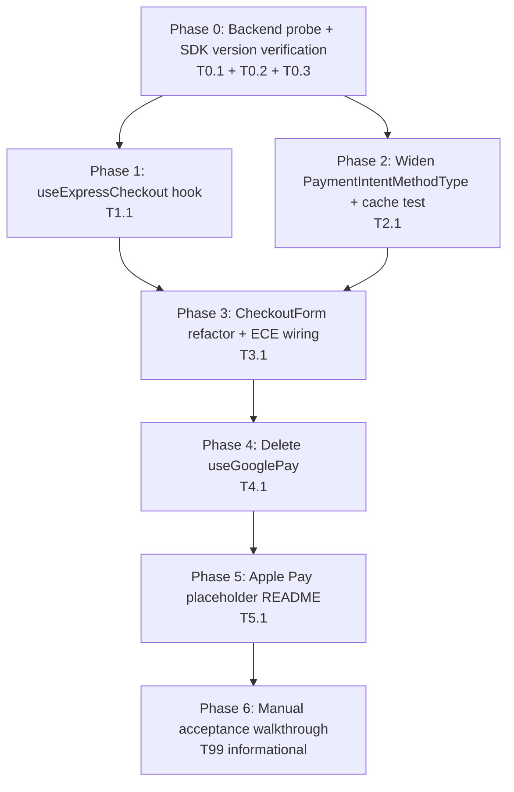
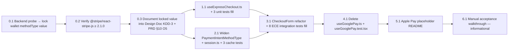

# Work Plan: Module 3 — Stripe Wallets via Express Checkout Element (ECE)

Created Date: 2026-04-29
Type: refactor
Estimated Duration: 2–3 days (solo)
Estimated Impact: ~9 files (3 new, 4 modified, 2 deleted) + 1 new placeholder README; possibly `package.json` if `@stripe/react-stripe-js` requires upgrade
Module: 3 of 5 — wallet-slot migration on top of the shipped first-payment slice

## Related Documents

- Design Doc (canonical): [`docs/design/module-3-stripe-wallets-ece.md`](../design/module-3-stripe-wallets-ece.md) — ACs AC-D01..AC-D11, KDD-1 KEEP NESTED, KDD-2 NATURAL CACHE MISS, KDD-3 PROBE-THEN-LOCK, KDD-4 hook does not own Stripe instance.
- ADR: [`docs/adr/ADR-0001-stripe-wallets-via-express-checkout-element.md`](../adr/ADR-0001-stripe-wallets-via-express-checkout-element.md) — Accepted; Open Questions #1/#2/#3 referenced throughout.
- PRD: [`docs/prd/module-3-first-payment.md`](../prd/module-3-first-payment.md) — updated 2026-04-29; ACs 20–25a + 25 (single-stage confirm) + R11′/R13/R14 risks.
- Predecessor plan (shipped): [`docs/plans/module-3-first-payment.md`](./module-3-first-payment.md) — establishes `usePaymentIntent`, `CardForm`, `CheckoutForm`, `useGooglePay`. This plan migrates the wallet slot only.
- Codebase conventions: [`CLAUDE.md`](../../CLAUDE.md).

## Objective

Replace the legacy `useGooglePay` + `paymentRequest()` two-stage flow in `<CheckoutForm>` with a hoisted `<Elements mode='payment'>` provider hosting `<ExpressCheckoutElement>`, so Google Pay AND Apple Pay render as correctly-branded buttons in a single Stripe-managed wallet slot. Preserve PayPal, Card, consent gating, intent caching, and `assertKeyMatchesMode` semantics. Land the placeholder README for the deployment-side Apple Pay association file. Close ADR-0001 OQ#2 and OQ#3; specify the resolution path for OQ#1 via a backend probe.

## Background

- Module 3 first-payment (predecessor plan) shipped on `develop`. `<CheckoutForm>` currently mounts `useGooglePay`, exposes a custom GPay pill with `gpayIcon`, and uses two-stage `confirmCardPayment` + `handleCardAction`. The card path mounts a scoped `<Elements clientSecret>` around `<CardForm>` with `<PaymentElement>`. PayPal uses `usePayPalCheckout` over `@paypal/paypal-js` and is unaffected.
- `usePaymentIntent.PaymentIntentMethodType` is currently `"card" | "google_pay"`. ECE requires a single value spanning both GPay and Apple Pay because ECE does not expose the chosen wallet at create-intent time (only inside `onConfirm` post-confirm). Default-locked candidate is `'card'` per Design Doc KDD-3, pending backend probe.
- `FunnelSession.paymentIntent.keyedBy.methodType` is the cache key field. Legacy entries with `methodType === 'google_pay'` will be left in `sessionStorage` for users mid-funnel at deploy. Per KDD-2, those become natural cache misses on byte-for-byte equality and are overwritten by the next fresh intent. No migration code.
- Stripe Elements groups are immutable post-mount. The hoisted deferred-mode `<Elements>` (no `clientSecret`) cannot also serve the card path's `<PaymentElement>` (which requires `clientSecret` at provider mount). Per KDD-1, the card-path scoped `<Elements clientSecret>` is **kept nested** under the hoisted provider. Stripe explicitly supports two coexisting Elements groups.
- No backend changes in this slice. No new env vars. `@stripe/react-stripe-js >= 2.1.0` is required for `<ExpressCheckoutElement>`; verify and upgrade if needed in Phase 0.
- Test-skeleton inputs from the test-design phase: `CheckoutForm.test.tsx` (8 ECE skeletons appended; existing 16 preserved), `useExpressCheckout.test.tsx` (NEW; 3 skeletons including KDD-4 architectural guard), `usePaymentIntent.test.tsx` (3 skeletons appended for legacy-cache-miss + 2 non-regression). Manual walkthrough in `tests/e2e/checkout-ece-manual.md` (7 sub-walkthroughs; final-phase informational).

## Implementation Strategy

**Approach: Horizontal-slice prep → vertical wallet slice → cleanup → deployment placeholder → manual sanity** (Hybrid per implementation-approach skill, vertical-slice-leaning).

Rationale (matches Design Doc §Implementation Approach):

- The union widening in `usePaymentIntent` and `session.ts` is a small horizontal-slice prerequisite that must land first so the wallet method-type value compiles everywhere.
- `useExpressCheckout` is a thin pure adapter; testable in isolation before any UI consumes it.
- `<CheckoutForm>` refactor is the integration commit: hoist `<Elements>`, mount ECE, remove all GPay-specific state, keep the nested card `<Elements clientSecret>` (KDD-1), preserve PayPal and consent gate. The production refactor and the test rewrite land together to avoid a broken-test commit.
- `useGooglePay.ts` + `useGooglePay.test.tsx` are deleted only after no importers remain (post-refactor).
- The Apple Pay placeholder README is independent and can land any time; placed in Phase 5 to keep cleanup-adjacent commits together.
- Manual walkthrough (Phase 6) is informational; it does not block commit / merge if Phases 1–5 pass automated tests.

Verification levels (from `implementation-approach` skill):

- **L3 (build)** on every commit: `npx tsc --noEmit` + `npm run lint` + `npm run build`.
- **L2 (unit + integration tests)** for `useExpressCheckout`, `usePaymentIntent` (extension), `CheckoutForm` (rewrite). All Stripe SDK surfaces mocked via `vi.hoisted` + `vi.mock` per existing repo convention.
- **L1 (manual smoke)** in Phase 6 against Stripe test mode with the existing `pk_test_` from the predecessor plan.

Each phase ends in a green test suite for the files it touches; phase ordering enforces this. The task-executor commits at the end of each phase after `quality-fixer` approves.

**Out of scope for this plan** (explicit): PayPal flow, Card path business logic, backend changes, Stripe Dashboard configuration (deployment task), automated Playwright E2E.

## Risks and Countermeasures

### Technical Risks

- **R-D1 (PRD R11′)** — Pricing regression silently disables wallet path.
  - **Impact**: ECE button never appears in production despite passing AC-D02; users cannot use GPay/Apple Pay.
  - **Countermeasure**: Phase 3 integration tests assert `<ExpressCheckoutElement>` does not mount when `pricing` is undefined (AC-D02). Module 2 pricing-arrival tests upstream guard ingress.

- **R-D2 (PRD R13)** — Apple Pay live-mode prerequisites missed at deploy.
  - **Impact**: Apple Pay button absent in production despite passing test-mode acceptance.
  - **Countermeasure**: Phase 5 placeholder README documents the deployment requirement explicitly. Risk acknowledged, not fixed in implementation slice; tracked under PRD §10 O6/O7.

- **R-D3 (PRD R14)** — ECE branding does not match prior custom GPay pill.
  - **Impact**: Visual diff vs. predecessor implementation; design/marketing review may flag.
  - **Countermeasure**: `useExpressCheckout` exposes Stripe's `buttonType` / `buttonTheme` / `buttonHeight` via options. Implementation lands with Stripe defaults. DD-OQ-1 leaves design tuning for marketing review pre-launch.

- **R-D4** — Backend rejects the chosen wallet `payment_method_type`.
  - **Impact**: Wallet path 4xx on first click; ECE reports payment failed; users cannot pay via wallet.
  - **Countermeasure**: Phase 0 probe procedure with explicit escalation rule per Design Doc §Backend contract & probe procedure. Default-lock `'card'`. Phase 6 manual walkthrough verifies test-mode end-to-end before release.

- **R-D5** — Card-path `<PaymentElement>` re-mounts on hoisted-Elements churn.
  - **Impact**: Card form loses transient state when wallet is interacted with; user-visible field reset.
  - **Countermeasure**: KDD-1 (KEEP NESTED) — scoped `<Elements clientSecret>` stays as descendant of hoisted provider; lifecycle independent. Phase 3 integration tests assert no card-form re-mount on wallet interactions.

- **R-D6** — ECE's `onConfirm` errors don't update its button visual state.
  - **Impact**: Wallet button remains in "loading"/"submitted" state after error; user cannot retry without page reload.
  - **Countermeasure**: Boundary contract in `useExpressCheckout`: error path MUST call `helpers.paymentFailed()` AND `setMethodError(...)`. Phase 3 integration test exercises both code paths (AC-D05).

- **R-D7** — Apple Pay manual acceptance gap (no Safari automation).
  - **Impact**: Apple Pay regressions land undetected by the automated suite.
  - **Countermeasure**: Phase 6 walkthrough explicitly enumerates the Safari + Apple Pay step as manual-only. Release checklist must include Safari verification.

- **R-D8** — Probe yields a backend whitelist that requires per-wallet differentiation.
  - **Impact**: Default `'card'` value fails for one or both wallets at create-intent time.
  - **Countermeasure**: Phase 0 escalation rule fires → halt before Phase 1; pull-in backend owner. Default `'card'` is intentionally non-locked-in to avoid premature commitment.

- **R-D9** — `@stripe/react-stripe-js` version in repo is too old for `<ExpressCheckoutElement>`.
  - **Impact**: Phase 1 import resolution fails; whole slice blocked.
  - **Countermeasure**: Phase 0 explicitly verifies `@stripe/react-stripe-js >= 2.1.0` in `package.json` and upgrades if needed. Lockfile change committed in Phase 0.

### Schedule Risks

- **Phase 0 backend access blocker.** If the backend repo is opaque or inaccessible, the probe falls back to `'card'` per KDD-3. Documented; not schedule-blocking.
- **Phase 6 Safari availability.** Manual Apple Pay verification needs a macOS / iOS Simulator with an Apple Pay-configured wallet. If unavailable at Phase 6, the Safari step is deferred to release checklist; automated phases unaffected.
- **DD-OQ-1 design review.** ECE button options (theme, type, height) may need a design pass before live launch. Phase 6 ships with Stripe defaults; design tuning is post-merge.

## Phase Structure

## Task Dependency Diagram

T1.1 and T2.1 have no compile-time dependency on each other once T0.3 has locked the wallet value — they can be parallelised by a second developer. T3.1 depends on both.

---

## Phase 0: Backend probe + domain prep (1 commit)

**Purpose**: Lock the backend `payment_method_type` value for the wallet path (KDD-3 default `'card'`), verify SDK supports `<ExpressCheckoutElement>`, and record the locked value back into the Design Doc + PRD. No production code changes yet.

**Closes ACs**: foundation for AC-D04 (correct method-type value flowing into `intent.createIntent`). Does not fully close any AC.

**Estimated complexity**: S. **Risk note**: Backend access may be opaque → fall back to `'card'` and document the rationale.

### Task 0.1 — Probe backend for accepted `payment_method_type` values, lock the wallet value

- **Purpose**: Resolve ADR-0001 OQ#1 / Design Doc KDD-3.
- **Files touched**: none in this task; outputs are documentation in T0.3.
- **Procedure** (verbatim from Design Doc §Backend contract & probe procedure):
  1. Locate the backend repo. If inaccessible/opaque → fall back to `'card'`, skip steps 2–5.
  2. Find handler for `POST /payment/stripe/create-payment-intent` (search by route string or response shape `{ client_secret, id }`).
  3. Inspect the validator/whitelist on `payment_method_type` (enum lists, allow-lists, switch/match, `Stripe::PaymentIntent.create(payment_method_types: [...])` calls).
  4. Determine the accepted set. Common cases:
     - Only `'card'` and `'paypal'` → use `'card'`. **Locked.**
     - `'card'`, `'paypal'`, `'apple_pay'` etc. → still use `'card'` (KDD-3: ECE cannot differentiate at create-intent time).
     - Free-form string → use `'card'`.
  5. Verify in Stripe **test mode** that an intent created with the chosen value can be confirmed via ECE on Chrome (GPay) and (if available) Safari (Apple Pay) in a scratch local run.
  6. If chosen value fails (intent 4xxs or `confirmPayment` rejects) → **escalate**, halt the plan. Do not silently fall back to a different method's value.
- **Outcome to record**: a single string — the locked wallet `payment_method_type` value (default `'card'` unless probe finds a stronger requirement). Capture this for T0.3.
- **Acceptance**:
  - One value chosen (default or probe-confirmed); rationale captured for T0.3.
  - Escalation triggered IF AND ONLY IF probe step 5 fails outright.

### Task 0.2 — Verify `@stripe/react-stripe-js` supports `<ExpressCheckoutElement>`

- **Purpose**: Avoid a Phase 1 import-resolution failure (R-D9).
- **Files touched** (only if upgrade needed):
  - `package.json` — bump `@stripe/react-stripe-js` to `>= 2.1.0` if currently below.
  - `package-lock.json` and/or `bun.lockb` — lockfile refresh.
- **Procedure**:
  1. Open `package.json` → check `@stripe/react-stripe-js` version. ECE was added in `2.1.0`.
  2. If version `< 2.1.0` → `npm install @stripe/react-stripe-js@latest` (matching repo convention for caret/exact pinning); commit lockfile.
  3. If version `>= 2.1.0` → no change.
  4. Verify `@stripe/stripe-js` version is compatible (Stripe's own peer requirements; usually no separate bump needed).
  5. Run `npx tsc --noEmit` to confirm types resolve.
- **Acceptance**:
  - `import { ExpressCheckoutElement } from '@stripe/react-stripe-js'` resolves without TS error.
  - If upgraded: `npm run build` + `npm run test` still green (no breaking changes from minor upgrade).

### Task 0.3 — Document locked wallet value into Design Doc KDD-3 + PRD §10 O5

- **Purpose**: Make the locked value the single source of truth before any code touches it; resolve PRD §10 Open Item O5.
- **Files touched**:
  - `docs/design/module-3-stripe-wallets-ece.md` — KDD-3 section: replace "default candidate `'card'`" wording with the locked value + brief probe-result note (1–2 sentences).
  - `docs/prd/module-3-first-payment.md` — §10 O5: mark resolved with the locked value and date.
- **Acceptance**:
  - Both docs reference the same locked value.
  - PRD O5 status changed from open to resolved.

### Phase 0 Completion Criteria
- [x] Wallet `payment_method_type` value is locked (default `'card'` or probe-confirmed alternative). Locked to `'card'` (fallback applied 2026-04-29; backend repo `d:/Projects/JadeApp/jadeapp-backend/` is a different service and does not own create-payment-intent).
- [x] `@stripe/react-stripe-js >= 2.1.0` confirmed in `package.json`; upgraded if needed. Confirmed `^6.2.0` in `package.json` on 2026-04-29 (well above `2.1.0` minimum). `ExpressCheckoutElement` export verified present at runtime; `npx tsc --noEmit` clean. No upgrade performed; no-op task — no diff, no commit.
- [x] Design Doc KDD-3 and PRD §10 O5 both reference the locked value.
- [x] No production code changed yet (only `package.json` + lockfile if upgrade needed, plus the two docs). Phase 0 Task 0.2 was a no-op — no `package.json` or lockfile change.
- [ ] If upgrade was performed: `npx tsc --noEmit` + `npm run lint` + `npm run build` + `npm run test` all green.

### Phase 0 Operational Verification
1. `grep -n "payment_method_type" docs/design/module-3-stripe-wallets-ece.md docs/prd/module-3-first-payment.md` shows the locked value consistently.
2. `node -e "console.log(require('./package.json').dependencies['@stripe/react-stripe-js'])"` prints a version `>= 2.1.0`.
3. If upgrade was performed: full repo test suite still green.

---

## Phase 1: `useExpressCheckout` hook (1 commit)

**Purpose**: Create the thin pure adapter hook that wires `pricing` → ECE button options + onConfirm glue. KDD-4: hook does not own a Stripe instance, no `stripePromise` subscription, no `useEffect` for SDK loading. Fill in the 3 skeletons in `useExpressCheckout.test.tsx`.

**Closes ACs**: foundation for AC-D03, AC-D10. Test-resolution progress: 3/14 (3 of useExpressCheckout's tests; rest land in Phase 2/3).

**Estimated complexity**: S. **Risk note**: Low. Hook is intentionally thin — most behavioural logic lives in `<CheckoutForm>`'s `onConfirm` and is verified in Phase 3.

### Task 1.1 — Create `useExpressCheckout.ts` + fill 3 unit-test skeletons

- **Purpose**: Deliver the configuration helper conforming to the Design Doc §Module / hook contracts.
- **Files touched**:
  - `src/hooks/useExpressCheckout.ts` (**new**).
  - `src/hooks/useExpressCheckout.test.tsx` (**modify** — fill in 3 skeletons; file already exists from test-design phase).
- **Hook contract** (per Design Doc):
  - **Inputs**: `{ pricing: PricingWithMode | undefined, disabled: boolean, onConfirm: (event, helpers) => Promise<void>, onReady?: () => void }`.
  - **Outputs**: `{ eceProps, ready }` where `eceProps` spreads onto `<ExpressCheckoutElement>` (includes `onConfirm`, `options.buttonType`, `options.buttonTheme`, `options.buttonHeight`, `onReady`); `ready` becomes true once `onReady` fires once.
  - When `pricing === undefined`: returns a sentinel that suppresses ECE rendering (e.g. `{ eceProps: undefined, ready: false }` — call site renders nothing when `eceProps` is falsy).
  - When `disabled === true`: ECE's button options are configured to treat the slot as non-interactive (Stripe's documented options for disabling the button visually + behaviourally).
  - **No** module-level `stripePromise` import. **No** `useEffect` for SDK loading. **No** `available` state. **No** imperative `show()` handle. (KDD-4 architectural guard.)
  - Lifecycle: pure; re-runs only when `pricing` scalars (`first_sale_price`, `currency_code`, `first_sale_cents_price`) change.
- **Test cases** (fill the 3 skeletons that already exist in the test file):
  1. When `pricing` is undefined → returned `eceProps` is the suppression sentinel (e.g. falsy / `undefined`); consumer can detect and skip rendering ECE.
  2. When `pricing` is present → returned `eceProps.options` includes the configured `buttonType` / `buttonTheme` / `buttonHeight` defaults (assertable via direct object access).
  3. **KDD-4 architectural guard**: the hook does not import or subscribe to `stripePromise` from `@/lib/stripe`. Verified by the test file mocking `@/lib/stripe` with a spy and asserting the spy is never called when the hook renders. (If the test skeleton uses a different verification pattern — e.g. ESM static-analysis assertion — match the skeleton's intent.)
- **Acceptance**:
  - Hook signature matches the Design Doc contract exactly.
  - All 3 tests in `useExpressCheckout.test.tsx` are green.
  - `useExpressCheckout.ts` does not import `@/lib/stripe`. (`grep -n "from.*lib/stripe" src/hooks/useExpressCheckout.ts` → zero hits.)
- **Verification**:
  - `npx vitest run src/hooks/useExpressCheckout.test.tsx` → 3/3 passing.
  - `npx tsc --noEmit` + `npm run lint` + `npm run build` + `npm run test` all green.
  - No file in `src/components/` or `src/pages/` imports `useExpressCheckout` yet (isolation check).

### Phase 1 Completion Criteria
- [x] `useExpressCheckout.ts` matches the Design Doc §Module / hook contracts contract.
- [x] `useExpressCheckout.test.tsx` 3/3 green; KDD-4 architectural guard test (no `stripePromise` subscription) passes.
- [x] `npx tsc --noEmit` + `npm run lint` + `npm run build` + `npm run test` all green.
- [x] No production consumer of `useExpressCheckout` yet (isolation check).
- [x] Test resolution progress: 3 / 14 ECE-track tests resolved.

### Phase 1 Operational Verification
1. `npx vitest run src/hooks/useExpressCheckout.test.tsx` → 3 passing.
2. `grep -rn "useExpressCheckout" src` returns only the hook file and its test file (no consumer yet).

---

## Phase 2: Widen `PaymentIntentMethodType` + verify cache behaviour (1 commit)

**Purpose**: Land the smallest horizontal-slice prerequisite — widen the union to include the locked wallet value (Phase 0 outcome) so the wallet path can call `intent.createIntent(<wallet value>)` in Phase 3. Verify the natural-cache-miss behaviour for legacy `'google_pay'` entries (KDD-2). Fill in the 3 skeletons in `usePaymentIntent.test.tsx`.

**Closes ACs**: AC-D07 (legacy-cache natural miss). Foundation for AC-D04. Test-resolution progress: 6/14 cumulative.

**Estimated complexity**: S. **Risk note**: Low. Type-level change with one behavioural assertion (cache miss). KDD-2 says no migration code; the assertion confirms structural equality already does the right thing.

### Task 2.1 — Widen union in `usePaymentIntent.ts` + `session.ts`; fill 3 cache test skeletons

- **Purpose**: Type widening + behavioural assertion.
- **Files touched**:
  - `src/hooks/usePaymentIntent.ts` (**modify**) — widen `PaymentIntentMethodType` from `"card" | "google_pay"` to `"card" | <locked wallet value>`. If locked value is `'card'`, the union becomes `"card"` for the wallet path AND the card path — i.e. the union may collapse to a single literal string. In that case keep the type alias for clarity. **No** signature changes to `createIntent` or any other export.
  - `src/lib/session.ts` (**modify**) — widen `FunnelSession.paymentIntent.keyedBy.methodType` to match `PaymentIntentMethodType`.
  - `src/hooks/usePaymentIntent.test.tsx` (**modify** — fill in 3 skeletons appended in test-design phase).
- **Test cases** (fill the 3 skeletons):
  1. **Legacy-cache natural miss**: pre-populate `session.paymentIntent.keyedBy.methodType = 'google_pay'`. Call `createIntent(<locked wallet value>)`. Assert: `apiPost('create-payment-intent')` is called once (fresh POST), the cached entry is overwritten with the new `methodType`, no errors raised, no duplicate cache entry persists. (AC-D07.)
  2. **Non-regression: card path cache hit**: pre-populate cache with `methodType: 'card'`. Call `createIntent('card')` within TTL. Assert: cache hit, no POST, returned `clientSecret` matches cached value.
  3. **Non-regression: paypal path cache behaviour**: pre-populate with `methodType: 'paypal'`. Call `createIntent('paypal')` within TTL. Assert: same cache-hit behaviour as before; the union widening did not break paypal-path matching.
- **Acceptance**:
  - `PaymentIntentMethodType` union includes the locked wallet value.
  - `FunnelSession.paymentIntent.keyedBy.methodType` typed identically to `PaymentIntentMethodType`.
  - `createIntent` signature unchanged; all existing callers compile unchanged.
  - All 3 new tests green AND all 9 pre-existing `usePaymentIntent.test.tsx` tests still green (12/12 total).
- **Verification**:
  - `npx vitest run src/hooks/usePaymentIntent.test.tsx` → 12/12 passing.
  - `npx tsc --noEmit` clean (the widening should not break any existing call site; if it does, that's a discovery and the offending site needs to be addressed in this task).
  - `npm run lint` + `npm run build` + `npm run test` all green.

### Phase 2 Completion Criteria
- [x] `PaymentIntentMethodType` collapsed to the single locked literal `'card'` (legacy `'google_pay'` removed; KDD-3 lock applied 2026-04-29). Alias retained for clarity / future extension. `WALLET_METHOD_TYPE` const exported as the single source of truth.
- [x] `FunnelSession.paymentIntent.keyedBy.methodType` typed as `PaymentIntentMethodType` (type-only import from `@/hooks/usePaymentIntent`).
- [x] `usePaymentIntent.test.tsx` 11/11 green (8 pre-existing + 3 skeleton fills). The "9 + new 3 = 12" estimate in the original framing miscounted the pre-existing tests (actual: 8 it() + 3 it.todo()). One existing test was minimally adapted via `as unknown as PaymentIntentMethodType` cast on the legacy `'google_pay'` literal to preserve runtime behaviour against the narrowed union.
- [x] `createIntent` signature unchanged; no caller broken.
- [x] `npx tsc --noEmit` clean (root tsconfig); pre-existing strict-mode errors in unrelated files (`useLocalizedQuestionText`, `paypal.ts`, `PremiumReportPage`, etc.) are out of scope. Full vitest suite green (154 passed, 8 todo — down from 11 todo).
- [x] Test resolution progress: 6 / 14 ECE-track tests resolved (3 useExpressCheckout + 3 usePaymentIntent extension).

### Phase 2 Operational Verification
1. `npx vitest run src/hooks/usePaymentIntent.test.tsx` → 12 passing.
2. `grep -n "google_pay" src` returns only legacy `useGooglePay.ts` (still present until Phase 4) — confirms no new dependence on the legacy literal.
3. `npx tsc --noEmit` clean across the whole repo.

---

## Phase 3: Refactor `<CheckoutForm>` + wire ECE (1 commit)

**Purpose**: The integration commit. Hoist `<Elements mode='payment'>`, mount `<ExpressCheckoutElement>` via `useExpressCheckout`, wire `onConfirm` to `intent.createIntent → stripe.confirmPayment → finalizeAfterStripeSuccess`, remove all GPay-specific state, keep card-path nested `<Elements clientSecret>` (KDD-1), preserve PayPal and consent gate. Fill in the 8 ECE skeletons in `CheckoutForm.test.tsx`. **`useGooglePay` is still imported in this phase — its deletion is Phase 4** because some legacy importers need the full refactor to land first to confirm zero references.

Wait — `useGooglePay` import IS removed in this phase. The deletion of the **files** is Phase 4. Confirming the order: Phase 3 removes the import line and all references; Phase 4 deletes the (now-unused) source files.

**Closes ACs**: AC-D01, AC-D02, AC-D03, AC-D04, AC-D05, AC-D06, AC-D08, AC-D09, AC-D10. Test-resolution progress: 14/14 cumulative (8 of CheckoutForm's ECE skeletons + 16 preserved existing).

**Estimated complexity**: L. **Risk note**: Highest-risk task in the plan. R-D1 (pricing regression), R-D5 (card form re-mount), R-D6 (ECE error visual state) all converge here. Mitigated by AC-D02 / AC-D09 / AC-D05 tests landing in this same commit.

### Task 3.1 — Refactor `CheckoutForm.tsx` + fill 8 ECE integration-test skeletons

- **Purpose**: Land the entire wallet-slot migration end-to-end.
- **Files touched**:
  - `src/components/checkout/CheckoutForm.tsx` (**modify** — substantial refactor).
  - `src/components/checkout/CheckoutForm.test.tsx` (**modify** — fill in 8 ECE skeletons; existing 16 tests preserved).
- **Production refactor — REMOVE**:
  - `gpayClientSecretRef` and any closure that reads from it.
  - `handleGooglePayMethod` handler.
  - `handleGooglePayClick` handler (and any binding to a wallet button's `onClick`).
  - `import { useGooglePay } from '@/hooks/useGooglePay'` (and the `useGooglePay({...})` call).
  - The standalone GPay `<Button>` block (lines 297–315 in current `CheckoutForm.tsx`).
  - Any `gpayIcon` prop / import / `` reference in CheckoutForm (the icon is no longer used; ECE renders Stripe-managed branding). If `gpayIcon` is passed in from `<CheckoutPage>`, it's now unused at the call site; that's tracked as a follow-up out-of-scope cleanup but the prop is removed from `CheckoutForm`'s `Props`.
- **Production refactor — ADD**:
  - At the top of the form's render: hoist `<Elements stripe={stripePromise} options={{ mode: 'payment', amount, currency, appearance, loader: 'auto' }}>`. Derive `amount` and `currency` from `pricing` (e.g. `pricing.first_sale_cents_price` and `pricing.currency_code`). When `pricing` is undefined, render a graceful fallback (no `<Elements>`, no ECE, no throw — AC-D02).
  - `useExpressCheckout({ pricing, disabled: !consented || submitting, onConfirm })` invocation.
  - `<ExpressCheckoutElement {...eceProps} />` rendered inside the hoisted provider, in the wallets slot.
  - `onConfirm(event, helpers)` implementation (the consumer-supplied callback that `useExpressCheckout` accepts):
    1. `setSubmitting(true)`.
    2. `const { clientSecret } = await intent.createIntent(<locked wallet methodType>)` — exactly once per call. Catch errors; on failure call `helpers.paymentFailed()` AND `setMethodError(err.message)`; do NOT proceed to `confirmPayment`.
    3. `const { paymentIntent, error } = await stripe.confirmPayment({ elements, clientSecret, confirmParams: { return_url: cardReturnUrl }, redirect: 'if_required' })`.
    4. On `error`: `helpers.paymentFailed()`; `setMethodError(error.message)`; do NOT call backend confirm. (AC-D05.)
    5. On `paymentIntent.status === 'succeeded'`: `await finalizeAfterStripeSuccess(paymentIntent.id)`; `navigate(...)` per the resolved `redirect_page`. (AC-D06.)
    6. `setSubmitting(false)` in a `finally`.
- **Production refactor — KEEP NESTED (KDD-1)**:
  - The card-path scoped `<Elements stripe={stripePromise} options={{ clientSecret, appearance, loader: 'auto' }}>` block stays. It now lives **as a descendant of** the hoisted provider, **only** when `activeMethod === 'card' && intent.clientSecret`. CardForm props and behaviour unchanged.
- **Production refactor — PRESERVE**:
  - Consent checkbox + gating logic (no change).
  - PayPal slot via `usePayPalCheckout` (no change; not under the hoisted Stripe `<Elements>` because PayPal does not consume Stripe Elements).
  - "Credit or debit card" `<Button onClick={handleCardClick} />`.
  - `assertKeyMatchesMode(pricing.payment_mode)` invocation (idempotent; runs every render when pricing.payment_mode is present).
  - `handleFinalize` / `handleRetryFinalize` / auto-finalise on `recoveredSucceeded`.
  - `cardReturnUrl` derivation via `withPromoParams`.
- **Test cases — fill the 8 ECE skeletons**:
  1. **AC-D01**: When `pricing` is provided, the hoisted `<Elements>` mock is rendered with `mode='payment'`, `amount` derived from `pricing`, `currency` derived from `pricing.currency_code`. `<ExpressCheckoutElement>` mounts inside it.
  2. **AC-D02**: When `pricing` is undefined, neither the hoisted `<Elements>` nor `<ExpressCheckoutElement>` mounts; CheckoutForm renders without throwing; consent + card button + PayPal slot all still render (graceful skip).
  3. **AC-D03**: With pricing present, `<ExpressCheckoutElement>` is rendered; the test mocks ECE as a stub that captures `onConfirm` into a hoisted `vi.fn`, no application-level `canMakePayment()` call exists in CheckoutForm code.
  4. **AC-D04 + AC-D06 happy path**: drive the captured `onConfirm` with a fake event + `fakeHelpers = { resolve: vi.fn(), reject: vi.fn(), paymentFailed: vi.fn() }`. Assert: `intent.createIntent(<locked wallet methodType>)` called exactly once → `stripe.confirmPayment` called with `{ elements, clientSecret, confirmParams: { return_url: <expected> }, redirect: 'if_required' }` → on success, `finalizeAfterStripeSuccess(paymentIntent.id)` called → `navigate(...)` fires with the resolved redirect_page.
  5. **AC-D05 error path**: drive `onConfirm`; mock `stripe.confirmPayment` to return `{ error: { message: 'Card declined' } }`. Assert: inline alert shows the error; backend confirm endpoint is NOT called (assert via `apiPost` mock not called for the confirm route); `helpers.paymentFailed()` called.
  6. **AC-D08 + AC-D09 (KDD-1 nested + no remount)**: render with consent ticked; toggle `activeMethod` from `null` → `'card'` → `null` → `'card'`. Assert: hoisted `<Elements>` mock instance is the same across all toggles (no remount); the nested `<Elements clientSecret>` mounts only when `activeMethod === 'card' && intent.clientSecret`; CardForm does NOT re-mount when ECE's `onConfirm` is driven mid-test.
  7. **AC-D10 consent gating**: render with `consented === false`. Assert: `useExpressCheckout` was called with `disabled: true`; even if the test invokes the captured `onConfirm`, no `createIntent` fires (the ECE stub respects `disabled` per the hook contract). When `consented` flips to true, `disabled` flips to false on the next render.
  8. **AC-D07 (legacy-cache natural miss in CheckoutForm context)**: pre-populate `session.paymentIntent.keyedBy.methodType = 'google_pay'` in `sessionStorage`; mount CheckoutForm; drive `onConfirm`; assert exactly one fresh `apiPost('create-payment-intent')` is issued (no cache hit) and the new methodType overwrites the legacy entry. (Confirms behaviour at the integration level — Phase 2 already verifies it at the hook level.)
- **Mocking strategy** (per Design Doc §Test Strategy / Mocking strategy for `<ExpressCheckoutElement>`):
  - Mock `@stripe/react-stripe-js` to export a stub `<ExpressCheckoutElement>` that renders `data-testid="ece-stub"` and captures `onConfirm` into a hoisted `vi.fn`.
  - Tests retrieve the captured callback via `eceOnConfirmMock.mock.calls[0][0]` and invoke it as `await capturedOnConfirm(fakeEvent, fakeHelpers)`.
  - Mock `<Elements>` as a passthrough that exposes its options for assertion.
  - Mock `useStripe` / `useElements` to return the existing mocked Stripe instance.
- **Acceptance**:
  - All 8 new ECE tests green.
  - All 16 pre-existing CheckoutForm tests still green (24 / 24 total).
  - No reference to `useGooglePay` / `gpayClientSecretRef` / `handleGooglePay*` remains in `CheckoutForm.tsx`. (`grep -nE "useGooglePay|gpayClientSecretRef|handleGooglePay" src/components/checkout/CheckoutForm.tsx` → zero hits.)
  - Hoisted `<Elements>` is at the top of the rendered tree; the nested `<Elements clientSecret>` is a descendant when card branch is active.
  - The wallet path's `onConfirm` calls `intent.createIntent` with the locked wallet methodType value (single source of truth, e.g. a constant `WALLET_METHOD_TYPE = '<locked value>'` at the top of the file).
- **Verification**:
  - `npx vitest run src/components/checkout/CheckoutForm.test.tsx` → 24/24 passing.
  - `npx tsc --noEmit` + `npm run lint` + `npm run build` + `npm run test` all green.
  - `grep -rn "useGooglePay" src/components/` → zero hits (only `src/hooks/useGooglePay.ts` and its test file still exist; deleted in Phase 4).

### Phase 3 Completion Criteria
- [x] `<CheckoutForm>` refactored: hoisted `<Elements>` + ECE in wallets slot + nested `<Elements clientSecret>` for card + PayPal preserved + consent preserved + GPay-specific state removed.
- [x] `CheckoutForm.test.tsx` 24/24 green (existing 16 + new 8).
- [x] No `useGooglePay` reference in `src/components/`.
- [x] `npx tsc --noEmit` + `npm run lint` + `npm run build` + `npm run test` all green.
- [x] Test resolution progress: 14 / 14 ECE-track tests resolved.

### Phase 3 Operational Verification
1. `npx vitest run src/components/checkout/CheckoutForm.test.tsx` → 24 passing.
2. `npm run dev` with `VITE_STRIPE_PUBLISHABLE_KEY=pk_test_…` in `.env.local` → open `/checkout` after walking the funnel → ECE button area renders (a Stripe-styled wallet button if the browser has a configured wallet, else nothing); card button still works; PayPal button still works; consent gate still works.
3. `grep -rn "useGooglePay" src/components/ src/pages/` → zero hits.

---

## Phase 4: Delete legacy `useGooglePay` (1 commit)

**Purpose**: Now that no consumer references `useGooglePay`, delete the source files. Verify zero remaining importers via grep. Run full `vitest run` to confirm green.

**Closes ACs**: indirect — supports AC-D03 (no application-level `canMakePayment()`). No new test resolution.

**Estimated complexity**: S. **Risk note**: Low. If grep reveals a missed importer, that's a Phase 3 escape — go back and fix.

### Task 4.1 — Delete `useGooglePay.ts` + `useGooglePay.test.tsx`

- **Files touched**:
  - `src/hooks/useGooglePay.ts` (**delete**).
  - `src/hooks/useGooglePay.test.tsx` (**delete**).
- **Procedure**:
  1. `grep -rn "useGooglePay" src` → must return only the two files about to be deleted. If any other hit exists, **halt** and fix the importer in Phase 3 first.
  2. `git rm src/hooks/useGooglePay.ts src/hooks/useGooglePay.test.tsx`.
  3. `npx vitest run` (full repo) → all green.
  4. `npx tsc --noEmit` + `npm run lint` + `npm run build` clean.
- **Acceptance**:
  - Both files removed.
  - Full repo test suite green.
  - `grep -rn "useGooglePay" src` → zero hits.

### Phase 4 Completion Criteria
- [x] `useGooglePay.ts` + `useGooglePay.test.tsx` deleted.
- [x] Full repo `npx vitest run` green.
- [x] `npx tsc --noEmit` + `npm run lint` + `npm run build` all green.
- [x] `grep -rn "useGooglePay" src` → zero hits.

### Phase 4 Operational Verification
1. `git status` shows the two deletions and nothing else in this commit.
2. `grep -rn "useGooglePay\|paymentRequest\|canMakePayment" src` returns only legitimate Stripe-internal references (if any in the new ECE wiring) — no app-level Google Pay code remains.

---

## Phase 5: Apple Pay deployment placeholder (1 commit)

**Purpose**: Land a documentation-only README under `public/.well-known/` describing the deployment requirement for the `apple-developer-merchantid-domain-association` file. The actual association file is provisioned at deploy time and is NOT committed to source control.

**Closes ACs**: AC-D11 (no-association-file resilience is a runtime property, not blocked by this README; the README captures the deployment task).

**Estimated complexity**: S. **Risk note**: None.

### Task 5.1 — Create `public/.well-known/README.md`

- **Files touched**:
  - `public/.well-known/README.md` (**new**).
- **Content** (single short README describing the deployment requirement). Required points:
  - Why the file is needed: Apple Pay live-mode requires `https://<prod-domain>/.well-known/apple-developer-merchantid-domain-association` to be served.
  - File name (no extension): `apple-developer-merchantid-domain-association`.
  - Source: downloaded from Stripe Dashboard → Settings → Payment Methods → Apple Pay after registering the production domain.
  - Vite serves anything under `public/` as static assets at the root path; the file under `public/.well-known/` will be served at `/.well-known/...`.
  - Verify CDN / reverse proxy / path-rewrite rules do not intercept `.well-known/`.
  - The file is provisioned at deploy time and is NOT committed to source control (sensitive; per-environment).
  - Test mode does not require the file; this is a live-mode-only prerequisite.
- **Acceptance**:
  - README exists at the path.
  - README content covers the points above.
  - No actual association file committed.
- **Verification**:
  - `cat public/.well-known/README.md` shows the content.
  - `ls public/.well-known/` shows only `README.md`.
  - `git status` for the commit shows only the one new file.

### Phase 5 Completion Criteria
- [ ] `public/.well-known/README.md` created.
- [ ] No actual association file committed.
- [ ] `npx tsc --noEmit` + `npm run lint` + `npm run build` + `npm run test` all green (no code change; should be a no-op).

### Phase 5 Operational Verification
1. `npm run build` produces a `dist/.well-known/README.md` artifact (Vite copies `public/` verbatim). Confirms the deploy-time path is correct.
2. `ls public/.well-known/` → only `README.md`.

---

## Phase 6: Manual acceptance walkthrough (0 commits, informational)

**Purpose**: Execute `tests/e2e/checkout-ece-manual.md` against Stripe test mode. Closes any ACs that automated tests cannot verify (notably AC PRD §8 22 — Safari + Apple Pay) and provides a final visual sanity check on Stripe's default ECE button styling. **This phase is informational; it does NOT block commit / merge if Phases 0–5 pass automated tests.**

**Closes ACs**: PRD §8 21 (Chrome + GPay), 22 (Safari + Apple Pay), 23 (unsupported browsers), 25a (legacy cache-key migration end-to-end). AC-D11 (no-association-file resilience) is informational here because it's a live-mode property; verify by absence in test mode.

**Estimated complexity**: M (mostly waiting; Safari step requires macOS / iOS Simulator). **Risk note**: R-D7 (Safari automation gap) — explicit manual step.

### Task 99 — Manual walkthrough

- **Files touched**: none.
- **Walkthroughs** (per `tests/e2e/checkout-ece-manual.md` — 7 sub-walkthroughs):
  1. **Chrome + Google Pay (automatable in concept)**: fresh incognito, complete the funnel to `/checkout?qid=…`, tick consent. Verify ECE renders the GPay button. Click → native sheet → select method → success → backend confirm → navigated per `redirect_page`. **DevTools Network**: exactly one `POST /payment/stripe/create-payment-intent` (or zero if cache-hit), exactly one `POST /payment/stripe/first-sale/payments/confirm`.
  2. **Safari + Apple Pay (manual-only — R-D7)**: macOS Safari or iOS Simulator with Apple Pay configured. Same steps as walkthrough 1. Verify Apple Pay button renders inside ECE; click → Apple Pay sheet → succeed → confirm → navigate.
  3. **Firefox without wallet (no-wallet automatable)**: Firefox without any Apple Pay or GPay wallet → ECE slot renders nothing (or Stripe's empty state); no console errors; card + PayPal still work.
  4. **Legacy-cache-miss walkthrough (automatable in concept)**: pre-populate `sessionStorage.funnelSession` with `paymentIntent.keyedBy.methodType === 'google_pay'` (manually inject via DevTools); refresh `/checkout?qid=…`; click ECE wallet button; verify exactly one fresh `POST /payment/stripe/create-payment-intent`; new entry overwrites legacy.
  5. **No-pricing graceful skip (AC-D02)**: dev-injection scenario — temporarily mock `usePricing` to return `undefined`; mount `/checkout`; verify ECE slot is absent, card + PayPal still render, no console error.
  6. **Card-path no-remount (AC-D09 visual)**: open `/checkout`; tick consent; click "Credit or debit card"; type into the card number field; click somewhere outside the card form (without collapsing); click the wallet button (don't complete); cancel the wallet sheet. Return to the card form and confirm the previously-typed text is still there (CardForm did NOT remount).
  7. **ECE button visual sanity**: visually inspect the wallet button rendered by Stripe (defaults: `buttonType`, `buttonTheme`, `buttonHeight`). Confirm the button is reasonably sized and themed for the page; flag DD-OQ-1 (design tuning) if visibly off.
- **Outcomes**:
  - Walkthrough notes captured in the manual test file (or attached to the merge request) — pass/fail/notes per sub-walkthrough.
  - Walkthrough 2 (Safari) is the only one with a hard manual dependency; other walkthroughs could be automated in a future Playwright slice (DD-OQ-2).
- **Acceptance** (informational, not blocking):
  - Walkthroughs 1, 3, 4, 5, 6, 7 pass.
  - Walkthrough 2 passes if Safari is available; otherwise deferred to release checklist.
- **Verification**:
  - Notes captured.
  - Any hard failure → file follow-up issue; do NOT block merge unless the failure indicates an automated-test gap (in which case go back, add the missing test in the relevant phase, fix).

### Phase 6 Completion Criteria
- [ ] All 7 walkthroughs executed against Stripe test mode (or Safari step deferred if hardware unavailable).
- [ ] Walkthrough notes captured.
- [ ] No regressions surfaced; if any, they are documented as follow-up.

### Phase 6 Operational Verification
1. Manual checklist signed off (or Safari step deferred per release checklist).
2. ECE button visual: snapshot or note attached to the merge request.

---

## Quality Assurance (cross-cutting, applies to every phase)

- [ ] Phase 0: Backend probe outcome documented; SDK version verified.
- [x] Phase 1: `useExpressCheckout.test.tsx` 3/3 green; KDD-4 architectural guard test passes.
- [ ] Phase 2: `usePaymentIntent.test.tsx` 12/12 green; type widening clean across the repo.
- [ ] Phase 3: `CheckoutForm.test.tsx` 24/24 green; full repo green; zero `useGooglePay` references in `src/components/`.
- [x] Phase 4: full repo `vitest run` green; zero `useGooglePay` references anywhere in `src/`.
- [ ] Phase 5: build artifact contains `dist/.well-known/README.md`; full repo green (no code change).
- [ ] Phase 6: informational; does not block merge.

Per-phase quality gate (every phase except Phase 6):

- [ ] `npx tsc --noEmit` clean.
- [ ] `npm run lint` clean.
- [ ] `npm run build` succeeds.
- [ ] `npx vitest run` (relevant test files) green.
- [ ] No skipped or `.todo` tests for the ECE track at end of phase.

## Completion Criteria
- [ ] All 6 phases completed (Phase 6 informational).
- [ ] Each phase's operational verification procedures executed.
- [ ] Design Doc ACs AC-D01..AC-D11 satisfied (AC-D11 is live-mode; verified informationally in Phase 6 by absence).
- [ ] PRD §8 ACs 20, 21, 23, 24, 25, 25a satisfied via automated tests; AC 22 (Safari) via manual step in Phase 6 or deferred.
- [ ] Test resolution progress: 14 / 14 ECE-track skeletons resolved (0 unresolved at end of Phase 3).
- [ ] Staged quality checks completed (zero errors) on every commit.
- [ ] All tests pass.
- [ ] Documentation updated (Design Doc KDD-3 + PRD §10 O5 in Phase 0).
- [ ] User review approval obtained.

## Per-phase deliverables summary

| Phase | Files added | Files modified | Files deleted | Test files updated | Skeletons filled | Acceptance gate | Complexity | Risk |
|---|---|---|---|---|---|---|---|---|
| 0 | — | `package.json` (if upgrade), Design Doc, PRD | — | — | 0 | Wallet value locked; SDK ≥ 2.1.0 | S | Backend access |
| 1 | `useExpressCheckout.ts` | — | — | `useExpressCheckout.test.tsx` | 3 | Hook + 3/3 tests green; no `stripePromise` import | S | Low |
| 2 | — | `usePaymentIntent.ts`, `session.ts` | — | `usePaymentIntent.test.tsx` | 3 | 12/12 green; signature unchanged | S | Low |
| 3 | — | `CheckoutForm.tsx` | — | `CheckoutForm.test.tsx` | 8 | 24/24 green; no GPay references in components | L | High (R-D1, R-D5, R-D6) |
| 4 | — | — | `useGooglePay.ts`, `useGooglePay.test.tsx` | — | 0 | Full repo green; zero references | S | Low |
| 5 | `public/.well-known/README.md` | — | — | — | 0 | README exists; build copies it | S | None |
| 6 | — | — | — | (manual checklist) | 0 | Walkthroughs executed; informational | M | R-D7 |

## Progress Tracking

### Phase 0
- Start: 2026-04-29
- Complete: TBD
- Notes:
  - Task 0.1 (backend probe): locked wallet `payment_method_type = 'card'` (fallback applied 2026-04-29; the JadeApp backend at `d:/Projects/JadeApp/jadeapp-backend/` does not own the create-payment-intent endpoint, so the probe could not be executed against the owning service — KDD-3 default applies).
  - Task 0.2 (SDK version verify): `@stripe/react-stripe-js` is at `^6.2.0` in `package.json` (well above the `2.1.0` minimum). Verified on 2026-04-29 via `node -e "console.log(require('./package.json').dependencies['@stripe/react-stripe-js'])"` → `^6.2.0`; `node -e "Object.keys(require('@stripe/react-stripe-js'))"` includes `ExpressCheckoutElement`; `npx tsc --noEmit` clean. **No-op task — no upgrade performed, no diff, no commit (per task file's empty-commit policy).** SDK version pre = post = `^6.2.0`.

### Phase 1
- Start: TBD
- Complete: TBD
- Notes:

### Phase 2
- Start: TBD
- Complete: TBD
- Notes:

### Phase 3
- Start: TBD
- Complete: TBD
- Notes:

### Phase 4
- Start: 2026-04-30
- Complete: 2026-04-30
- Notes: T4.1 executed. `git rm src/hooks/useGooglePay.ts src/hooks/useGooglePay.test.tsx`. Full repo: 148/148 vitest green (20 files), tsc clean, build OK. Pre-deletion test count 158 (148 + 10 in `useGooglePay.test.tsx`); post-deletion 148 — drop of 10 matches expectation. Lint shows 5 pre-existing repo-wide errors unrelated to this task (ui/command, ui/textarea, pdf/ReportPdf, tailwind.config, usePaymentIntent unused-disable) — out of scope per task spec. `grep -rn "useGooglePay" src` returns 4 doc-comment hits in `useExpressCheckout.test.tsx` (regression-guard rationale, intentionally retained — task is delete-only). `paymentRequest` / `canMakePayment` non-Stripe-doc hits: zero (only SDK-doc comments and the regression-guard assertion remain). `git status` shows only the two staged deletions.

### Phase 5
- Start: TBD
- Complete: TBD
- Notes:

### Phase 6
- Start: TBD
- Complete: TBD
- Notes:

## Notes

- This plan is a follow-up slice on top of the shipped first-payment plan (`docs/plans/module-3-first-payment.md`); it is NOT an update of that plan.
- Out-of-scope reminders: PayPal flow, Card path business logic, backend changes, Stripe Dashboard configuration (deployment task), automated Playwright E2E (DD-OQ-2).
- The locked wallet `payment_method_type` value (Phase 0 outcome) is the single source of truth referenced by Phases 1, 2, and 3. Use a single constant in `usePaymentIntent.ts` or a shared constants module if the same literal is used in multiple call sites.
- KDD-1 (KEEP NESTED) is the binding architectural constraint for Phase 3. Any reviewer who suggests "merge into a single provider" should be redirected to Design Doc §Key Design Decisions / KDD-1, which enumerates why that alternative was rejected.
- KDD-2 (NATURAL CACHE MISS) means there is no migration code in this plan. Phase 2's test 1 is the only artefact verifying this behaviour; it is the entire migration strategy. Do not add a manual eviction or version bump.
- KDD-4 (hook does not own Stripe instance) is verified architecturally by Phase 1 test 3. If a future change to `useExpressCheckout` adds a `stripePromise` import, that test will fail — by design.
- Phase 6 is informational. The merge gate is automated tests (Phases 0–5). Manual walkthrough notes attach to the merge request as documentation.
