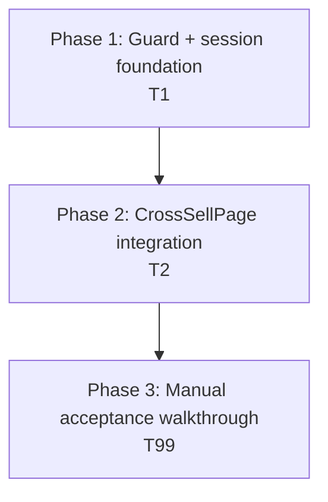
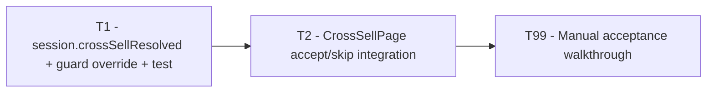

# Work Plan: Module 4 — Cross-sell

Created Date: 2026-04-23
Type: feature
Estimated Duration: 0.5–1 day (solo)
Estimated Impact: ~3 files modified (`session.ts`, `useRedirectGuard.ts`, `CrossSellPage.tsx`) + 1 test file modified (`useRedirectGuard.test.tsx`)
Module: 4 of 5 (cross-sell accept/skip wiring on `/cross-sell`)

## Related Documents

- PRD (design of record): [`docs/prd/module-4-cross-sell.md`](../prd/module-4-cross-sell.md) — §4 architecture, §5 data flow, §6 per-page specs, §7 code-changes table, §8 acceptance criteria (12 items), §9 risks, §11 high-level work plan. Every task below cites a PRD anchor.
- Module 1 PRD (foundation shipped): [`docs/prd/module-1-load-questions.md`](../prd/module-1-load-questions.md) — `apiPost`, `FunnelSession`, `resolveRedirect`, `useRedirectGuard`.
- Module 2 PRD (pricing hook shipped): [`docs/prd/module-2-pricing-display.md`](../prd/module-2-pricing-display.md) — `usePricing()` already powers CrossSellPage's `cross_sale_price_label`.
- Module 3 PRD (first-sale shipped): [`docs/prd/module-3-first-payment.md`](../prd/module-3-first-payment.md) — `finalizeAfterStripeSuccess` merges `cross_sale` into `session.pricingInfo.transactions.cross_sale` + `.cross_sale_compulsory` before the user lands here. Establishes the `user_on_iqbooster: ''`-empty-string quirk and the `{ meta, data: { redirect_page } }` envelope pattern that `apiPost` unwraps.
- Parent scope: [`docs/scope.md`](../scope.md) — `redirect_page` enum confirmed post-Module-3 (including `CROSS_SELL_OFFER_PAGE`).
- Backend contract: [`docs/Frontend API List.postman_collection.json`](../Frontend%20API%20List.postman_collection.json) — `POST /payment/cross-sale/payments/confirm`.
- Codebase conventions: [`typestest/CLAUDE.md`](../../typestest/CLAUDE.md).

> There is no separate Design Doc for Module 4. The PRD's §4–§9 + §11 are the technical spec. Anything unclear during implementation goes to **Open items** below, not a guess.

## Objective

Wire the single `POST /payment/cross-sale/payments/confirm` endpoint into `CrossSellPage`, replacing today's placeholder Accept/Skip handlers (both of which just `navigate('/details?qid=...')`) with real one-click-upsell (accept) and client-side-flag (skip) flows. Extend `FunnelSession` with a `crossSellResolved` boolean and teach `useRedirectGuard` to honor it so a skipped user doesn't bounce back to `/cross-sell` after a refresh.

## Background

- Modules 1, 2, 3 shipped on `typestest` branch `develop`. `CrossSellPage.tsx` already mounts the resume guard (`useRedirectGuard('/cross-sell')`), consumes `usePricing()` for the `cross_sale_price_label` in the IQ Pro description paragraph, and renders Accept + Skip buttons that both call `navigate('/details?qid=...')` as placeholders.
- `FunnelSession` carries `qidRaw`, `qidEncrypted`, `email`, `prcId`, `mdid`, `pricingInfo`, `paymentIntent` today — no cross-sell state.
- By the time the user lands on `/cross-sell`, Module 3's `finalizeAfterStripeSuccess` has already merged the first-sale confirm response's `cross_sale` block into `session.pricingInfo.transactions.cross_sale` and `session.pricingInfo.cross_sale_compulsory`. Module 4 relies on those fields being present; the PRD §4.2 defensive branch covers the hypothetical case where they're missing.
- **No new npm dependencies.** **No backend changes.** `src/utils/scoring.ts` untouched (product direction preserved across all modules). Module 5 (Details + Report) remains deferred.
- **`redirect_page` enum note (learned in Module 3):** the backend's real value is `CROSS_SELL_OFFER_PAGE`, not `CROSS_SELL_PAGE`. `redirectRouter.ts` already maps it, and PRD §4.4 / §4.6 have been patched accordingly. Any literal `'CROSS_SELL_OFFER_PAGE'` in the guard override must match this enum value.
- **`user_on_iqbooster: ''` quirk (learned in Module 3):** Module 3's `create-payment-intent` body required this empty string in the body. The cross-sale confirm body in PRD §4.1 also lists it. We default to sending `''` unless backend response proves it's harmless to omit. Don't guess — follow the PRD verbatim.
- **Envelope pattern:** the backend wraps `{ meta, data: { redirect_page } }`. `apiPost<{ redirect_page: string }>('payment/cross-sale/payments/confirm', body)` unwraps one `{ meta, data }` layer and returns `{ redirect_page }` directly — matching the pattern Module 3 established with `ConfirmResponse`. Confirm at runtime during Phase 3 manual walkthrough; if the response nests further, document and adapt (see Open items O1).

## Implementation Strategy

**Approach: Guard/session foundation first, then CrossSellPage integration, then manual walkthrough.** Only two executable tasks because the feature is small enough to stay inline in the page component (PRD §7 explicitly notes "Files added: none").

Rationale:

- T1 (session field + guard override) is a pre-requisite for T2. Without `crossSellResolved` typed on `FunnelSession` and the guard override in place, T2's skip flow would be a dead-end (the guard would bounce the user back to `/cross-sell` on refresh). Shipping T1 as a single self-contained commit keeps the type/test/runtime change atomic.
- T2 (CrossSellPage integration) composes `usePricing()` (already mounted), `useRedirectGuard()` (already mounted; now override-aware), and a small inline accept/skip state machine. No new files, no new hooks — the page owns the cross-sell state machine directly per PRD §7 ("logic is small enough to live inline in the page component").
- T99 (manual walkthrough) covers the five scenarios PRD §11 enumerates: accept happy path, accept failure, skip + refresh, compulsory, `show_cross_sale_page: false` edge, plus promo-param propagation on the confirm body.

Verification levels used (from `implementation-approach` skill):

- **L3 (build)** on every commit: `npx tsc --noEmit` + `npm run lint` + `npm run build`.
- **L2 (unit tests)** for the guard override (one new test case minimum) — added in T1. No new unit tests for CrossSellPage itself; the page is thin integration glue over already-tested primitives (`apiPost`, `usePricing`, `useRedirectGuard`, session helpers). Existing Module 1/2/3 test suites remain green.
- **L1 (manual smoke)** in T99 against the real backend with a real sandbox Stripe card that has a reusable payment method. This is the only way to verify the backend's off-session charge actually fires (PRD §9 R2).

## Risks and Countermeasures

### Technical Risks

- **R1 — No skip endpoint; post-skip refresh loop (PRD §9 R1).** The backend returns `redirect_page: CROSS_SELL_OFFER_PAGE` until a state-advancing action (Module 5's `PUT /customer/update`). A skipped user who refreshes `/details` would be bounced back to `/cross-sell` without our workaround.
  - **Impact**: Infinite guard loop; user trapped at `/cross-sell`.
  - **Countermeasure**: T1 adds `session.crossSellResolved` + a `resolveEffectiveRedirect` helper inside `useRedirectGuard.ts` per PRD §4.4 / §4.6. Both accept and skip set the flag to `true` before navigation. Covered by a new unit test in `useRedirectGuard.test.tsx`.

- **R2 — Saved payment method reliability (PRD §9 R2).** The backend must have stored a reusable payment method during first-sale confirm. If Stripe's off-session setup isn't enabled account-side, cross-sale confirm systematically fails.
  - **Impact**: Every accept click returns an error; compulsory users are stuck.
  - **Countermeasure**: Out of frontend control. T2 handles the error cleanly (inline alert + retry/skip-promoted UX per PRD §4.3). T99 scenario S2 exercises the failure path using a forced backend error (e.g. tampered `quiz_result_id`). Flagged in Open items O2 for backend confirmation.

- **R3 — Envelope shape assumption for confirm response (PRD §9 R3, Open items O1).** PRD §4.1 documents `{ meta, data: { redirect_page } }`. `apiPost` unwraps one layer — so `apiPost<{ redirect_page: string }>(...)` should return `{ redirect_page }`. If the backend wraps further (e.g. `{ meta, data: { cross_sale: {...}, redirect_page } }`), typing still holds but we miss merge opportunities.
  - **Impact**: Likely none for Module 4 since we navigate per `redirect_page` and don't re-merge cross-sale state (Module 3's merge already happened). But if the response has a different key name (`next_page`, etc.), accept silently falls through to `/checkout` via `resolveRedirect`'s default.
  - **Countermeasure**: T2's accept handler logs the full response on first real call for manual inspection. T99 S1 captures the actual shape. If different, update the response type and note in Open items. Don't fight the type system — adapt.

- **R4 — `user_on_iqbooster` field omission.** The PRD §4.1 body includes `user_on_iqbooster: ''`. If we omit it, the backend may 400.
  - **Impact**: Accept requests fail with a validation error.
  - **Countermeasure**: T2 includes the field literally as `''` per PRD §4.1. Don't "clean up" by omitting — same precedent as Module 3's `create-payment-intent`. T99 S1's payload inspection confirms.

- **R5 — Cross-tab race on accept (PRD §9 R5).** Two tabs on `/cross-sell` both click accept → two confirm calls → potentially two charges.
  - **Impact**: Double-charge; backend-side idempotency dependent.
  - **Countermeasure**: Accepted for v1 per PRD §9 R5 (same concern as Module 3 R5). Out of frontend scope; flagged in Open items O2 for backend idempotency confirmation.

- **R6 — Defensive navigation on missing `transactions.cross_sale` (PRD §4.2 step 3).** If the first-sale merge somehow didn't populate this field, the page must not render a broken card.
  - **Impact**: Confusing empty / errored state.
  - **Countermeasure**: T2 adds an early-return that navigates to `/details` when the field is missing, per PRD §4.2 step 3. Shouldn't happen post-Module-3 but is belt-and-braces.

### Schedule Risks

- **Real Stripe sandbox card with reusable PM required for T99 S1.** If the dev backend's sandbox Stripe account doesn't support off-session charges, S1 and S2 can't distinguish "correct frontend, broken backend" from a frontend bug. Flagged in T99 notes; doesn't block automated work.
- **Open items O3 (compulsory copy) / O4 (first-sale vs /questions/results `cross_sale` parity).** Not frontend blockers; marketing copy and backend observation. Resolution can trail the PR.

## Phase Structure

## Task Dependency Diagram

Each executable task leaves the tree building and green. T99 is a manual-only verification sweep; no commits land from it.

---

## Phase 1: Guard + session foundation (1 commit)

**Purpose**: Ship the `crossSellResolved` session field and the `resolveEffectiveRedirect` override inside `useRedirectGuard.ts`. Zero runtime behavior change in Module 4 until T2 sets the flag — but the guard now treats `CROSS_SELL_OFFER_PAGE` as "already resolved" when the flag is true.

**Closes ACs**: foundation for **AC 3, AC 4, AC 11**. AC 4 (post-skip refresh on `/details` does not bounce) is fully closed once T2 wires the skip flow; the guard-side half lands here.

### Task T1 — `session.crossSellResolved` + `resolveEffectiveRedirect` helper + guard unit test

See [`tasks/module-4/01-session-and-guard-override.md`](./tasks/module-4/01-session-and-guard-override.md).

- **Purpose**: Extend `FunnelSession` with `crossSellResolved?: boolean` (PRD §4.5) and add a `resolveEffectiveRedirect(serverRedirect, session)` helper inside `useRedirectGuard.ts` that remaps `CROSS_SELL_OFFER_PAGE` → `CUSTOMER_DETAILS_PAGE` when the flag is set (PRD §4.4, §4.6). Cover the override with at least one new unit test.
- **Files touched**:
  - `typestest/src/lib/session.ts` (**modify**) — add `crossSellResolved?: boolean` to `FunnelSession`.
  - `typestest/src/hooks/useRedirectGuard.ts` (**modify**) — add module-scoped `resolveEffectiveRedirect(serverRedirect, session)` helper; call it inside the existing `apiPost(...).then(data => ...)` block before `resolveRedirect`.
  - `typestest/src/hooks/useRedirectGuard.test.tsx` (**modify**) — add one new test case covering the override (server returns `CROSS_SELL_OFFER_PAGE`, session has `crossSellResolved: true`, caller is on `/details` → guard marks ready rather than bouncing back).
- **PRD anchors**: §4.4 (override logic), §4.5 (session field), §4.6 (helper contract), §7 (files touched).
- **AC coverage**: Foundation for AC 3, 4, 11. AC 4 closed once T2 lands and sets the flag.
- **Verification**:
  - `npx vitest run src/hooks/useRedirectGuard.test.tsx` — all existing cases pass + the new override case.
  - `npx tsc --noEmit` + `npm run lint` + `npm run build` clean.

### Phase 1 Completion Criteria

- [ ] `FunnelSession.crossSellResolved?: boolean` typed.
- [ ] `resolveEffectiveRedirect` helper added inside `useRedirectGuard.ts`; called before `resolveRedirect`.
- [ ] New unit test in `useRedirectGuard.test.tsx` covers override-active case.
- [ ] `npx tsc --noEmit` + `npm run lint` + `npm run build` + `npm run test` all green.
- [ ] No `CrossSellPage.tsx` changes in this commit (isolation check via `git diff --stat`).

### Phase 1 Operational Verification

1. `npm run dev` starts cleanly.
2. In DevTools console on `/cross-sell`: `sessionStorage.getItem('testiq.session')` — inspect parsed shape, confirm `crossSellResolved` is absent by default (undefined on fresh visits).
3. Full `npm run test` suite green (Module 1 + 2 + 3 suites + new override case).

---

## Phase 2: CrossSellPage integration (1 commit)

**Purpose**: Replace the placeholder accept/skip handlers in `CrossSellPage.tsx` with the real accept flow (POST `/payment/cross-sale/payments/confirm` → navigate per response) and skip flow (set flag → navigate `/details`), add the visibility gates (`show_cross_sale_page`, `cross_sale_compulsory`, missing `transactions.cross_sale`), and render the inline error alert + compulsory-retry UX per PRD §4.3 + §6.1 + §6.2.

**Closes ACs**: 1 (from Module 2 — re-verified), 2, 3, 4, 5, 6, 7, 8, 9, 10, 11, 12 — i.e., every PRD §8 AC. Full closure is verified in T99.

### Task T2 — `CrossSellPage.tsx` accept + skip + visibility gates + error states

See [`tasks/module-4/02-cross-sell-page-integration.md`](./tasks/module-4/02-cross-sell-page-integration.md).

- **Purpose**: Rewrite the accept/skip handlers, add the compulsory-aware and error-aware button states, add the three visibility gates from PRD §4.2, preserve every visual + pricing binding Module 2 shipped.
- **Files touched**:
  - `typestest/src/pages/CrossSellPage.tsx` (**modify**) — see task file for step-by-step.
- **PRD anchors**: §4.1 (confirm request/response shape), §4.2 (visibility gates), §4.3 (accept flow with error branches), §4.4 (skip sets flag), §5 (end-to-end data flow), §6.1 (rendering), §6.2 (button states), §6.3 (navigation side-effects), §8 (all 12 ACs).
- **AC coverage**:
  - AC 1 — `cross_sale_price_label` binding preserved from Module 2.
  - AC 2 — Accept fires exactly one confirm POST; navigation uses `resolveRedirect(response.redirect_page)`.
  - AC 3 — Skip makes no API call; sets `crossSellResolved = true`; navigates to `/details?qid=<encrypted>`.
  - AC 4 — After skip + refresh, guard override from T1 keeps user on `/details`.
  - AC 5 — Skip button is not rendered when `cross_sale_compulsory === true`.
  - AC 6 — `show_cross_sale_page === false` triggers auto-navigation without rendering the card.
  - AC 7 — Accept failure surfaces inline alert; Accept re-enables; Skip promoted to primary (when not compulsory).
  - AC 8 — Compulsory accept failure replaces Skip with a Retry button that re-fires confirm.
  - AC 9 — Both buttons disabled while any request is in flight.
  - AC 10 — `prc_id` / `pricing_discount` from session included in confirm body when present.
  - AC 11 — `pricingInfo.transactions.cross_sale` and `.cross_sale_compulsory` preserved after accept (we don't mutate them).
  - AC 12 — URL stays as `/cross-sell?qid=<encrypted>` while on page; both accept and skip navigations carry `qid` forward.
- **Verification**:
  - `npx tsc --noEmit` + `npm run lint` + `npm run build` clean.
  - `npm run test` green (no regressions in Modules 1/2/3 suites).
  - Manual smoke captured in T99 scenarios.

### Phase 2 Completion Criteria

- [ ] Accept handler posts to `/payment/cross-sale/payments/confirm` with body `{ quiz_result_id, user_on_iqbooster: '', prc_id, pricing_discount }` from session.
- [ ] On accept success: `patchSession({ crossSellResolved: true })` + `navigate(`${resolveRedirect(response.redirect_page)}?qid=${qidRaw}`, { replace: true })`.
- [ ] On accept error (`ApiError` or `NetworkError`): inline alert above CTAs, Accept re-enables, Skip promoted to primary when not compulsory, Retry button when compulsory.
- [ ] Skip handler: no API call; `patchSession({ crossSellResolved: true })`; `navigate('/details?qid=...', { replace: true })`.
- [ ] Visibility gate: `show_cross_sale_page === false` → navigate per `session.pricingInfo.redirect_page` (or `/details` as defensive fallback) without rendering card.
- [ ] Visibility gate: `cross_sale_compulsory === true` → Skip button not rendered; disclaimer copy per PRD §6.1 variant.
- [ ] Visibility gate: missing `pricingInfo.transactions.cross_sale` → navigate to `/details` without rendering card.
- [ ] Buttons disabled during in-flight request (either accept or retry).
- [ ] `cross_sale_price_label` binding (Module 2) untouched.
- [ ] `useRedirectGuard('/cross-sell')` mount (Module 1) untouched.
- [ ] `npx tsc --noEmit` + `npm run lint` + `npm run build` + `npm run test` all green.

### Phase 2 Operational Verification

1. `npm run dev`, complete funnel to `/cross-sell`.
2. DevTools Network: verify the `POST /payment/cross-sale/payments/confirm` payload matches PRD §4.1 on accept click.
3. DevTools Application → Session Storage: after skip click, `testiq.session.crossSellResolved === true`.
4. Refresh `/details?qid=...` after skip: URL stays `/details`, no bounce to `/cross-sell`.
5. Full test suite still green.

---

## Phase 3: Manual acceptance walkthrough (verification only)

**Purpose**: Close every PRD §8 AC that requires a live backend round-trip — the envelope shape assumption, the real backend charge, the compulsory retry UX, the `show_cross_sale_page: false` edge, and the promo-param propagation.

**No commits land from this phase.** Output is a signed-off checklist attached to the Module 4 PR.

### Task T99 — Manual acceptance walkthrough

See [`tasks/module-4/99-acceptance-walkthrough.md`](./tasks/module-4/99-acceptance-walkthrough.md).

Six scenarios (accept happy path / accept failure / skip + refresh / compulsory / `show_cross_sale_page: false` / promo run) against the real dev backend. AC-to-scenario matrix in the task file.

### Phase 3 Completion Criteria

- [ ] All 6 scenarios executed; every PRD §8 AC (1–12) verified against at least one scenario.
- [ ] Pre-flight quality gate (lint + tsc + test + build) green.
- [ ] Open items O1–O4 refreshed in the PRD / plan.
- [ ] PR body contains signed-off checklist + AC-to-scenario matrix.

---

## Quality Assurance (cross-phase)

- [ ] `npm run lint` — zero errors.
- [ ] `npx tsc --noEmit` — zero errors.
- [ ] `npm run test` — full suite (Module 1 + 2 + 3 + Module 4's one new guard test) green.
- [ ] `npm run build` — succeeds.
- [ ] No new npm dependencies introduced.
- [ ] No backend changes.
- [ ] `src/utils/scoring.ts` untouched.

## Completion Criteria

- [ ] T1 + T2 committed on a single branch; T99 executed against latest.
- [ ] All 12 PRD §8 ACs verified (unit tests for the guard half of AC 4; manual sweep for the remainder).
- [ ] Open items O1–O4 refreshed per observations.
- [ ] User review approval obtained.

## Open Items

- **O1 — Cross-sale confirm response envelope.** PRD §4.1 documents `{ meta, data: { redirect_page } }`. Confirm empirically in T99 S1; update type if shape differs. Surfaced during implementation if the compiler complains or the response is unexpectedly shaped.
- **O2 — Backend idempotency on duplicate confirm (mirrors Module 3 O1 / PRD §9 R5).** Cross-tab race and double-click-retry both send the same `quiz_result_id`. Confirm backend is idempotent; if it 409s on duplicate, treat 409 as success (pattern from Module 3). Verify in T99.
- **O3 — Marketing copy for compulsory variant.** Placeholder: `This add-on is required to continue.` PRD §6.1 defers to marketing. Replace before production launch; not a frontend-release blocker.
- **O4 — `cross_sale` block parity.** Whether the first-sale confirm response's `cross_sale` and `/questions/results`'s `pricing_info.transactions.cross_sale` ever disagree. Module 4 reads from session-cached `pricing_info`; if parity breaks, Module 3's merge is the single source of truth. Flagged per PRD §10 O4.

## Progress Tracking

### Phase 1 — T1
- Start: 
- Complete: 
- Notes: 

### Phase 2 — T2
- Start: 
- Complete: 
- Notes: 

### Phase 3 — T99
- Start: 
- Complete: 
- Notes: 

## Notes

- **No Design Doc.** PRD §4–§9 + §11 are the technical spec; task files cite specific § anchors.
- **No E2E test harness changes.** The Playwright config in `lovable-agent-playwright-config` is not touched in Module 4. Manual smoke (T99) is the integration gate.
- **Module 5 (Details + Report) remains deferred** — do not plan, implement, or speculate on `/details` beyond the navigation target in Module 4.
- **Module 3 learnings carried forward verbatim**: `user_on_iqbooster: ''` sent literally; envelope unwrap pattern trusted per `apiPost`'s contract; `CROSS_SELL_OFFER_PAGE` (not `CROSS_SELL_PAGE`) used everywhere.
