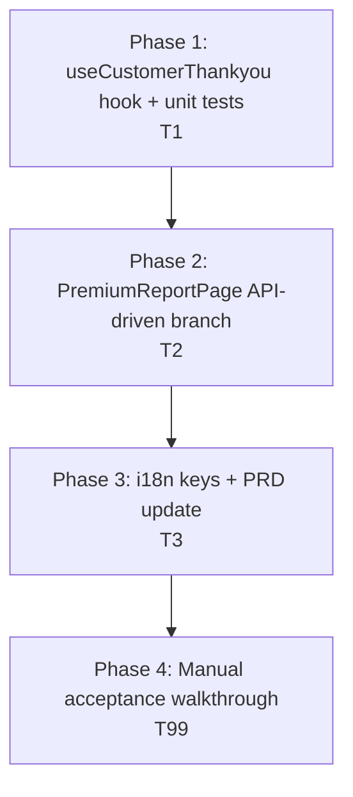
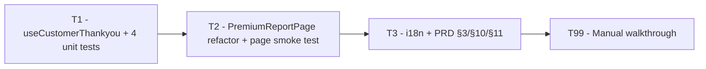

# Work Plan: Module 5 — Thankyou Report Wiring (deferred portion)

Created Date: 2026-04-29
Type: feature
Estimated Duration: 0.5–1 day (solo)
Estimated Impact: ~3 files modified (`PremiumReportPage.tsx`, `i18n/locales/en.json`, PRD doc) + 2 files added (`useCustomerThankyou.ts`, `useCustomerThankyou.test.tsx`) + 1 page-level smoke test (new or extended).
Module: 5 of 5 — report-rendering portion only. DetailsPage is already shipped; this plan only covers the `<ReportComingSoon>` → live `<ReportContent>` swap.

## Related Documents

- PRD (design of record): [`docs/prd/module-5-details-and-report.md`](../prd/module-5-details-and-report.md) — §3 (out-of-scope list to be trimmed), §4.4 (current placeholder behaviour), §4.5 (session shape — `qidEncrypted` already reserved), §10 (Open items O1/O2 to be resolved here), §11 (deferred work plan that this plan replaces).
- Module 1 PRD (foundation): [`docs/prd/module-1-load-questions.md`](../prd/module-1-load-questions.md) — `apiPost`, `FunnelSession`, `resolveRedirect`, `useRedirectGuard`.
- Module 4 plan (precedent for guard-override + session-flag pattern): [`docs/plans/module-4-cross-sell.md`](./module-4-cross-sell.md).
- Module 3 PRD (envelope precedent): [`docs/prd/module-3-first-payment.md`](../prd/module-3-first-payment.md) — `{ meta, data }` unwrap pattern that `apiPost` already handles.
- Backend contract: [`docs/Frontend API List.postman_collection.json`](../Frontend%20API%20List.postman_collection.json) line 829+ — `POST /customer/thankyou`.
- Codebase conventions: [`typestest/CLAUDE.md`](../../typestest/CLAUDE.md).

> No separate Design Doc. This plan + the user-confirmed contract in the prompt body are the technical spec. Anything unclear during implementation goes to **Open items** below, not a guess.

## Objective

Wire `POST /customer/thankyou` and use the *dynamic values from its response* to drive the existing `<ReportContent>` on `/results?qid=…`. Replace the `<ReportComingSoon>` placeholder branch only — keep every other piece (12 section components, Sidebar, PrintStyles, PDF generator, avatar resolution, dev `state.scores` path, route alias) byte-identical.

Out-of-scope by user direction: `report_file_url`, `certificate_file_url`, `promocode_url`, top-level `personality_type` (we use the nested `sixteentypes_report_detail.personalityType` instead). The client-rendered PDF and all section content stay as-is.

## Background

- DetailsPage (Module 5 first half) has already shipped. After a successful `PUT /customer/update`, the user is navigated to `/results?qid=<rotated-quiz_result_id>`. `session.qidEncrypted` is also re-persisted with the rotated `encrypted_quiz_result_id` (Module 5 PRD §4.1).
- `PremiumReportPage` currently has two branches (PRD §4.4):
  - **Dev path**: `location.state.scores` is present → `<ReportContent scores={…}>` renders directly, no guard, no API call. Used for local previews.
  - **Production path**: `qid`-only landing → `useRedirectGuard('/results')` runs → on `ready`, renders `<ReportComingSoon qid={qid}/>`.
- `useRedirectGuard` already advances correctly: when the backend says `redirect_page === CUSTOMER_DETAILS_PAGE` but `session.customerUpdateSubmitted === true`, the guard's `resolveEffectiveRedirect` overrides to `THANK_YOU_PAGE`, and `redirectRouter.ts` maps `THANK_YOU_PAGE → /results`. **No change needed in the guard or router** — Module 5 Phase 1 (DetailsPage) put the override in place. We only verify it.
- `apiPost` already unwraps the standard `{ meta, data }` envelope and returns `data` directly (Module 3 precedent). So `apiPost<ThankyouResponse>('customer/thankyou', body)` returns the inner shape verbatim.
- `EmailCapturePage` already resets `customerUpdateSubmitted` (and the related session flags) when a new `qidRaw` is persisted, so a fresh quiz in the same tab won't inherit a stale override (Module 5 PRD §7).
- **No new npm dependencies. No backend changes. `src/utils/scoring.ts` untouched** (the dev `state.scores` path still consumes it).
- **No changes to the 12 section components, Sidebar, PrintStyles, ReportPdf, avatarMap, or premiumTypeData lookups.** Sections accept their existing prop shapes; only `StressSection` and `FriendshipsSection` get one new optional override prop each (`markerPositionOverride`, `socialBatteryOverride`) so the API path can bypass the existing baseline blends without touching the dev path.

## Implementation Strategy

**Approach: Hook first, then page integration, then i18n + PRD update, then manual walkthrough.** The feature is small enough that the full report content stays inline in `PremiumReportPage.tsx`; we only refactor `ReportContent`'s data source.

Rationale:

- T1 (`useCustomerThankyou` hook + unit tests) is a pre-requisite for T2. Shipping it as a self-contained commit keeps the API contract and its test coverage atomic — same pattern as `usePaymentIntent` and `useRedirectGuard`. Mirrors the existing test scaffolding (`apiPost` mocked at the module level, `clearSession`/`patchSession` for fixture setup).
- T2 (`PremiumReportPage` refactor) splits `ReportContent`'s input into a tagged union (`{ kind: 'client' } | { kind: 'api' }`), threads it through `HeroSection`/`StressSection`/`FriendshipsSection`, and adds the loading + error variants inside `ReportGuardedPlaceholder`. No new files; the deferred-portion logic stays inside the existing page module (PRD §7 precedent: "Files added: none").
- T3 (i18n keys + PRD update) is a paperwork-only commit: add the three new strings to `en.json` (loading text, error title/body, retry button) and patch the PRD §3 / §10 / §11 to reflect the wired status.
- T99 (manual walkthrough) covers the four scenarios that need a real backend round-trip: happy path, ApiError, NetworkError, and the dev `state.scores` path (regression check that no thankyou call fires).

Verification levels used (from `implementation-approach` skill):

- **L3 (build)** on every commit: `npx tsc --noEmit` + `npm run lint` + `npm run build`.
- **L2 (unit tests)** for the hook in T1 — full happy-path + 3 error cases. Page-level smoke test in T2 covers the `kind: 'api'` branch and the dev-path regression.
- **L1 (manual smoke)** in T99 against the dev backend with a real funnel run-through (EmailCapture → Checkout → CrossSell → Details → Results). The only way to verify the actual response shape matches the documented contract.

## Risks and Countermeasures

### Technical Risks

- **R1 — `traitPercentages` not in API response.** `HeroSection` renders the four axis bars from `useResults(scores).traitPercentages`. The thankyou response provides `personalityType` but not the per-axis percentages.
  - **Impact**: Without a fallback, the API-driven path renders the hero with no axis bars (or worse, a runtime error if a downstream consumer assumes a non-empty array).
  - **Countermeasure (chosen: Option A with B as graceful fallback)**: T2 reads `readResult()` from localStorage (`MbtiResult.traits.{EI,SN,TF,JP}.{letter,percent}`) and adapts it to `TraitPercentage[]`. When `readResult()` returns `null` (user cleared storage / different device), `<HeroSection>` is invoked without `traitPercentages` and gracefully degrades to a "type only, no axis bars" header. Documented as a known UX degradation rather than a hard error.
  - **Detection**: T99 S5 explicitly clears `localStorage` before refreshing `/results` to exercise the fallback path. The page must still render, with a visibly bar-less hero.

- **R2 — Response envelope shape assumption.** Per the user-confirmed contract, `apiPost` unwraps one `{ meta, data }` layer and we get `{ report_file_url, certificate_file_url, …, sixteentypes_report_detail: { personalityType, identity, turbulentPercent, socialBattery, stressMarker } }` directly. If the backend wraps further or renames `sixteentypes_report_detail`, the page falls to the error variant.
  - **Impact**: Live users see the error variant instead of the report.
  - **Countermeasure**: T1's hook logs the full raw response at `console.debug` on the first real call to aid live debugging. T2's error variant exposes the qid prominently for support lookups. T99 S1 captures the actual shape; if mismatched, surface in Open items O1 and update the type without redesign.

- **R3 — `personalityType` value not in `getPremiumTypeData`'s lookup.** The function expects one of the 16 canonical four-letter codes (e.g. `ISTJ`). If the backend returns a non-canonical string, `getPremiumTypeData` either throws or returns undefined, breaking every section.
  - **Impact**: Fatal render error on the API path.
  - **Countermeasure**: T2's API-path adapter validates the type against the 16-type allow-list before passing to `getPremiumTypeData`. On mismatch, surface as `ApiError`-equivalent in the hook's consumer (treat as data-shape failure → render error variant). Logged with the offending value for support.

- **R4 — `socialBattery` / `stressMarker` out of range.** API documentation says 0–100 but a buggy backend response could ship 150 or -5.
  - **Impact**: CSS `width: 150%` looks broken; marker dot escapes the meter.
  - **Countermeasure**: T2 clamps both values to `[0, 100]` for `socialBattery` and `[2, 98]` for `stressMarker` (matches the existing client-side blend's clamp range) **before** passing to sections. Defensive only; not a substitute for backend validation.

- **R5 — Single-shot semantics: refresh re-fires the call.** The user-confirmed scope says "single-shot, no retry, no refetch; the page renders once per visit". A page refresh on `/results` is a new visit and does re-fire the call (per AC 19).
  - **Impact**: Slightly higher load if a user repeatedly refreshes; no functional issue. Backend should be idempotent w.r.t. the thankyou call (no charge, no state advance).
  - **Countermeasure**: Out of frontend control. Documented in Open items O2 for backend confirmation. Frontend treats every mount as a fresh request (matches the existing guard's mount-time POST pattern).

- **R6 — Missing `qidEncrypted` in session.** If the user lands on `/results?qid=…` directly without going through the funnel (e.g. shared link, browser restored a stale tab) and `session.qidEncrypted` is empty, the hook can't make the call.
  - **Impact**: Error variant renders.
  - **Countermeasure**: T1's hook returns a synthetic error when `session.qidEncrypted` is missing — no network call is fired. T2's error variant copy explicitly invites the user to restart from the home page via a secondary action. Covered by unit test "missing qidEncrypted in session".

### Schedule Risks

- **Real backend response shape capture.** T99 S1 must capture the live response shape verbatim. If the dev backend isn't returning `sixteentypes_report_detail` in the format documented, this plan needs an amendment commit before merge — flagged in Open items O1.
- **Open items O1 (response shape) / O2 (backend idempotency on duplicate thankyou calls).** Not frontend blockers; backend observation. Resolution can trail the PR if the happy path renders correctly.

## Phase Structure



## Task Dependency Diagram



Each executable task leaves the tree building and green. T99 is a manual-only verification sweep; no commits land from it.

---

## Phase 1: `useCustomerThankyou` hook + unit tests (1 commit)

**Purpose**: Ship the new hook with full unit-test coverage. Zero runtime behavior change in the report page until T2 consumes it.

**Closes ACs**: foundation for **AC 15**, **AC 16**, **AC 18**, **AC 19**. Full closure happens once T2 wires it into the page.

### Task T1 — `useCustomerThankyou` hook + 4 unit tests

- **Purpose**: Add a single-shot mount-time hook that POSTs `customer/thankyou` with `{ quiz_result_id: session.qidEncrypted, old_quiz_id: '' }`, persists rotated qids back into session via `patchSession`, and exposes `{ data, loading, error }`.
- **Files touched**:
  - [`typestest/src/hooks/useCustomerThankyou.ts`](../../typestest/src/hooks/useCustomerThankyou.ts) (**add**) — new hook; signature `useCustomerThankyou(): { data: ThankyouResponse | null; loading: boolean; error: ApiError | NetworkError | null }`. Defines and exports `ThankyouResponse` and `SixteenTypesReportDetail` types.
  - [`typestest/src/hooks/useCustomerThankyou.test.tsx`](../../typestest/src/hooks/useCustomerThankyou.test.tsx) (**add**) — vitest + `@testing-library/react` `renderHook`, mirroring `usePaymentIntent.test.tsx` structure. Mocks `apiPost` at module level; uses `clearSession` / `patchSession` for fixture setup.
- **Implementation notes**:
  - Hook body uses a single `useEffect(() => { … }, [])` (mount-only, no deps) — same pattern as `useRedirectGuard`.
  - Read `getSession().qidEncrypted` first. If falsy → set `error` to a synthetic `ApiError` (status 0, message "Session is missing the encrypted quiz id. Please restart the test.") and return without calling `apiPost`.
  - Otherwise → set `loading: true`, call `apiPost<ThankyouResponse>('customer/thankyou', { quiz_result_id, old_quiz_id: '' })`. On resolution, `patchSession({ qidRaw: data.quiz_result_id, qidEncrypted: data.encrypted_quiz_result_id })`, then set `data` and `loading: false`. On rejection, set `error` (`ApiError` and `NetworkError` are passed through unchanged) and `loading: false`.
  - Emit `console.debug('[customer/thankyou] response', data)` once on success — see R2.
- **Test cases** (mirrors `usePaymentIntent.test.tsx`'s structure):
  1. **Happy path** — session has `qidEncrypted`; `apiPost` resolves with the contract-shaped payload; assert `data` matches, `loading: false`, `error: null`, session was patched with rotated qids.
  2. **Missing `qidEncrypted`** — session is empty; assert no `apiPost` call (`expect(mockedApiPost).not.toHaveBeenCalled()`), `data: null`, `error` is non-null with the expected message.
  3. **`ApiError`** — `apiPost` rejects with `new ApiError('boom', 500)`; assert `error instanceof ApiError`, `data: null`, `loading: false`.
  4. **`NetworkError`** — `apiPost` rejects with `new NetworkError('offline')`; assert `error instanceof NetworkError`.
- **AC coverage**: Foundation for AC 15, 16, 18, 19. Closed at the page level by T2.
- **Verification**:
  - `npx vitest run src/hooks/useCustomerThankyou.test.tsx` — all 4 cases pass.
  - `npx tsc --noEmit` + `npm run lint` + `npm run build` clean.

### Phase 1 Completion Criteria

- [x] `useCustomerThankyou.ts` exported with the signature above; types `ThankyouResponse` and `SixteenTypesReportDetail` exported from the same file.
- [x] All 4 unit tests pass.
- [x] `apiPost` not called when `session.qidEncrypted` is missing (verified by mock spy).
- [x] Session re-persisted with rotated qids on success.
- [ ] `npx tsc --noEmit` + `npm run lint` + `npm run build` + full `npm run test` all green.
- [x] No `PremiumReportPage.tsx` changes in this commit (isolation check via `git diff --stat`).

### Phase 1 Operational Verification

1. `npm run dev` starts cleanly.
2. `npx vitest run src/hooks/useCustomerThankyou.test.tsx` shows 4 passing cases.
3. Existing test suites (Module 1 + 2 + 3 + 4 + DetailsPage) remain green — `npm run test` shows zero regressions.

---

## Phase 2: PremiumReportPage API-driven branch + page smoke test (1 commit)

**Purpose**: Replace `<ReportComingSoon>` in the production branch with a three-state UI (loading / error / `<ReportContent kind="api">`). Refactor `ReportContent` so it accepts either a client-derived (existing) or API-derived (new) data source via a tagged union. Thread the API-driven values into `HeroSection` (with localStorage fallback for `traitPercentages`), `StressSection` (override `markerPosition`), and `FriendshipsSection` (override `socialBattery`).

**Closes ACs**: 15, 16, 17, 18, 20, 21. AC 19 (refresh repeats the flow) is automatic given mount-only hook semantics; verified manually in T99 S2.

### Task T2 — `PremiumReportPage.tsx` refactor + section prop additions + page smoke test

- **Purpose**: Drive the production-path report from the thankyou response while preserving the dev `state.scores` path byte-identically.
- **Files touched**:
  - [`typestest/src/pages/PremiumReportPage.tsx`](../../typestest/src/pages/PremiumReportPage.tsx) (**modify**) — see step list below.
  - [`typestest/src/pages/PremiumReportPage.test.tsx`](../../typestest/src/pages/PremiumReportPage.test.tsx) (**add or extend**) — page-level smoke test using MSW (or `apiPost` direct mock if MSW isn't yet set up; check the repo and mirror the existing pattern).
- **Step list (refactor inside `PremiumReportPage.tsx`)**:
  1. Define a tagged-union `ReportSource`:
     ```ts
     type ReportSource =
       | { kind: 'client'; scores: Scores; careerPurchased?: boolean }
       | { kind: 'api'; type: string; identity: 'A' | 'T'; turbulentPercent: number; socialBattery: number; stressMarker: number; traitPercentages: TraitPercentage[] | null; careerPurchased?: boolean };
     ```
  2. Change `ReportContent`'s prop signature from `{ scores, careerPurchased }` to `{ source: ReportSource }`. Inside, derive `type` / `traitPercentages` / `data` from the union: `kind === 'client'` keeps the existing `useResults(scores)` call; `kind === 'api'` uses `source.type` and `source.traitPercentages` directly.
  3. Update `HeroSection` invocation: pass `traitPercentages={traitPercentages ?? []}`. If `HeroSection`'s current implementation iterates `traitPercentages` it already handles empty gracefully — confirm during implementation, otherwise add the empty-array guard inside the section (one minimal change).
  4. Update `StressSection` to accept an optional `markerPositionOverride?: number` prop. When defined, use it directly (after clamping `[2, 98]`) and skip the existing `0.4 * stressBaseline + 0.6 * turbulentPercent` blend. The dev path (`<StressSection data={data} type={type} result={result} />`) keeps working with no override.
  5. Update `FriendshipsSection` to accept an optional `socialBatteryOverride?: number` prop. When defined, use it directly (after clamping `[0, 100]`) and skip the existing EI blend. Dev path unchanged.
  6. In the `kind: 'api'` `ReportContent` invocation, pass `markerPositionOverride={source.stressMarker}` to `<StressSection>` and `socialBatteryOverride={source.socialBattery}` to `<FriendshipsSection>`.
  7. Refactor `ReportGuardedPlaceholder`:
     - After `useRedirectGuard` returns `ready: true`, call `useCustomerThankyou()`.
     - `loading === true` → render the same full-screen spinner as `DetailsPage` (`details.generating` copy via `useTranslation`); reuse the existing spinner SVG markup verbatim.
     - `error !== null` → render an inline error variant of `<ReportComingSoon>` titled `report.error.title` (e.g. "We couldn't load your report"), body `report.error.body` (e.g. "Please try again. If the problem persists, contact support with quiz id …"), with two buttons: a primary "Try again" that calls `window.location.reload()`, and a secondary "Back to home" → `navigate('/')`. The qid is rendered as a `<code>` for support, mirroring the existing `<ReportComingSoon>`.
     - `data !== null` → build the `kind: 'api'` `ReportSource` and render `<ReportContent source={…} />`. The build step:
       - `type = data.sixteentypes_report_detail.personalityType` — validated against the 16-type allow-list (export `ALL_TYPES` from `premiumTypeData.ts` if not already exported, or inline a const set). On invalid type, treat as error → render error variant (R3).
       - `identity = data.sixteentypes_report_detail.identity`.
       - `turbulentPercent`, `socialBattery`, `stressMarker` — clamp per R4.
       - `traitPercentages = adaptMbtiResultToTraitPercentages(readResult())` — adapter helper either inline (small) or in a new `src/utils/mbtiResultAdapter.ts` if it grows past ~20 lines. Returns `null` when `readResult()` is `null`.
  8. Top-level `PremiumReportPage` — keep the existing dev-path early return (`if (scores) return <ReportContent source={{ kind: 'client', scores, careerPurchased }} />;`). Production branch unchanged structurally; only `ReportGuardedPlaceholder`'s body differs.
  9. Confirm the `/premium-report` route alias in `App.tsx` (or wherever routes are declared) still maps to `PremiumReportPage`. **No change** — verification only (AC 21).
- **Page smoke test cases** (`PremiumReportPage.test.tsx`):
  1. **Missing qidEncrypted → error variant** — set up session with no `qidEncrypted`, render the page on `/results?qid=…` (mock the redirect guard's `apiPost` to return `redirect_page: 'THANK_YOU_PAGE'`). Assert "Try again" button is visible and the qid appears in the document.
  2. **Happy path → API-driven content** — MSW (or mocked `apiPost`) returns the contract-shaped payload with `sixteentypes_report_detail.stressMarker = 47`, `socialBattery = 41`. Render the page; wait for `<ReportContent>` to mount; query the stress meter element (`data-testid="stress-marker-dot"` — add the test id during implementation if not present) and assert its inline `style.left` parses to `47%`. Query the social battery percent text (e.g. via `getByText(/41%/)`) and assert presence.
  3. **Dev `state.scores` path: no thankyou call** — render `<PremiumReportPage>` via `MemoryRouter` with `location.state.scores` set. Assert `mockedApiPost` was called zero times for the `'customer/thankyou'` path. The full report still renders (sanity: `data-testid="hero"` or section heading present).
- **AC coverage**:
  - AC 15 — happy path test asserts exactly one `apiPost('customer/thankyou', { quiz_result_id, old_quiz_id: '' })` call.
  - AC 16 — loading-spinner snapshot or `getByText('Generating your personality report…')` while the call is in flight (test the in-flight state by holding the mock promise unresolved).
  - AC 17 — happy path test asserts marker `style.left` and battery `%`.
  - AC 18 — error-variant test (extension: a fourth case mocking `apiPost` to reject with `ApiError`). Inline alert visible, "Try again" present, no navigation away.
  - AC 19 — covered by mount-only hook semantics; manually verified in T99.
  - AC 20 — dev-path test asserts zero thankyou calls.
  - AC 21 — verified manually in T99 (route alias check).
- **Verification**:
  - `npx vitest run src/pages/PremiumReportPage.test.tsx` green.
  - `npx tsc --noEmit` + `npm run lint` + `npm run build` clean.
  - Full `npm run test` green (no regressions in any prior suite).

### Phase 2 Completion Criteria

- [x] `ReportContent` accepts `source: ReportSource` (tagged union); both `kind: 'client'` and `kind: 'api'` branches compile and render.
- [x] `StressSection` accepts optional `markerPositionOverride?: number`; uses it directly (clamped 2–98) when present, skips the blend.
- [x] `FriendshipsSection` accepts optional `socialBatteryOverride?: number`; uses it directly (clamped 0–100) when present, skips the EI blend.
- [x] `HeroSection` renders gracefully when `traitPercentages` is empty (no axis bars, type/name/tagline still present).
- [x] `ReportGuardedPlaceholder` calls `useCustomerThankyou` after the guard settles; renders loading / error / `<ReportContent kind="api">` accordingly.
- [x] Invalid `personalityType` (not in the 16-type allow-list) is treated as an error.
- [x] `traitPercentages` derived from `readResult()` via an adapter; falls back to `null` (not crashed) when `readResult()` returns `null`.
- [x] Page smoke test covers: missing-qid-encrypted, happy-path API-driven render (asserts `style.left` and battery %), and dev-path-no-thankyou-call.
- [ ] `npx tsc --noEmit` + `npm run lint` + `npm run build` + `npm run test` all green.
- [x] No changes to: 12 section components beyond the two new optional props; `Sidebar`; `PrintStyles`; `MobileTabBar`; `ReportPdf`; `avatarMap`; `premiumTypeData` lookup tables; `useRedirectGuard`; `redirectRouter`; `session.ts` shape; `useResults`; `scoring.ts`.

### Phase 2 Operational Verification

1. `npm run dev`, complete the funnel through Details → Results.
2. DevTools Network: verify exactly one `POST /customer/thankyou` request with body `{ "quiz_result_id": "<encrypted>", "old_quiz_id": "" }`.
3. DevTools Console: verify the `[customer/thankyou] response` debug log fires once with the full payload.
4. Inspect the rendered stress marker dot: `style.left` should match `${sixteentypes_report_detail.stressMarker}%` (within the 2–98 clamp).
5. Inspect the social battery bar: text shows `${socialBattery}%`; bar `width` matches.
6. Refresh `/results?qid=…`: the request fires again (single-shot per visit, AC 19); page renders identically.
7. With `localStorage` cleared (DevTools → Application → Clear site data), refresh `/results?qid=…`: hero renders without axis bars; rest of report still renders. Manual confirmation of R1 fallback (Option B graceful degradation).

---

## Phase 3: i18n keys + PRD update (1 commit)

**Purpose**: Add the three new UI strings to `en.json` and update Module 5 PRD to reflect the wired status.

**Closes ACs**: 22 (PRD §3 / §10 / §11 reflect wired status).

### Task T3 — i18n strings + PRD §3 / §10 / §11 update

- **Purpose**: Document the new state of the world; ensure copy is i18n-ready (R: user has `en.json` open).
- **Files touched**:
  - [`typestest/src/i18n/locales/en.json`](../../typestest/src/i18n/locales/en.json) (**modify**) — add a new `report` key block:
    ```json
    "report": {
      "loading": "Generating your personality report…",
      "error": {
        "title": "We couldn't load your report",
        "body": "Please try again. If the problem persists, contact support with quiz id {{qid}}.",
        "retry": "Try again",
        "back": "Back to home"
      }
    }
    ```
    Reuse `details.generating` for the spinner caption rather than duplicating — `details.generating` is already "Generating your personality report…" verbatim. (Decision during implementation: reuse `details.generating` and add only the `report.error.*` keys.)
  - **Sister locales**: check `typestest/src/i18n/locales/` for any non-English JSON files. If any exist, add the same keys (placeholder English values are acceptable for languages without translations yet — translation is a separate workstream). If only `en.json` exists, this step is a no-op.
  - [`docs/prd/module-5-details-and-report.md`](../prd/module-5-details-and-report.md) (**modify**):
    - **§3** — Remove `POST /customer/thankyou integration — requires the encrypted qid …` from the out-of-scope list. Move to "Wired in [`docs/plans/module-5-thankyou-report.md`](../plans/module-5-thankyou-report.md)".
    - **§10 O1** — Mark resolved: "Scoring ownership: hybrid. Backend supplies `personalityType`, `identity`, `turbulentPercent`, `socialBattery`, `stressMarker` via `customer/thankyou.sixteentypes_report_detail`. Per-axis `traitPercentages` continue to be derived client-side from the persisted `MbtiResult`. Client-side `src/utils/scoring.ts` remains for the dev preview path."
    - **§10 O2** — Mark resolved: "Contract confirmed (see plan). `report_file_url` / `certificate_file_url` / `promocode_url` deferred to a future iteration."
    - **§11** — Replace the deferred work plan with: "Live-report integration shipped per [`docs/plans/module-5-thankyou-report.md`](../plans/module-5-thankyou-report.md). Acceptance criteria 15–22 listed in that plan."
    - **§8** — Append acceptance criteria 15–22 (copied from this plan's §"Acceptance Criteria" below) under a new "PremiumReportPage (live)" subsection.
- **AC coverage**: AC 22.
- **Verification**:
  - `npx tsc --noEmit` + `npm run lint` + `npm run build` clean (no code changes besides i18n).
  - `npm run test` green (i18n keys are accessed at runtime; no test reads the literal string).
  - PRD renders correctly in the markdown preview; all internal links resolve.

### Phase 3 Completion Criteria

- [x] `report.error.{title,body,retry,back}` keys present in `en.json` (and any sister locales if they exist).
- [x] `details.generating` reused for the loading caption (no duplicate key).
- [x] PRD §3, §10 O1, §10 O2, §11, and §8 updated as listed above.
- [x] No code regressions; full `npm run test` + lint + tsc + build green.

### Phase 3 Operational Verification

1. Search `en.json` for the new `report.error` block — present and well-formed JSON.
2. PRD markdown opened in preview — links to this plan resolve; new ACs visible under §8.

---

## Phase 4: Manual acceptance walkthrough (verification only)

**Purpose**: Close every AC that requires a live backend round-trip — actual response shape, real `style.left` math, refresh semantics, dev-path regression.

**No commits land from this phase.** Output is a signed-off checklist attached to the PR.

### Task T99 — Manual acceptance walkthrough

Five scenarios against the dev backend. AC-to-scenario matrix below.

- **S1 — Happy path.** Fresh tab; complete the entire funnel (EmailCapture → Checkout → CrossSell skip → Details submit) → land on `/results?qid=…`. Verify spinner appears, then `<ReportContent>` renders. Capture the network response shape verbatim and compare to the documented contract; if mismatched, file an Open item and amend the type. Inspect stress marker `style.left` and social battery percent text against the response payload (AC 15, 16, 17).
- **S2 — Refresh.** On the rendered S1 results page, hit `Ctrl+R`. Verify the spinner re-appears, the request re-fires, and the page renders again with the same values (AC 19).
- **S3 — ApiError variant.** Force a backend error (tamper the encrypted qid in sessionStorage to a known-bad value, then refresh `/results?qid=…`). Verify the error variant renders: title visible, body mentions the qid, "Try again" and "Back to home" buttons present. Click "Try again" — page reloads, error variant re-renders (request fails again with the tampered qid). Restore the qid manually; reload — happy path resumes (AC 18).
- **S4 — Dev `state.scores` path regression.** From the dev menu / a manual `navigate('/results', { state: { scores: <fixture> } })`, land on `/results` *without* `qid`. Verify `<ReportContent>` renders immediately, no spinner, no `customer/thankyou` request in the Network tab (AC 20). Verify the existing 12-section content is byte-identical to pre-T2 (visual diff against develop branch).
- **S5 — `traitPercentages` localStorage fallback (R1).** On the rendered S1 results page, DevTools → Application → Local Storage → clear `mbti.result` (or whatever key `readResult()` writes). Refresh. Verify the hero renders with type / name / tagline but **without** the four axis bars; rest of report intact. Acknowledged UX degradation per R1 Option B.
- **S6 — `/premium-report` route alias.** Navigate to `/premium-report?qid=<valid-from-S1>`. Verify the same page renders (AC 21).

### AC-to-scenario matrix

| AC | S1 | S2 | S3 | S4 | S5 | S6 |
|---|---|---|---|---|---|---|
| 15 | x |  |  |  |  |  |
| 16 | x |  |  |  |  |  |
| 17 | x |  |  |  | partial |  |
| 18 |  |  | x |  |  |  |
| 19 |  | x |  |  |  |  |
| 20 |  |  |  | x |  |  |
| 21 |  |  |  |  |  | x |
| 22 |  |  |  |  |  |  | (covered by Phase 3 PRD review) |

### Phase 4 Completion Criteria

- [ ] All 6 scenarios executed; every AC 15–22 verified against at least one scenario.
- [ ] Pre-flight quality gate (lint + tsc + test + build) green.
- [ ] Open items O1–O2 refreshed in the PRD / plan.
- [ ] PR body contains signed-off checklist + AC-to-scenario matrix.

---

## Quality Assurance (cross-phase)

- [ ] `npm run lint` — zero errors.
- [ ] `npx tsc --noEmit` — zero errors.
- [ ] `npm run test` — full suite (Modules 1–5 + new hook + new page test) green.
- [ ] `npm run build` — succeeds.
- [ ] No new npm dependencies introduced.
- [ ] No backend changes.
- [ ] `src/utils/scoring.ts` untouched.
- [ ] `useRedirectGuard.ts` untouched.
- [ ] `redirectRouter.ts` untouched.
- [ ] `session.ts` shape untouched (`qidEncrypted` was already reserved).
- [ ] 12 section components untouched except for two new optional props on `StressSection` and `FriendshipsSection`.
- [ ] `ReportPdf.tsx`, `avatarMap.ts`, `premiumTypeData.ts` untouched (read-only consumers).

## Acceptance Criteria

(continued from PRD §8 #14 baseline — DetailsPage ACs 1–11 + placeholder ACs 12–14)

15. `/results?qid=…` (no `state.scores`) lands → resume guard runs → exactly one `POST /customer/thankyou` is made with body `{ quiz_result_id: session.qidEncrypted, old_quiz_id: "" }`.
16. While the call is in flight, the full-screen "Generating your personality report…" spinner replaces the placeholder (reuses `details.generating` copy and the DetailsPage spinner SVG verbatim).
17. On success, `<ReportContent>` renders with API-driven values: `personalityType` drives `getPremiumTypeData(type)` and avatar resolution; the stress marker dot's inline `style.left` equals `${stressMarker}%` (clamped 2–98); the social battery shows `${socialBattery}%` and bar width.
18. On `ApiError` or `NetworkError`, the page renders an error variant titled "We couldn't load your report" with a "Try again" action (reloads the page), a secondary "Back to home" action, and the qid visible inline for support; the page does not navigate away on its own.
19. Refresh on `/results?qid=…` repeats the same flow (re-calls `customer/thankyou`); the page does not cache the prior response across refreshes.
20. The dev `state.scores` path is unaffected: zero `customer/thankyou` calls; full client-side report renders immediately, no guard, no spinner.
21. The `/premium-report` route alias still resolves to the same component and follows the same code path as `/results`.
22. PRD §3 (out-of-scope), §10 (O1, O2), and §11 (work plan) reflect the wired status with a pointer to this plan.

## Completion Criteria

- [ ] T1 + T2 + T3 committed on a single branch; T99 executed against latest.
- [ ] All ACs 15–22 verified (unit tests for AC 15/18/20; page smoke test for AC 16/17; manual sweep for AC 19/21/22).
- [ ] Open items O1–O2 refreshed per observations.
- [ ] User review approval obtained.

## Open Items

- **O1 — Live `customer/thankyou` response shape.** The user-confirmed contract is documented in this plan's prompt body. T99 S1 captures the actual shape; if the backend wraps further (`{ meta, data: { meta, data: {…} } }`), nests `sixteentypes_report_detail` differently, or renames fields, file a follow-up commit before merge. Type adjustment, no redesign required.
- **O2 — Backend idempotency on duplicate `customer/thankyou` calls.** Per AC 19 / R5, refresh re-fires the call. Confirm the backend treats this as idempotent (no double charge, no state advance, no email). If not, frontend may need a session-scoped cache flag — but that's a future iteration, not this plan.
- **O3 — `report_file_url` / `certificate_file_url` / `promocode_url` consumption.** Out of scope for this iteration per user direction. The fields are returned by the API but ignored by the frontend; the existing client-rendered PDF (via `react-pdf`) and inline report stay authoritative. Schedule a follow-up ticket once product decides whether to switch to server-rendered PDF.
- **O4 — `personality_type` (top-level) vs `sixteentypes_report_detail.personalityType`.** The API returns both. We use the nested one per user direction. If the two ever diverge in practice, we may need to revisit; not expected.
- **O5 — Sister-locale i18n keys.** If sister locales exist (`typestest/src/i18n/locales/*.json`), `report.error.*` was added with English values as a placeholder. Translation is a separate workstream.

## Progress Tracking

### Phase 1 — T1
- Start: 
- Complete: 
- Notes: 

### Phase 2 — T2
- Start: 2026-04-29
- Complete: 2026-04-29
- Notes: Refactored `PremiumReportPage.tsx` to a tagged-union `ReportSource`. Added optional `markerPositionOverride` / `socialBatteryOverride` props (with `data-testid` hooks) to `StressSection` / `FriendshipsSection`. Replaced `<ReportComingSoon>` with new `ReportLiveLoader` (loading + error + live) and `ReportErrorState` components. Added page-level smoke test (3 cases) at `src/pages/PremiumReportPage.test.tsx` — all green. Hook regression `useCustomerThankyou.test.tsx` still passes. Quality gate (lint/tsc/build) deferred to quality-fixer-frontend per scope.

### Phase 3 — T3
- Start: 
- Complete: 
- Notes: 

### Phase 4 — T99
- Start: 
- Complete: 
- Notes: 

## Notes

- **No Design Doc.** This plan + the user-confirmed contract are the technical spec. The PRD covers the broader Module 5 context.
- **No E2E test harness changes.** Manual smoke (T99) is the integration gate.
- **Module 4 / Module 3 / Module 2 / Module 1 learnings carried forward verbatim**: `apiPost` envelope unwrap trusted; session patches use `patchSession` not direct mutation; mount-only `useEffect(…, [])` semantics for single-shot hooks; `console.debug` for debug logs (not `console.log`).
- **Section components stay untouched.** The only outward-visible change in any of the 12 sections is the optional `markerPositionOverride` / `socialBatteryOverride` props on two of them — both with default behaviour preserved when unset (dev path).
- **No restructuring of `PremiumReportPage.tsx`'s file layout** — only the `ReportContent` prop signature, the two section invocations, and the body of `ReportGuardedPlaceholder`.
- **The dev `state.scores` path is sacred.** Every change is gated on "does this break the local MBTI preview?" — answer must be no.

---

Status: drafted, awaiting user approval to begin Phase 1 (T1).
